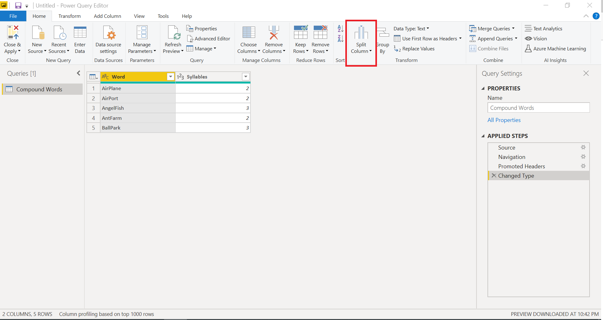
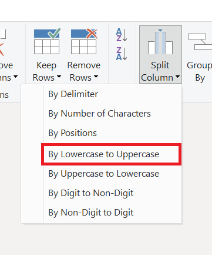
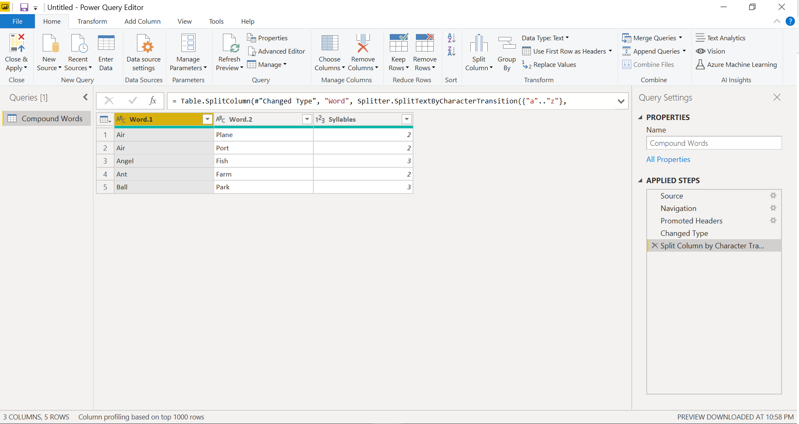
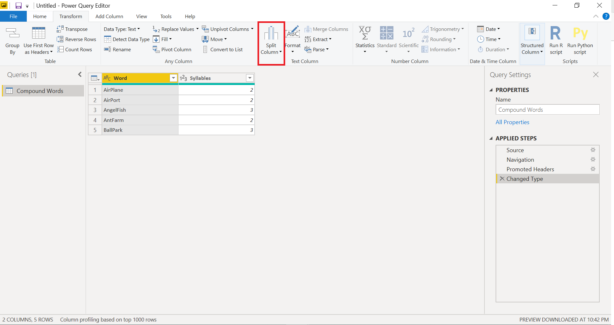
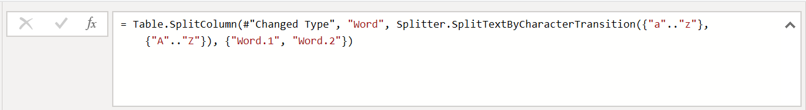

# Split Columns By Lowercase to Uppercase

In Power Query, you can create a split a column through different functions.
In this case, the column(s) selected can be split by the last Lowercase to the first Uppercase.

We will be using the following table to show the change.


The result of the transformation will be two or more columns split from the original column.


## Option One: Home Tab Split Columns By Lowercase to Uppercase 

Select the column that we want to split, then go to the **Split Column** option from the *Text column* group:



After clicking the **Split Column** option, click the suboption **By Lowercase to Uppercase**.



The final outcome will be the singular column split into multiple given every instance of the last Lowercase letter to the next Uppercase letter.



## Option Two: Transform Tab Split Columns By Lowercase to Uppercase 

Go to the top left hand corner and click on the *Transform* tab. Then follow the same directions given for ***Option 1: Home Tab Split Columns By Lowercase to Uppercase***.




## Option Three: Split Column By Lowercase to Uppercase Function into Formula Bar

On the top of the table there is a formula bar that can compute functions. 



Instead of using the graphical interface, there is an option to insert a function into the formula bar to do the same action. Copy and Paste the following lines of code, with personaled inputs in the <> brackets, into the formula bar and then press **Enter**.

```
= Table.SplitColumn(#"Changed Type", "<insert column name>", Splitter.SplitTextByCharacterTransition({"a".."z"}, {"A".."Z"}), {"<insert new column name #1>", "<insert new column name #2>"})
```
The result will split the first column into the multiple columns by the last Lowercase with an Uppercase following.


