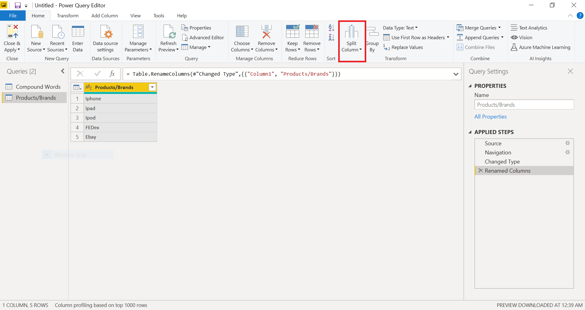

# Split Columns By Uppercase to Lowercase

In Power Query, you can create a split a column through different functions.
In this case, the column(s) selected can be split by the last Uppercase to the first Lowercase.

We will be using the following table to show the change.


The result of the transformation will be two or more columns split from the original column.


# Option One: Home Tab Split Columns By Uppercase to Lowercase 

Select the column that we want to split, then go to the **Split Column** option from the *Text column* group:



After clicking the **Split Column** option, click the suboption **By Uppercase to Lowercase**.


The final outcome will be the singular column split into multiple given every instance of the last Uppercase letter to the next Lowercase letter.


# Option Two: Transform Tab Split Columns By Uppercase to Lowercase 

Go to the top left hand corner and click on the *Transform* tab. Then follow the same directions given for ***Option 1: Home Tab Split Columns By Uppercase to Lowercase***.


# Option Three: Split Column By Uppercase to Lowercase Function into Formula Bar

On the top of the table there is a formula bar that can compute functions. 


Instead of using the graphical interface, there is an option to insert a function into the formula bar to do the same action. Copy and Paste the following lines of code, with personaled inputs in the <> brackets, into the formula bar and then press **Enter**.

```
= Table.SplitColumn(#"Changed Type", "<insert column name>", Splitter.SplitTextByCharacterTransition({"A".."Z"}, {"a".."z"}), {"<insert new column name #1>", "<insert new column name #2>"})

```
The result will split the first column into the multiple columns by the last Uppercase with a Lowercase following.


