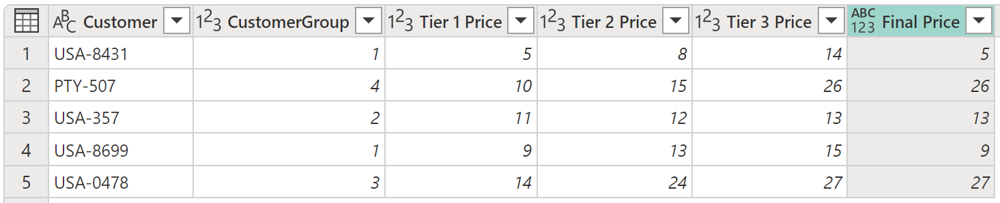

# Add a conditional column

With Power Query, you can create new columns whose values will be based on one or more conditions applied to other columns in your table.

The **Conditional column** command is located on the **Add column** tab, in the **General** group.

## Adding a conditional column

In this example, you'll be using the table shown in the following image.

In this table, you have a field that gives you the **CustomerGroup**. You also have different prices applicable to that customer in the **Tier 1 Price**, **Tier 2 Price**, and **Tier 3 Price** fields. In this example, your goal is to create a new column with the name **Final Price** based on the value found in the **CustomerGroup** field. If the value in the **CustomerGroup** field is equal to 1, you'll want to use the value from the **Tier 1 Price** field; otherwise, you'll use the value from the **Tier 3 Price**.

To add this conditional column, select **Conditional column**. In the **Add conditional column** dialog box, you can define three sections numbered in the following image.

1. **New column name**: You can define the name of your new column. In this example, you'll use the name **Final Price**.
2. **Conditional clauses**: Here you define your conditional clauses. You can add more clauses by selecting **Add clause**. Each conditional clause will be tested on the order shown in the dialog box, from top to bottom. Each clause has four parts:
   - **Column name**: In the drop-down list, select the column to use for the conditional test. For this example, select **CustomerGroup**.  
   - **Operator**: Select the type of test or operator for the conditional test. In this example, the value from the **CustomerGroup** column has to be equal to 1, so select **equals**. 
   - **Value**: You can enter a value or select a column to be used for the conditional test.  For this example, enter **1**.
   - **Output**: If the test is positive, the value entered here or the column selected will be the output. For this example, if the **CustomerGroup** value is equal to 1, your **Output** value should be the value from the **Tier 1 Price** column.
3. **Final Else clause**: If none of the clauses above yield a positive test, the output of this operation will be the one defined here, as a manually entered value or a value from a column. In this case, the output will be the value from the **Tier 3 Price** column.

The result of that operation will give you a new **Final Price** column.

>[!NOTE]
> New conditional columns won't have a data type defined. You can add a new step to define a data type for this newly created column by following the steps described in [Data types in Power Query](data-types.md).

## Adding and organizing multiple clauses

For this example, let's change your goal. Your new conditional clauses are:

- If the value from the **CustomerGroup** column is equal to 1, the **Output** will be the value from the **Tier 1 Price** column.
- If the value from the **CustomerGroup** column is equal to 2, the **Output** will be the value from the **Tier 2 Price** column.
- If none of the previous tests are positive, the **Output** will be the value from the **Tier 3 Price** column.

>[!NOTE]
>At the end of each clause, you can select the ellipsis button (...) to delete, move up, or move down the clause.

The result of that operation will give you the result that you're looking for.

