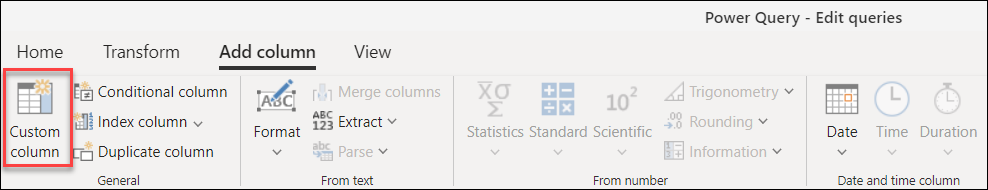
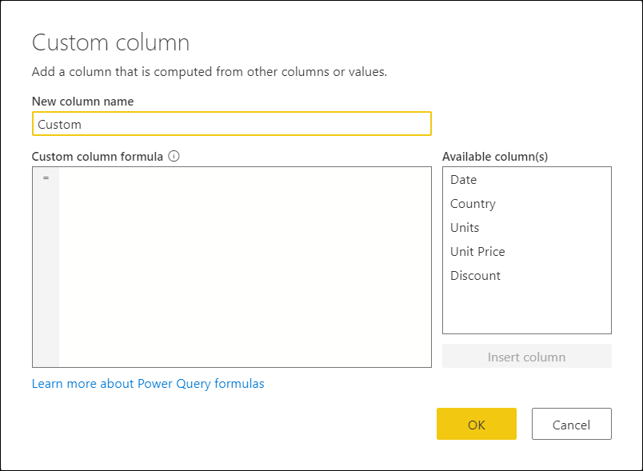
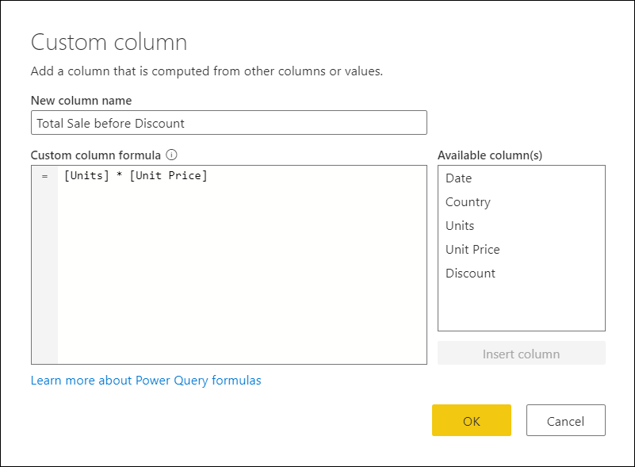
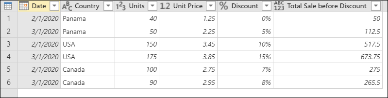
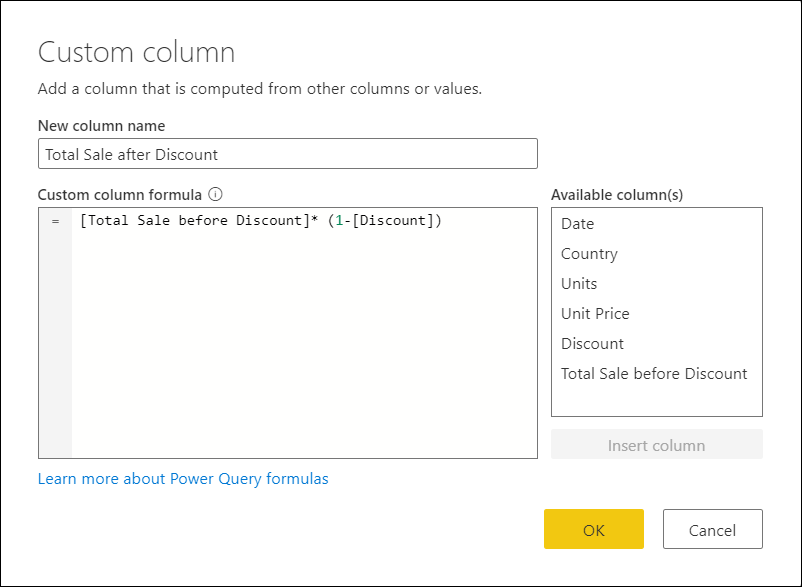
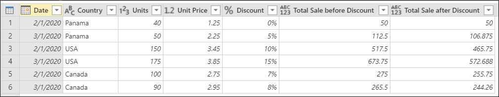
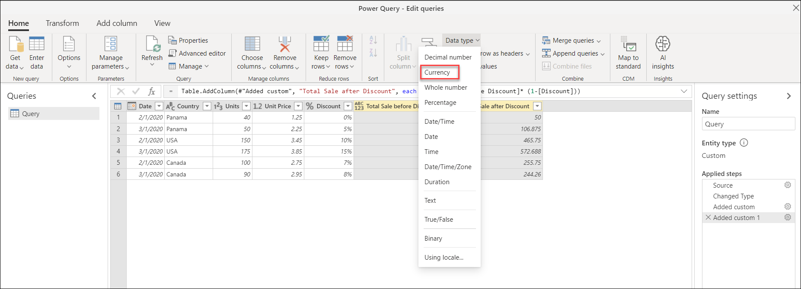
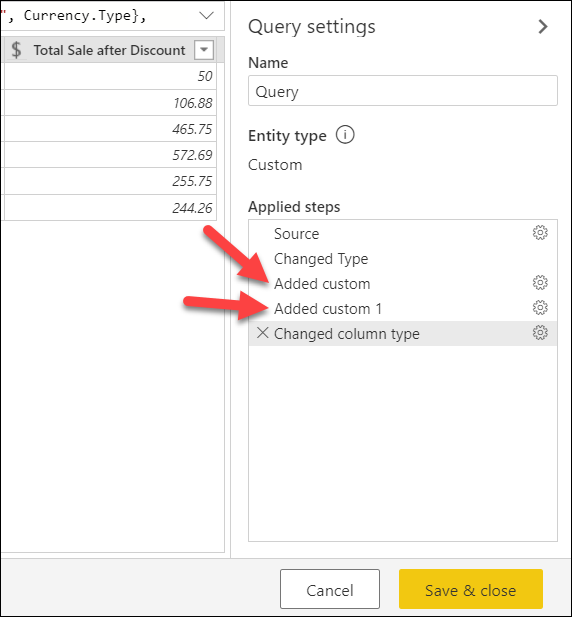

# Add a custom column

If you need more flexibility for adding new columns than the ones provided out of the box in Power Query, then you can create your custom column using the Power Query M formula language putting a comprehensive function reference content set at your fingertips.

Imagine that you have the following table with a set of columns. 

Using the **Units**, **Unit Price**, and **Discount** columns, you would like to create two new columns:

* **Total Sale before Discount**&mdash;calculated by multiplying the **Units** column times the **Unit Price** column.
* **Total Sale after Discount**&mdash;calculated by multiplying the **Total Sale before Discount** column by the net percentage value (one minus the discount value).

The final table with the new columns will look like the table in the following image.

## To add a custom column

To create a custom column, select the **Custom Column** button from the **Add Column** tab on the ribbon.

After selecting the custom column, a new **Add Custom Column** window appears.

This window is where you define the formula to create your columns.

The **Add Custom Column** window has the following features: 
- A list of available columns in the **Available columns** list on the right.

- The initial name of your custom column in the **New column name** box. You can rename this column.

- [Power Query M formula](https://docs.microsoft.com/powerquery-m/power-query-m-function-reference) in the **Custom column formula** box.  

To add a new custom column, select a column from the **Available columns** list on the right. Then select **Insert column** below the list to add them to the custom column formula. You can also add a column by double-clicking it in the list. Alternatively, you can write your own formula using the Power Query M formula language in the **Custom column formula** text box.

>[!Note]
>If there's a syntax error when creating your custom column, you'll see a yellow warning icon, along with an error message and reason. 

### Adding the Total Sales before Discount column

The formula that you can use to create the **Total Sales before Discount** is `[Units] * [Unit Price]`. The following image shows how it will look in your **Custom column** window.

The result of that operation will add a new **Total Sales before Discount** column to your table and will look like the following image:

### Adding the Total Sales after Discount column

The formula that you can use to create the **Total Sales before Discount** is `[Total Sales before Discount]* (1-[Discount]) `. The following image shows how it will look in your **Custom column** window.

The result of that operation will add a new **Total Sales after Discount** column to your table and will look like the following image:

### Setting the column data types

Notice that your new columns don't have a data type defined yet. You can tell this by looking at the icon in the header of the column that has the* data type icon (ABC123). You'll want to change the data types of both new columns to the type currency. 

To change the data types:

1. Select both the **Total Sales before Discount** and **Total Sales after Discount** columns.

2. Open the **Home** tab.

3. In **Transform** group, select the **Data Type** dropdown.

4. Select the **Currency** data type.

After defining the data types for both columns, your table will looks like the following image.

## Modify an existing custom column

Power Query adds your custom column to the table, and adds the **Added custom** step to your query's **Applied steps** list in **Query settings**.

To modify your custom column, double-click the **Added custom** step in the **Applied steps** list. 

The **Add Custom Column** window appears with the custom column formula you created.
   
## Next steps

- You can create a custom column in other ways, such as creating a column based on examples you provide to Query Editor. For more information, see [Add a column from an example](column-from-example.md).

- For Power Query M reference information, see [Power Query M function reference](/powerquery-m/power-query-m-function-reference).
