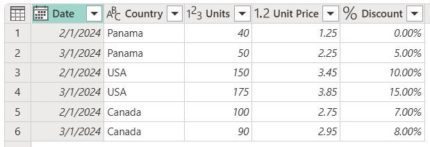
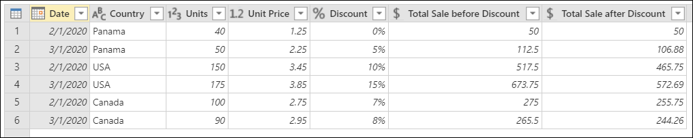
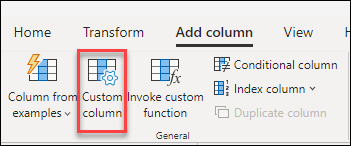
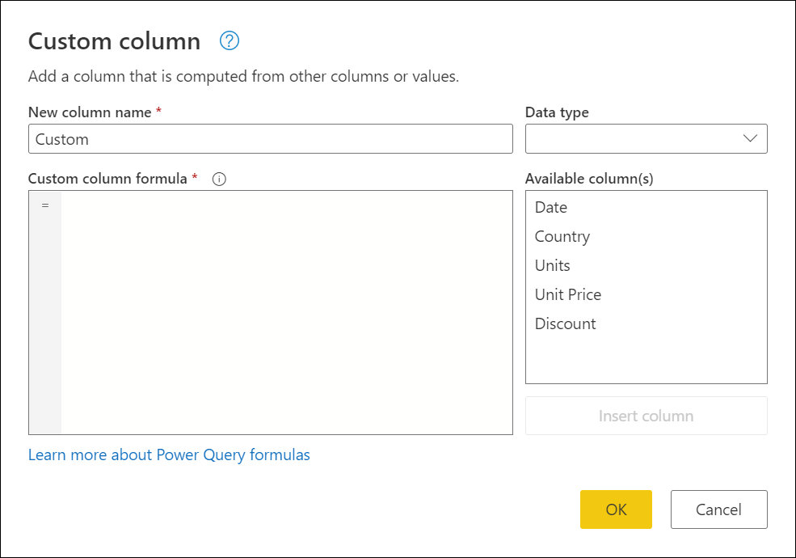
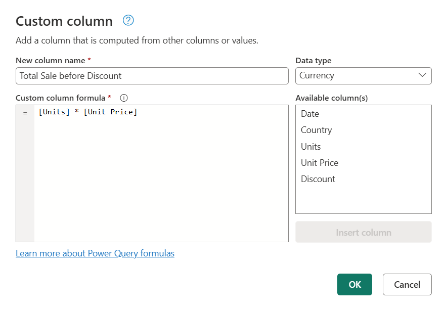
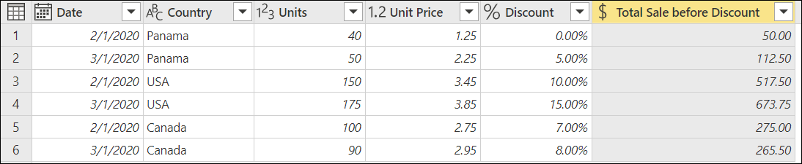
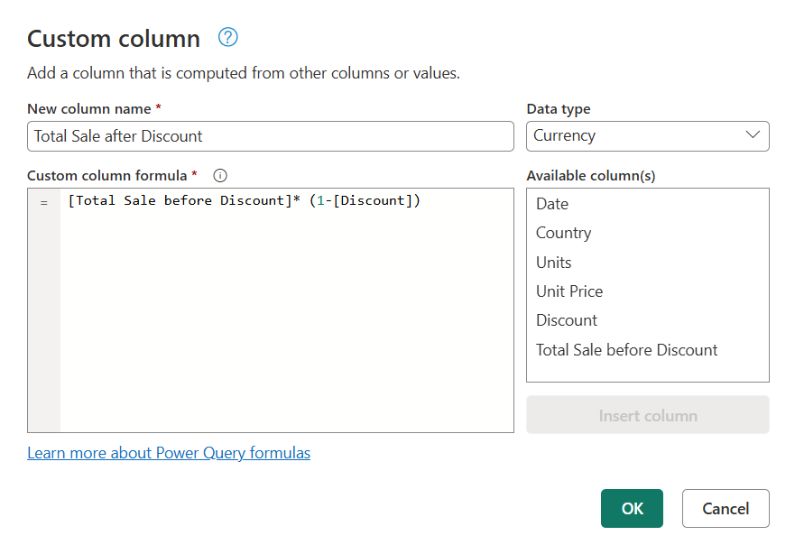
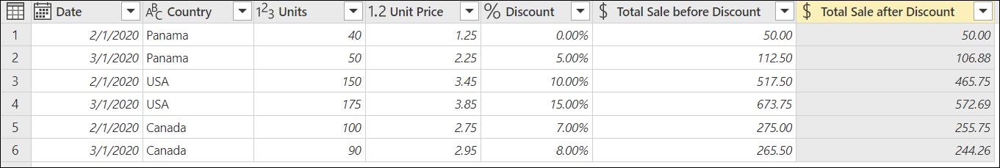
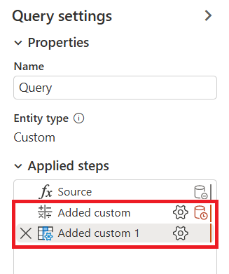

# Add a custom column

If you need more flexibility for adding new columns than the ones provided out of the box in Power Query, you can create your own custom column using the Power Query M formula language.

Imagine that you have a table with the following set of columns.

Using the **Units**, **Unit Price**, and **Discount** columns, you'd like to create two new columns:

* **Total Sale before Discount**: Calculated by multiplying the **Units** column times the **Unit Price** column.
* **Total Sale after Discount**: Calculated by multiplying the **Total Sale before Discount** column by the net percentage value (one minus the discount value).

The goal is to create a table with new columns that contain the total sales before the discount and the total sales after the discount.

## Create a custom column

On the **Add column** tab, select **Custom column**.

The **Custom column** dialog box appears. This dialog box is where you define the formula to create your column.

The **Custom column** dialog box contains:

* The initial name of your custom column in the **New column name** box. You can rename this column.

* A dropdown menu where you can select the data type for your new column.

* An **Available columns** list on the right underneath the **Data type** selection.

* A **Custom column formula** box where you can enter a [Power Query M formula](/powerquery-m/power-query-m-function-reference).  

To add a new custom column, select a column from the **Available columns** list. Then, select the **Insert column** button below the list to add it to the custom column formula. You can also add a column by selecting it in the list. Alternatively, you can write your own formula by using the Power Query M formula language in **Custom column formula**.

>[!Note]
>If a syntax error occurs when you create your custom column, you'll see a yellow warning icon, along with an error message and reason.

### Adding the Total Sale before Discount column

The formula you can use to create the **Total Sale before Discount** column is `[Units] * [Unit Price]`. In **Data type**, select the **Currency** data type.

The result of that operation adds a new **Total Sale before Discount** column to your table.

>[!NOTE]
>If you're using Power Query Desktop, you'll notice that the **Data type** field isn't available in **Custom column**. This means that you'll need to define a data type for any custom columns after creating the columns. More information: [Data types in Power Query](data-types.md#how-to-define-a-column-data-type)

### Adding the Total Sale after Discount column

The formula that you can use to create the **Total Sale before Discount** is `[Total Sale before Discount]* (1-[Discount])`. Set the data type of this new column to **Currency**.

The result of that operation adds a new **Total Sale after Discount** column to your table.

## Modify an existing custom column

Power Query adds your custom column to the table and adds the **Added custom** step to the **Applied steps** list in **Query settings**.

To modify your custom column, select the **Added custom** step in the **Applied steps** list.

The **Custom column** dialog box appears with the custom column formula you created.

>[!NOTE]
>Depending on the formula you've used for your custom column, Power Query changes the settings behavior of your step for a more simplified and native experience. For this example, the **Added custom** step changed its behavior from a standard custom column step to a *Multiplication* experience because the formula from that step only multiplies the values from two columns.

## Next steps

* You can create a custom column in other ways, such as creating a column based on examples you provide to Power Query Editor. More information: [Add a column from an example](column-from-example.md)
* For Power Query M reference information, go to [Power Query M function reference](/powerquery-m/power-query-m-function-reference).
