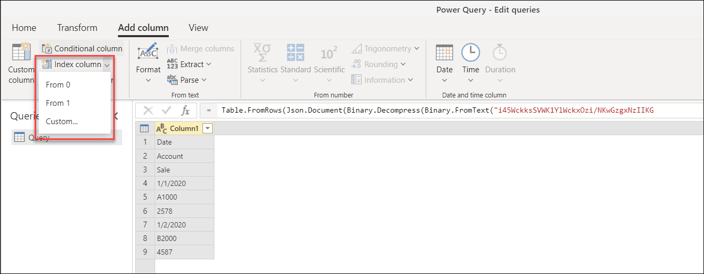
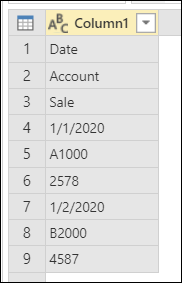
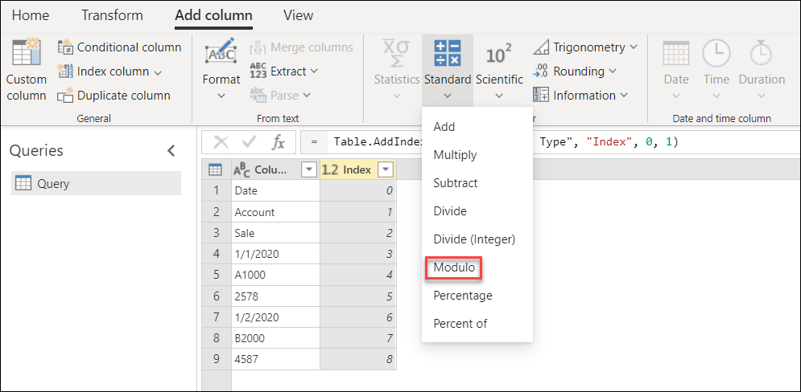
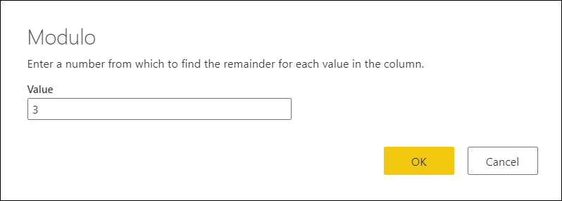
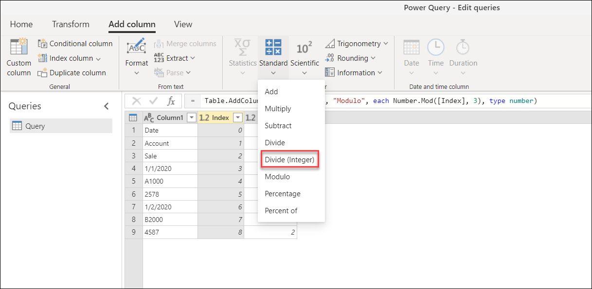

# Add an index column

**Index column** adds a new column to the table with explicit position values, and is usually created to support other transformation patterns.

By default, the starting index will start from the value 0 and have an increment of 1 per row.

You can also configure the behavior of this step by selecting the **Custom** option and configuring the two parameters:

* **Starting Index**&mdash;specifies the initial index value. 
* **Increment**&mdash;specifies how much to increment each index value.

## Example

For this example, you have the following table with only one column, but notice the data pattern within the column.

Let's say you want to transform that table into the one shown in the following image, with the columns **Date**, **Account**, and **Sale**.

### Add Index column

To add an index column, you first need to add a new **Index** column to your table that starts from 0.

### Add Modulo column from Index column

The next step is to select the newly added index column. Go to the **Add column** tab and select **Modulo** from the **Standard** dropdown menu inside the **From number** group.

Inside the **Modulo** window, enter the number from which to find the remainder for each value in the column. In this case, your pattern repeats itself every three rows, so you'll enter the value **3**.

The result of that operation will give you a new column called **Modulo**.

### Add Integer-divide column from Index column

Select the **Index** column, go to the **Add column** tab, and select **Divide (Integer)** from the **Standard** dropdown menu inside the **From number** group.

Inside the **Integer-divide** window, enter a number by which to integer-divide each value in the column. In this case, your pattern repeats itself every three rows, so enter the value **3**.

After removing the **Index column**, as you no longer need it, your table looks like this.

### Pivot a column

Your table now has three columns where:
* **Column1**&mdash;contains the values that should be inside the final table.
* **Modulo**&mdash;provides the column position of the value (similar to the y coordinates of an xy chart).
* **Integer-division**&mdash;provides the row position of the value (similar to the x coordinates of an xy chart).

To achieve the desired table, you need to pivot the **Modulo** column using the values from **Column1** where these values don't get aggregated. Go to the **Transform** tab, select the **Modulo** column, and then select the **Pivot column** icon from the **Any column** group. Inside the **Pivot column** window, select the **Advanced** section. Make sure **Value column** is set to **Column1** and **Aggregate values function** to **Don't aggregate**.

>[!Note]
>For more information about the Pivot column operation inside of Power Query, see [Pivot columns](pivot-columns.md).

The result of that operation will give you a table with four columns.

### Cleaning the table

You can now delete the **Integer-division** column and promote the first row of the table to become the headers of your table.

 >[!Note]
>For more information about the Promote headers operation inside of Power Query, see [Promote / Demote Headers](table-promote-demote-headers.md).

After defining the correct data types for your columns, your final table has exactly the three columns that you needed and the shape that you were looking for.

