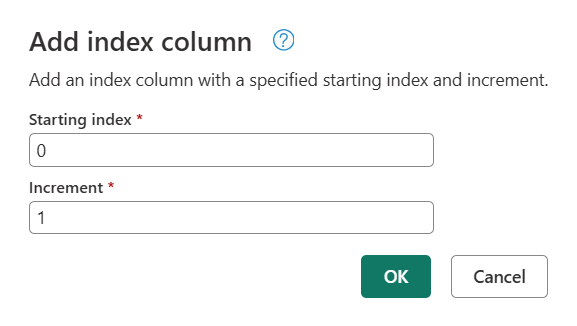
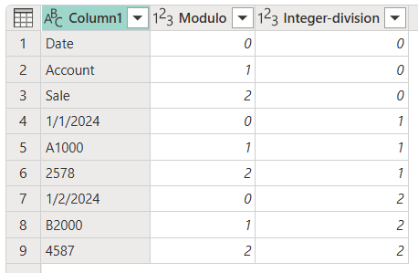
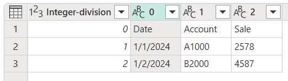

# Add an index column

The **Index column** command adds a new column to the table with explicit position values, and is usually created to support other transformation patterns.

By default, the starting index will start from the value 0 and have an increment of 1 per row.

You can also configure the behavior of this step by selecting the **Custom** option and configuring two parameters:

* **Starting index**: Specifies the initial index value.
* **Increment**: Specifies how much to increment each index value.

For the example in this article, you start with the following table that has only one column, but notice the data pattern in the column.

Let's say that your goal is to transform that table into the one shown in the following image, with the columns **Date**, **Account**, and **Sale**.

## Step 1. Add an index column

You first need to add a new **Index** column to your table that starts from 0.

## Step 2. Add a modulo column from the index column

The next step is to select the newly added index column, and then on the **Add column** tab, select **Standard** > **Modulo**.

In the **Modulo** dialog box, enter the number from which to find the remainder for each value in the column. In this case, your pattern repeats itself every three rows, so you'll enter **3**.

The result of that operation will give you a new column named **Modulo**.

## Step 3. Add an integer-divide column from the index column

Select the **Index** column, go to the **Add column** tab, and then select **Standard** > **Divide (Integer)**.

 button on the Add column tab")

In the **Integer-divide** dialog box, enter a number by which to divide each value in the column. In this case, your pattern repeats itself every three rows, so enter the value **3**.

 dialog box")

Remove the **Index** column, because you no longer need it. Your table now looks like the following image.

## Step 4. Pivot a column

Your table now has three columns where:

* **Column1** contains the values that should be in the final table.
* **Modulo** provides the column position of the value (similar to the y coordinates of an xy chart).
* **Integer-division** provides the row position of the value (similar to the x coordinates of an xy chart).

To achieve the table you want, you need to pivot the **Modulo** column by using the values from **Column1** where these values don't get aggregated. On the **Transform** tab, select the **Modulo** column, and then select **Pivot column** from the **Any column** group. In the **Pivot column** dialog box, select the **Advanced** option button. Make sure **Value column** is set to **Column1** and **Aggregate values function** is set to **Don't aggregate**.

More information: [Pivot columns](pivot-columns.md)

The result of that operation will give you a table with four columns, as shown in the following image.

## Step 5. Clean the table

You can now delete the **Integer-division** column and promote the first row of the table to become the headers of your table. More information: [Promote or demote column headers](table-promote-demote-headers.md)

After defining the correct data types for your columns, you'll create a table that looks like the following table, with exactly the three columns that you needed and the shape that you were looking for.

