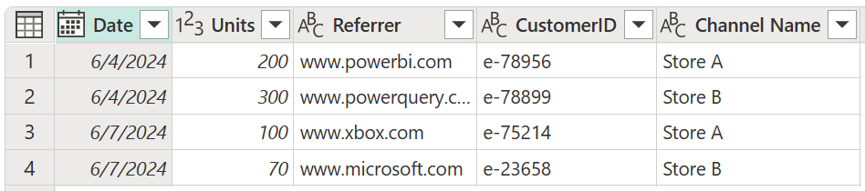
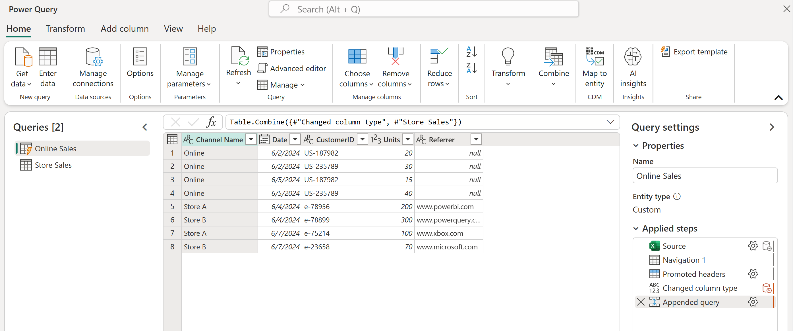
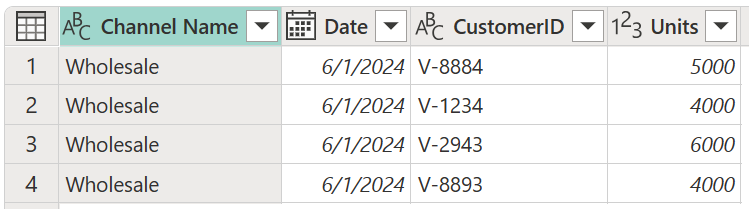
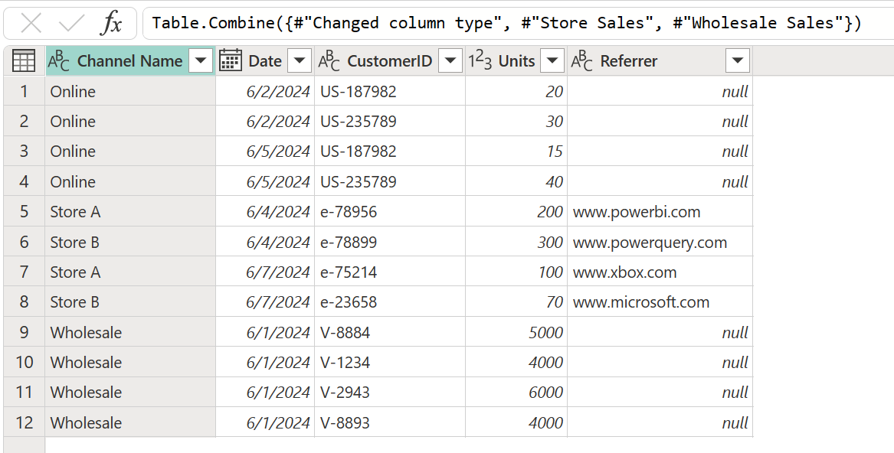

# Append queries

The append operation creates a single table by adding the contents of one or more tables to another, and aggregates the column headers from the tables to create the schema for the new table.

>[!NOTE]
>When tables that don't have the same column headers are appended, all column headers from all tables are appended to the resulting table. If one of the appended tables doesn't have a column header from other tables, the resulting table shows *null* values in the respective column, as shown in the previous image in columns C and D.

You can find the **Append queries** command on the **Home** tab in the **Combine** group. On the drop-down menu, you'll see two options:

* **Append queries** displays the **Append** dialog box to add additional tables to the current query.
* **Append queries as new** displays the **Append** dialog box to create a new query by appending multiple tables.

:::image type="content" source="media/append-queries/append-queries-icons.png" alt-text="Append queries commands.":::

The append operation requires at least two tables. The **Append** dialog box has two modes:

* **Two tables**: Combine two table queries together. This mode is the default mode.
* **Three or more tables**: Allow an arbitrary number of table queries to be combined.

>[!Note]
>The tables will be appended in the order in which they're selected, starting with the **Primary table** for the **Two tables** mode and from the primary table in the **Tables to append** list for the **Three or more tables** mode.

## Append two tables

For the example in this article, we'll use the following two tables with sample data:

* **Online Sales**: Sales made through an online channel.

    

* **Store Sales**: Sales made through the company's physical locations.

    

To append these tables, first select the **Online Sales** table. On the **Home** tab, select **Append queries**, which creates a new step in the **Online Sales** query. The **Online Sales** table will be the primary table. The table to append to the primary table will be **Store Sales**.

:::image type="content" source="media/append-queries/append-queries-sample-two-tables-window.png" alt-text="Append two tables.":::

Power Query performs the append operation based on the names of the column headers found on both tables, and not based on their relative position in the headers sections of their respective tables. The final table will have all columns from all tables appended.

In the event that one table doesn't have columns found in another table, *null* values will appear in the corresponding column, as shown in the **Referer** column of the final query.

## Append three or more tables

In this example, you want to append not only the **Online Sales** and **Store Sales** tables, but also a new table named **Wholesale Sales**.

The new approach for this example is to select **Append queries as new**, and then in the **Append** dialog box, select the **Three or more tables** option button. In the **Available table(s)** list, select each table you want to append, and then select **Add**. After all the tables you want appear in the **Tables to append** list, select **OK**.

:::image type="content" source="media/append-queries/append-queries-sample-three-more-tables-window.png" alt-text="Three or more tables mode.":::

After selecting **OK**, a new query will be created with all your tables appended.

