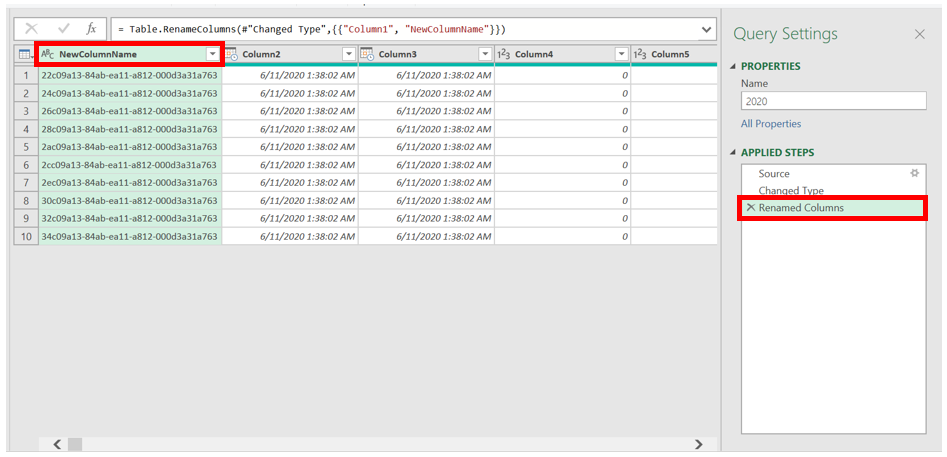
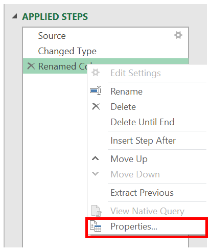
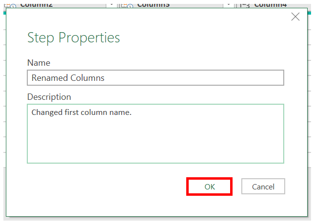

# Using the APPLIED STEPS list
APPLIED STEPS tracks the transforms to your data. In this guide you will learn to 
- Access the APPLIED STEPS pane
- View transforms to your data
- Edit step names and their descriptions

## Access the APPLIED STEPS pane
Select the **View** tab from the ribbon and then select **Query Settings**

The **Query Settings** menu will open to the right with the **APPLIED STEPS** pane.

## View transforms to your data
Any transformations to your data will show in the APPLIED STEPS pane. For instance, if we change the first column name, it will display in the APPLIED STEPS pane as **Renamed Columns**.

## Edit step names and their descriptions

To edit the APPLIED STEP, right click on the step and select **Properties**.

In the window you can change the APPLIED STEP name and description and save by selecting **OK**.

