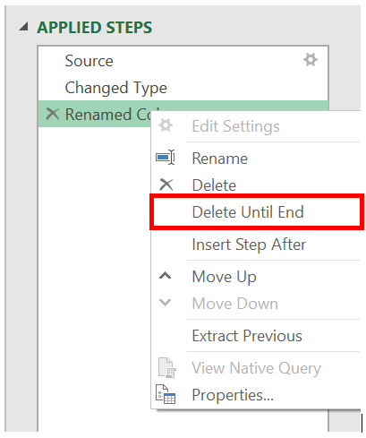
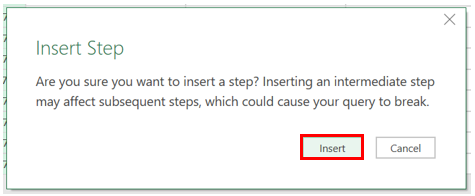
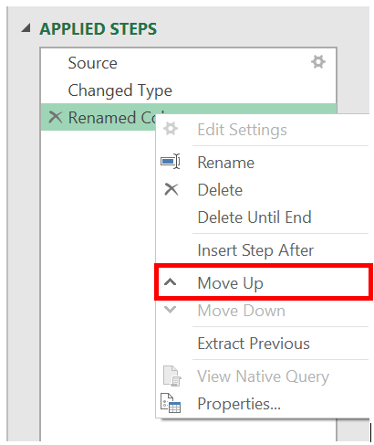

# Using the Applied steps list
Applied steps tracks the transforms to your data. In this guide you will learn to 
- Access the Applied steps list
- View data transformations
- Rename Step
- Delete Step
- Delete until end
- Insert step after 
- Move step
- Extract the previous steps into query 
- Edit step names and their descriptions

## Access the Applied steps list
Select the **View** tab from the ribbon and then select **Query Settings**

The **Query Settings** menu will open to the right with the **Applied steps** list.

## View data transformations
Any transformations to your data will show in the Applied steps list. For instance, if we change the first column name, it will display in the Applied steps list as **Renamed Columns**.

## Rename Step
To rename a step, right click the step and select **Rename**. 

Enter in the desired name and hit **Enter** or click away from the step.

## Delete Step
To delete a step, right click the step and select **Delete**.

Alternatively, select the **x** next to the step.

## Delete until end
To delete a series of steps, right click the first step of the series and select **Delete until end**. This will delete the selected step and all the subsequent steps.

Select **Delete** on the new window.

The Applied steps list after using the **Delete until end**.

## Insert step after
To add a new step, right click on the last step in the list and select **Insert step after**.

To insert a new intermediate step, right click on a step and select **Insert step after**. Then select **Insert** on the new window.

To set a transformation for the new step, select it in the list and make the change to the data. It will automatically link the transformation to the selected step.

## Move step
To move a step up one position in the list, right click the step and select **Move up**.

To move a step down one position in the list, right click the step and select **Move down**.

Alternatively, or to move more than a single position, drag and drop the step to the desired location.

## Extract the previous steps into query
It can help to separate a series of transformations into a different query. To extract all the previous steps into a new query, right click the first step you do *not* want to include in the query and select **Extract Previous**.

Name the new query and select **OK**. To access the new query, navigate to the **Queries pane** on the left side of the screen.

## Edit step names and their descriptions
To edit the step, right click the step and select **Properties**.

In the window you can change the step name and description and save the changes by selecting **OK**.

