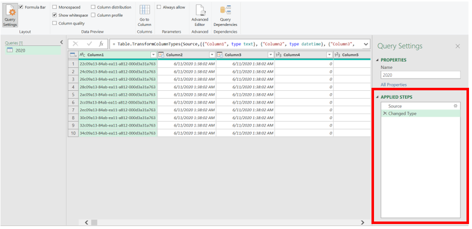
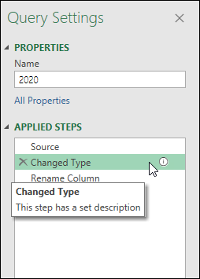

# Using the Applied Steps list

Any transformations to your data will show in the **Applied Steps** list. For instance, if you change the first column name, it will display in the **Applied Steps** list as **Renamed Columns**.

Selecting any step will show you the results of that particular step, so you can see exactly how your data changes as you add steps to the query.

## Access the Applied Steps list

Select the **View** tab from the ribbon, and then select **Query Settings**.

:::image type="content" source="media/applied-steps/applied-steps-view.png" alt-text="Applied steps view.":::

The **Query Settings** menu will open to the right with the **Applied Steps** list.

## Rename step

To rename a step, right-click the step and select **Rename**.

:::image type="content" source="media/applied-steps/applied-steps-rename.png" alt-text="Applied steps rename step.":::

Enter in the name you want, and then either select **Enter** or click away from the step.

## Delete step

To delete a step, right-click the step and select **Delete**.

:::image type="content" source="media/applied-steps/applied-steps-delete.png" alt-text="Applied steps delete step.":::

Alternatively, select the **x** next to the step.

:::image type="content" source="media/applied-steps/applied-steps-delete-x.png" alt-text="Applied steps delete step with x.":::

## Delete until end

To delete a series of steps, right-click the first step of the series and select **Delete until end**. This action will delete the selected step and all the subsequent steps.

:::image type="content" source="media/applied-steps/applied-steps-delete-until-end.png" alt-text="Applied steps delete until end.":::

Select **Delete** in the new window.

:::image type="content" source="media/applied-steps/applied-steps-delete-until-end-warning.png" alt-text="Applied steps delete until end warning.":::

The following image shows the Applied steps list after using the **Delete until end**.

:::image type="content" source="media/applied-steps/applied-steps-delete-until-end-after.png" alt-text="Applied steps delete until end after.":::

## Insert step after

To add a new step, right-click on the last step in the list and select **Insert step after**.

:::image type="content" source="media/applied-steps/applied-steps-insert-step-after.png" alt-text="Applied steps insert step after.":::

To insert a new intermediate step, right-click on a step and select **Insert step after**. Then select **Insert** on the new window.

:::image type="content" source="media/applied-steps/applied-steps-insert-step-after-warning.png" alt-text="Applied steps insert step after warning.":::

To set a transformation for the new step, select the new step in the list and make the change to the data. It will automatically link the transformation to the selected step.

## Move step

To move a step up one position in the list, right-click the step and select **Move up**.

:::image type="content" source="media/applied-steps/applied-steps-move-up.png" alt-text="Applied steps move up.":::

To move a step down one position in the list, right-click the step and select **Move down**.

:::image type="content" source="media/applied-steps/applied-steps-move-down.png" alt-text="Applied steps move down.":::

Alternatively, or to move more than a single position, drag and drop the step to the desired location.

:::image type="content" source="media/applied-steps/applied-steps-drag-and-drop-step.png" alt-text="Applied steps drag and drop step.":::

## Extract the previous steps into query

You can also separate a series of transformations into a different query. This allows the query to be referenced for other sources, which can be helpful if you're trying to apply the same transformation to multiple datasets. To extract all the previous steps into a new query, right-click the first step you do *not* want to include in the query and select **Extract Previous**.

:::image type="content" source="media/applied-steps/applied-steps-extract-previous.png" alt-text="Applied steps extract previous.":::

Name the new query and select **OK**. To access the new query, navigate to the **Queries pane** on the left side of the screen.

## Edit step names and their descriptions

To edit the step, right-click the step and select **Properties**.

:::image type="content" source="media/applied-steps/applied-steps-properties.png" alt-text="Applied steps properties.":::

In the window, you can change the step name and description and save the changes by selecting **OK**.

:::image type="content" source="media/applied-steps/applied-steps-properties-window.png" alt-text="Applied steps properties window.":::

>[!NOTE]
> Adding a description to a step will add a small icon next to the step to denote that the step has a description. You can hover over this icon to display the description as a tooltip.
>
> 
>
