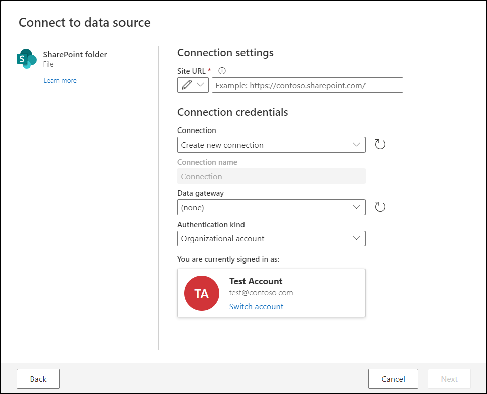

# Auto sign in for Azure Active Directory data sources

The auto sign-in feature attempts to automatically sign you in as the current user when connecting to data sources in Power Query that use Azure Active Directory as one of their authentication kinds. It does this auto sign-in to expedite the authentication process and minimize the time it takes to start working with your data.

More technically, the auto sign-in feature for Azure Active Directory data sources uses the information derived from the currently authenticated user in the Power Query Online experience. This information is then used to request a new access token for a selected data source during the connection settings and authentication steps of the [get data](get-data-experience.md#1-connection-settings) process.

>[!NOTE]
>This functionality is currently only available in Power Query Online and is enabled by default for a select set of connectors. No configuration is needed to enable this feature.

When selecting a connector that has this capability, it automatically signs you in with **Organizational account** set as the authentication kind.

>[!TIP]
>If you'd like to authenticate with a different account, select the **Switch account** link shown in the dialog.

## Further reading

* [Authentication in Power Query Online](connection-authentication-pqo.md)
* [Microsoft identity platform and OAuth 2.0 On-Behalf-Of flow](/azure/active-directory/develop/v2-oauth2-on-behalf-of-flow)