# Best practices when working with Power Query

This article contains some tips and tricks to make the most out of your data wrangling experience in Power Query.

## Choose the right connector

Power Query offers a vast number of data connectors. These connectors range from data sources such as TXT, CSV, and Excel files, to databases such as Microsoft SQL Server, and popular SaaS services such as Microsoft Dynamics 365 and Salesforce. If you don't see your data source listed in the **Get Data** window, you can always use the ODBC or OLEDB connector to connect to your data source.

Using the best connector for the task will provide you with the best experience and performance. For example, using the SQL Server connector instead of the ODBC connector when connecting to a SQL Server database not only provides you with a much better **Get Data** experience, but the SQL Server connector also offers you features that can improve your experience and performance, such as query folding. To read more about query folding, go to [Power Query query folding](power-query-folding.md).

Each data connector follows a standard experience as explained in [Getting data](get-data-experience.md). This standardized experience has a stage called **Data Preview**. In this stage, you're provided with a user-friendly window to select the data that you want to get from your data source, if the connector allows it, and a simple data preview of that data. You can even select multiple data sets from your data source through the **Navigator** window, as shown in the following image.

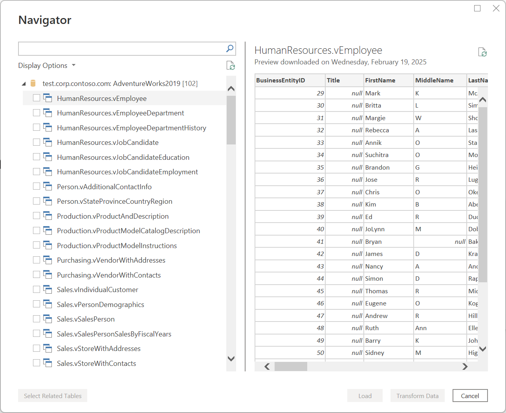

> [!NOTE]
> To see the full list of available connectors in Power Query, go to [Connectors in Power Query](connectors/index.md).

## Filter early

It's always recommended to filter your data in the early stages of your query or as early as possible. Some connectors will take advantage of your filters through query folding, as described in [Power Query query folding](power-query-folding.md). It's also a best practice to filter out any data that isn't relevant for your case. This will let you better focus on your task at hand by only showing data that’s relevant in the data preview section.

You can use the auto filter menu that displays a distinct list of the values found in your column to select the values that you want to keep or filter out. You can also use the search bar to help you find the values in your column.

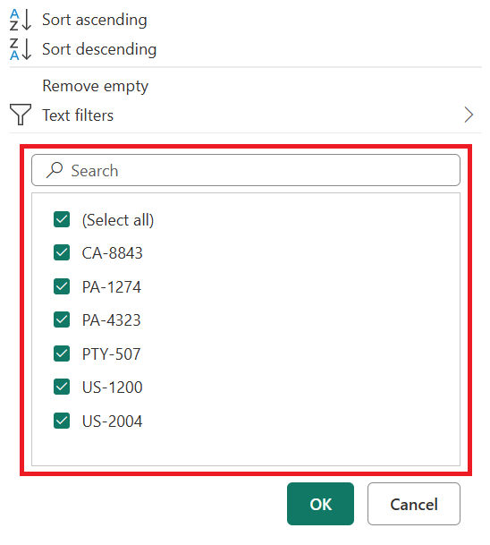

You can also take advantage of the type-specific filters such as **In the previous** for a date, datetime, or even date timezone column.

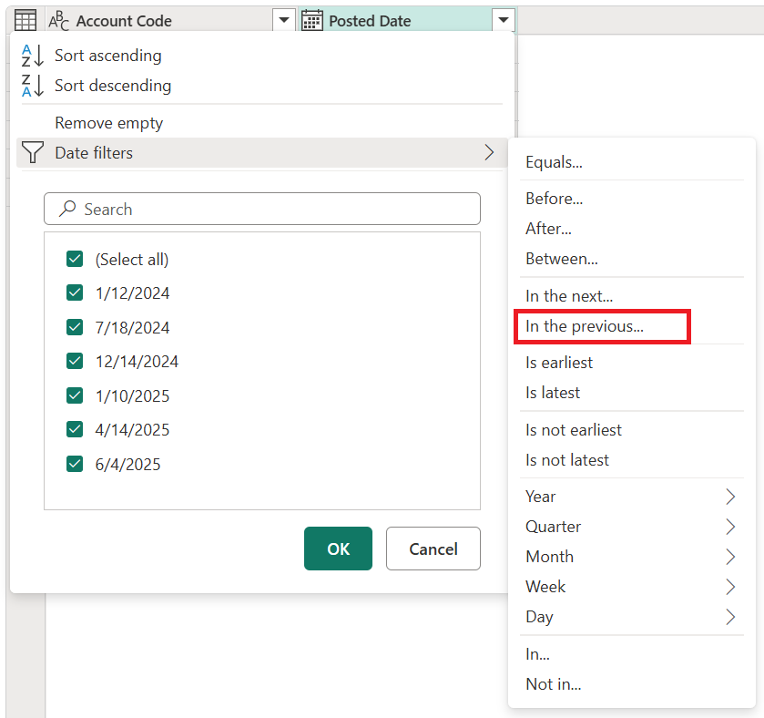

These type-specific filters can help you create a dynamic filter that will always retrieve data that's in the previous *x* number of seconds, minutes, hours, days, weeks, months, quarters, or years as showcased in the following image.

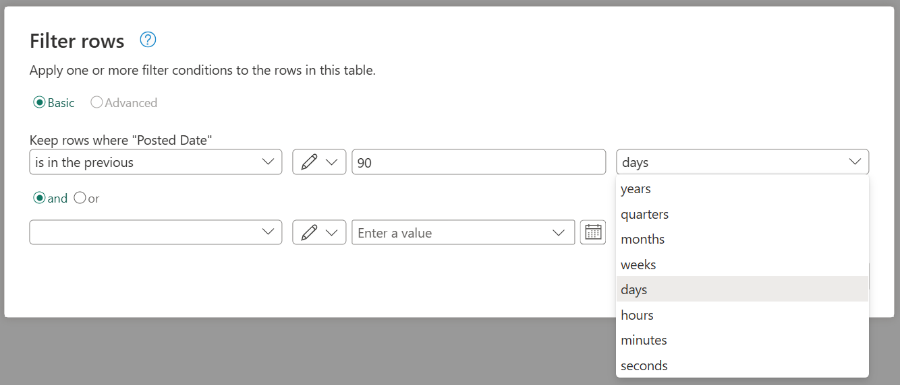

> [!NOTE]
> To learn more about filtering your data based on values from a column, go to [Filter by values](filter-values.md).

## Do expensive operations last

Certain operations require reading the full data source in order to return *any* results, and will thus be slow to preview in the Power Query Editor. For example, if you perform a sort, it's possible that the first few sorted rows are at the end of the source data. So in order to return any results, the sort operation must first read *all* the rows.

Other operations (such as filters) do not need to read all the data before returning any results. Instead, they operate over the data in what's called a "streaming" fashion. The data "streams" by, and results are returned along the way. In the Power Query Editor, such operations only need to read enough of the source data to populate the preview.

When possible, perform such streaming operations first, and do any more expensive operations last. This will help minimize the amount of time you spend waiting for the preview to render each time you add a new step to your query.

## Temporarily work against a subset of your data

If adding new steps to your query in the Power Query Editor is slow, consider first doing a "Keep First Rows" operation and limiting the number of rows you're working against. Then, once you've added all the steps you need, remove the "Keep First Rows" step.

## Use the correct data types

Some features in Power Query are contextual to the data type of the column selected. For example, when selecting a date column, the available options under the **Date and time column** group in the **Add Column** menu will be available. But if the column doesn't have a data type set, then these options will be greyed out.

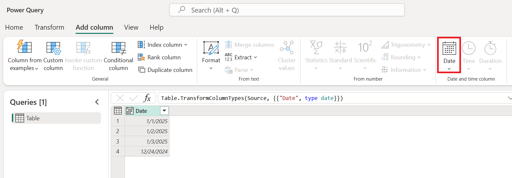

A similar situation occurs for the type-specific filters, since they're specific to certain data types. If your column doesn't have the correct data type defined, these type-specific filters won't be available.

It's crucial that you always work with the correct data types for your columns. When working with structured data sources such as databases, the data type information will be brought from the table schema found in the database. But for unstructured data sources such as TXT and CSV files, it's important that you set the correct data types for the columns coming from that data source.
By default, Power Query offers an automatic data type detection for unstructured data sources. You can read more about this feature and how it can help you in [Data types](data-types.md#automatic-detection-of-column-data-type-and-headers).

> [!NOTE]
> To learn more about the importance of data types and how to work with them, see [Data types](data-types.md).

## Explore your data

Before you start preparing you data and adding new transformation steps, we recommend that you enable the Power Query [data profiling tools](data-profiling-tools.md) to easily discover information about your data.

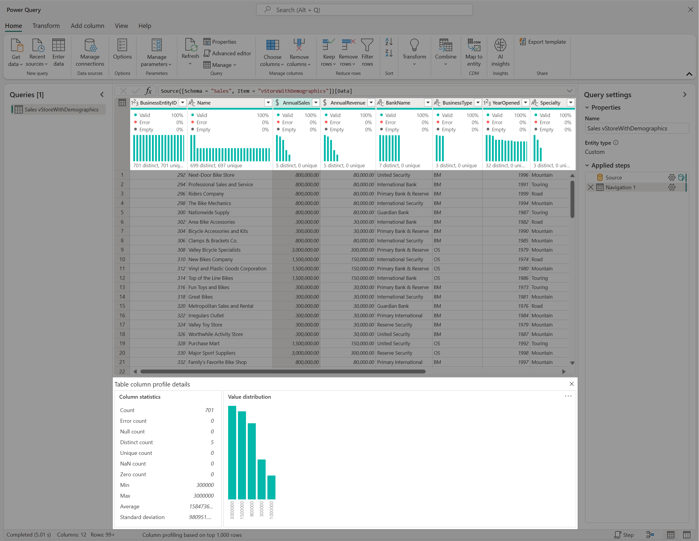

These data profiling tools help you better understand your data. The tools provide you with small visualizations that show you information on a per column basis, such as:

* **Column quality**&mdash;Provides a small bar chart and three indicators with the representation of how many values in the column fall under the categories of valid, error, or empty values.
* **Column distribution**&mdash;Provides a set of visuals underneath the names of the columns that showcase the frequency and distribution of the values in each of the columns.
* **Column profile**&mdash;Provides a more thorough view of your column and the statistics associated to it.

You can also interact with these features, which will help you prepare your data.

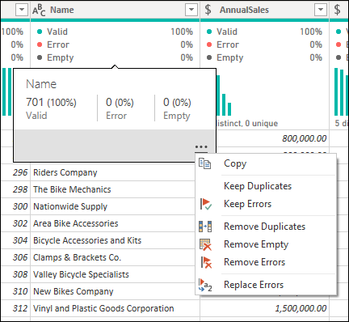

> [!NOTE]
> To learn more about the data profiling tools, go to [Data profiling tools](data-profiling-tools.md).

## Document your work

We recommend that you document your queries by renaming or adding a description to your steps, queries, or groups as you see fit.

While Power Query automatically creates a step name for you in the applied steps pane, you can also rename your steps or add a description to any of them.

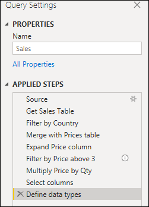

> [!NOTE]
> To learn more about all the available features and components found inside the applied steps pane, go to [Using the Applied steps list](applied-steps.md).

## Take a modular approach

It's entirely possible to create a single query that contains all the transformations and calculations that you may need. But if the query contains a large number of steps, then it might be a good idea to split the query into multiple queries, where one query references the next. The goal of this approach is to simplify and decouple transformation phases into smaller pieces so they're easier to understand.

For example, say you have a query with the nine steps shown in the following image.

You could split this query into two at the **Merge with Prices table** step. That way it's easier to understand the steps that were applied to the sales query before the merge. To do this operation, you right-click the **Merge with Prices table** step and select the **Extract Previous** option.

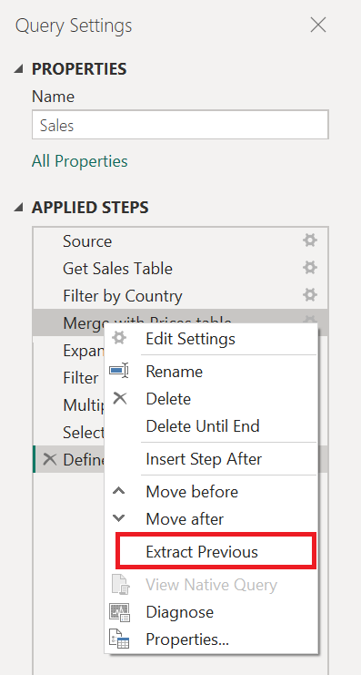

You'll then be prompted with a dialog to give your new query a name. This will effectively split your query into two queries. One query will have all the queries before the merge. The other query will have an initial step that will reference your new query and the rest of the steps that you had in your original query from the **Merge with Prices table** step downward.

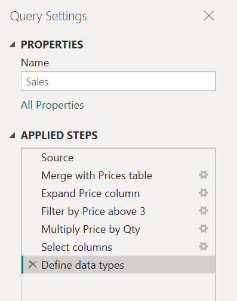

You could also leverage the use of query referencing as you see fit. But it's a good idea to keep your queries at a level that doesn't seem daunting at first glance with so many steps.

> [!NOTE]
> To learn more about query referencing, go to [Understanding the queries pane](queries-pane.md#referencing-a-query).

## Create groups

A great way to keep your work organized is by leveraging the use of groups in the queries pane.

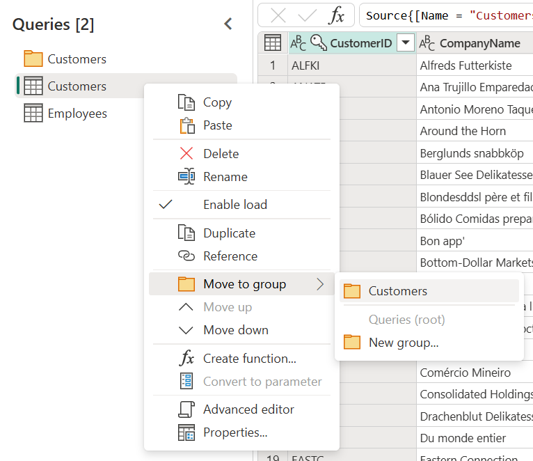

The sole purpose of groups is to help you keep your work organized by serving as folders for your queries. You can create groups within groups should you ever need to. Moving queries across groups is as easy as drag and drop.

Try to give your groups a meaningful name that makes sense to you and your case.

> [!NOTE]
> To learn more about all the available features and components found inside the queries pane, go to [Understanding the queries pane](queries-pane.md).

## Future-proofing queries

Making sure that you create a query that won't have any issues during a future refresh is a top priority. There are several features in Power Query to make your query resilient to changes and able to refresh even when some components of your data source changes.

It's a best practice to define the scope of your query as to what it should do and what it should account for in terms of structure, layout, column names, data types, and any other component that you consider relevant to the scope.

Some examples of transformations that can help you make your query resilient to changes are:

* If your query has a dynamic number of rows with data, but a fixed number of rows that serve as the footer that should be removed, you can use the **Remove bottom rows** feature.

   > [!NOTE]
   > To learn more about filtering your data by row position, go to [Filter a table by row position](filter-row-position.md).

* If your query has a dynamic number of columns, but you only need to select specific columns from your data set, you can use the **Choose columns** feature.

   > [!NOTE]
   > To learn more about choosing or removing columns, go to [Choose or remove columns](choose-remove-columns.md).

* If your query has a dynamic number of columns and you need to unpivot only a subset of your columns, you can use the **unpivot only selected columns** feature.

   > [!NOTE]
   > To learn more about the options to unpivot your columns, go to [Unpivot columns](unpivot-column.md).

* If your query has a step that changes the data type of a column, but some cells yield errors as the values don't conform to the desired data type, you could remove the rows that yielded error values.

   > [!NOTE]
   > To more about working and dealing with errors, go to [Dealing with errors](dealing-with-errors.md#remove-errors).

## Use parameters

Creating queries that are dynamic and flexible is a best practice. Parameters in Power Query help you make your queries more dynamic and flexible.
A parameter serves as a way to easily store and manage a value that can be reused in many different ways. But it's more commonly used in two scenarios:

* **Step argument**&mdash;You can use a parameter as the argument of multiple transformations driven from the user interface.

   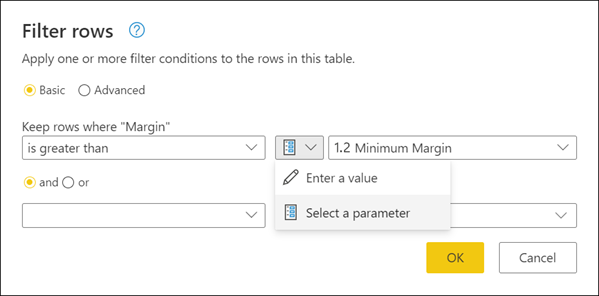

* **Custom Function argument**&mdash;You can create a new function from a query, and reference parameters as the arguments of your custom function.

   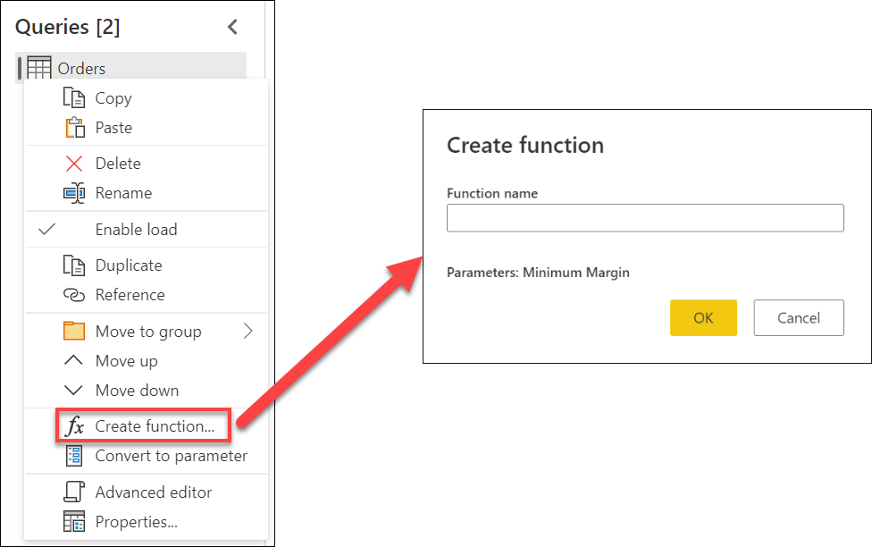

The main benefits of creating and using parameters are:

* Centralized view of all your parameters through the **Manage Parameters** window.

   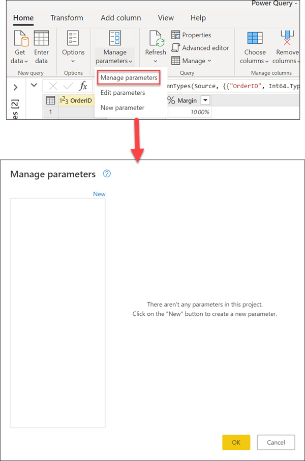

* Reusability of the parameter in multiple steps or queries.

* Makes the creation of custom functions straightforward and easy.

You can even use parameters in some of the arguments of the data connectors. For example, you could create a parameter for your server name when connecting to your SQL Server database. Then you could use that parameter inside the SQL Server database dialog.

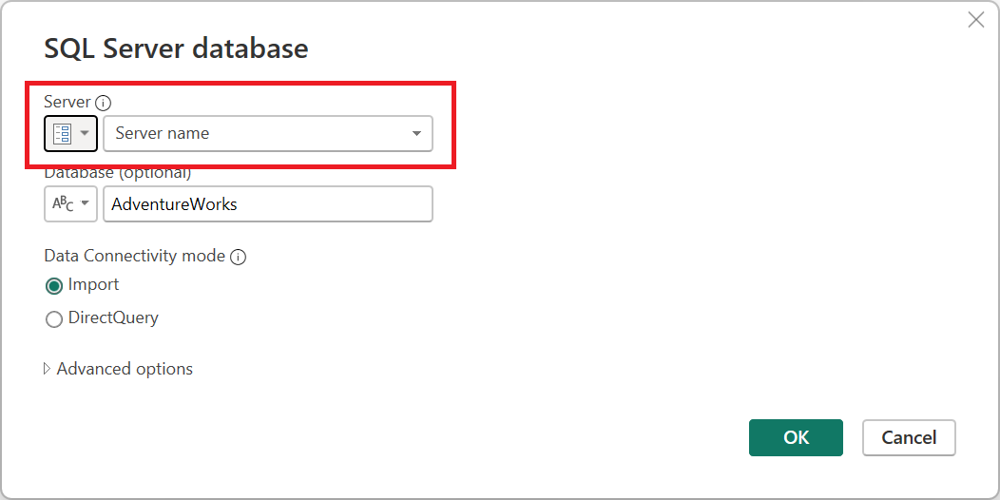

If you change your server location, all you need to do is update the parameter for your server name and your queries will be updated.

> [!NOTE]
> To learn more about creating and using parameters, go to [Using parameters](power-query-query-parameters.md).

## Create reusable functions

If you find yourself in a situation where you need to apply the same set of transformations to different queries or values, creating a Power Query custom function that can be reused as many times as you need could be beneficial. A Power Query custom function is a mapping from a set of input values to a single output value, and is created from native M functions and operators.

For example, say you have multiple queries or values that require the same set of transformations. You could create a custom function that later could be invoked against the queries or values of your choice. This custom function would save you time and help you in managing your set of transformations in a central location, which you can modify at any moment.

Power Query custom functions can be created from existing queries and parameters. For example, imagine a query that has several codes as a text string and you want to create a function that will decode those values.

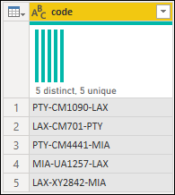

You start by having a parameter that has a value that serves as an example.

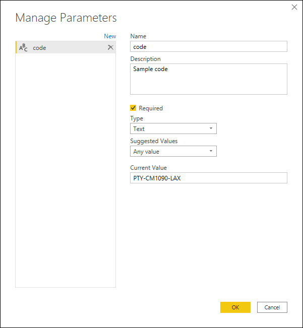

From that parameter, you create a new query where you apply the transformations that you need. For this case, you want to split the code **PTY-CM1090-LAX** into multiple components:

* **Origin** = PTY
* **Destination** = LAX
* **Airline** = CM
* **FlightID** = 1090

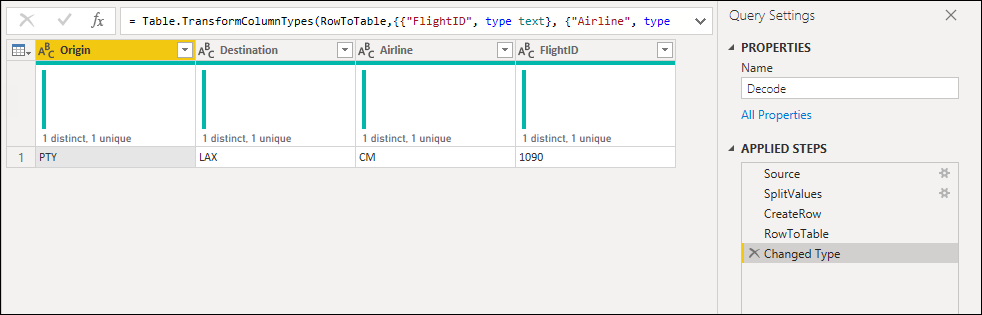

You can then transform that query into a function by doing a right-click on the query and selecting **Create Function**. Finally, you can invoke your custom function into any of your queries or values, as shown in the following image.

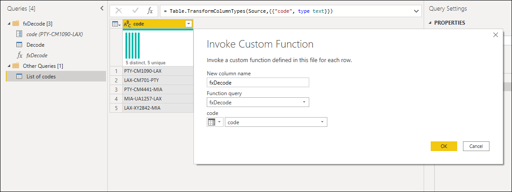

After a few more transformations, you can see that you've reached your desired output and leveraged the logic for such a transformation from a custom function.

 :::image type="content" source="media/best-practices-power-query/invoked-custom-function.png" lightbox="media/best-practices-power-query/invoked-custom-function.png" alt-text="Final output query after invoking a custom function.":::
>[!NOTE]
> To learn more about how to create and use custom functions in Power Query from the article [Custom Functions](custom-function.md).
