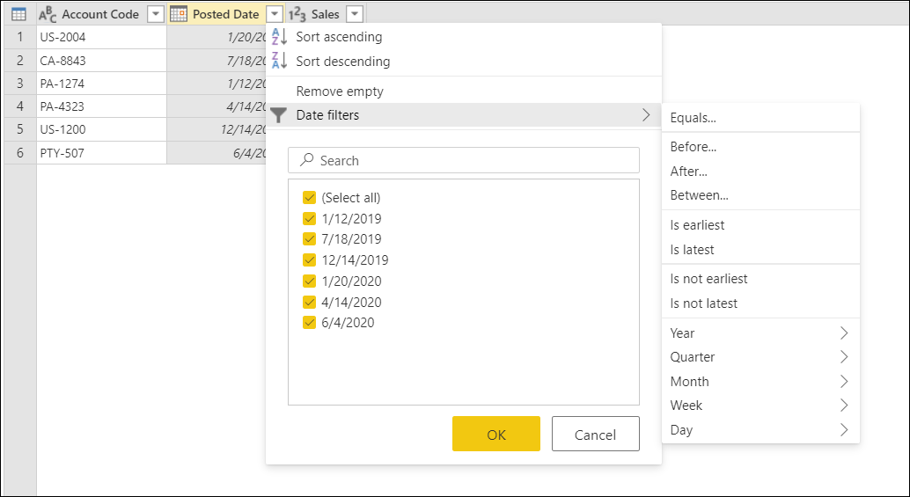
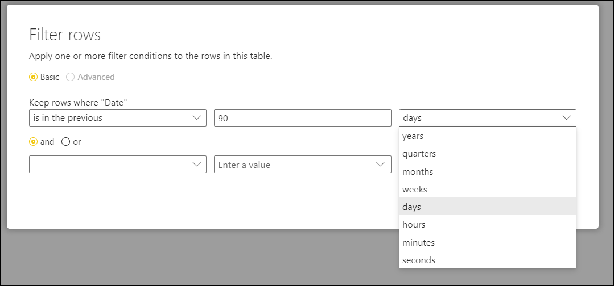
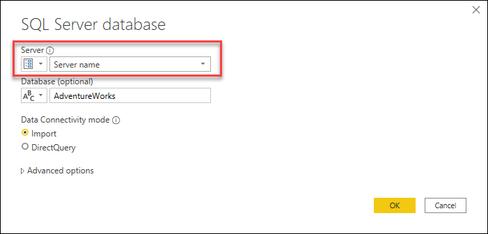
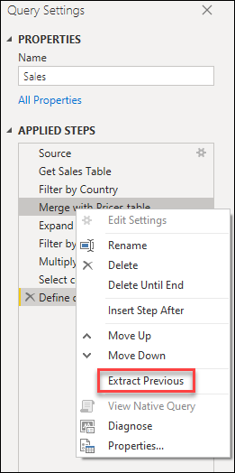
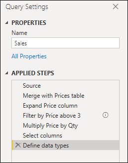

# Best practices when working with Power Query

Lorem

## Use the best connector for your task

Power Query offers a vast number of data connectors ranging from data sources such as TXT, CSV, and Excel files, to databases such as Microsoft SQL Server and popular SaaS services such as Microsoft Dynamics 365 and Salesforce. 
If you don't see your data source listed in the *Get Data* window, you can always use the ODBC or OLEDB connector to connect to your data source. 

Using the best connector for the task will provide you with the best experience and performance. For example, using the SQL Server connector instead of the ODBC connector when connecting to a SQL Server database will not only provide you with a much better *Get Data* experience, but the SQL Server connector also offers you features that can improve your experience and performance such as query folding. You can read more about query folding from the article [Power Query query folding](power-query-folding.md).

Each data connector follows a standard experience as explained in the article on [Getting data](get-data-experience.md). This standardized experience has a stage called **Data Preview** in which you're provided with a user-friendly window to select the data that you want to get from your data source, If the connector allows it, and a simple data preview of that data. You can even select multiple datasets from your datasource through the *Navigation* window as shown in the next image.

> [!NOTE]
> You can see the full list of available connectors in Power Query from the article [Connectors in Power Query](Connectors/index.md).

## Explore your data

Before you start preparing you data and adding new transformation steps, it is highly recommended that you enable the data profiling tools when using Power Query to easily discover information about your data.

These tools help you better understand your data by providing you with small visualizations that provide you with information on a per column basis such as.
* **Column quality** - Provides a small bar chart and three indicators with the representation of how many values in the column fall under the categories of valid, error, or empty values.
* **Column distribution** - This feature provides a set of visuals underneath the names of the columns that showcases the frequency and distribution of the values in each of the columns.
* **Column profile** - Provides a more thorough view of your column and the statistics associated to it.

You can also interact with these features, which will help you prepare your data.

> [!NOTE]
> You can read more about the data profiling tools from the article [Data profiling tools](data-profiling-tools.md).

## Filter your data in early steps

It is always recommended to filter your data in the early stages of your query or as early as possible. Some connectors will take advantage of your filters through query folding as described in the article [Power Query query folding](power-query-folding.md). 
It is also a best practice to filter out any data that is not relevant for your case. This will let you better focus in your task at hand also only show you the data that you're interested in within the data preview section.

You can use the Auto filter menu that displays a distinct list of the values found in your column to select the values that you want to keep or filter out. You can also use the search bar to help you find the values in your column.

You can also take advantage of the Type-specific filters such as "is in the previous" for a date, datetime or even date timezone column.

These type-specific filters can help you create a dynamic filter that will always retrieve data that is in the previous *x* number of seconds, minutes, hours, days, weeks, months, quarters, years as showcased in the image below.

> [!NOTE]
> You can read more about filtering your data based on values from a column from the article [Filter by values](filter-values.md).

## Use parameters 
Creating queries that are dynamic and flexible is a best practice. Parameters in Power Query help you make your queries more dynamic and flexible.
A parameter serves as way to easily store and manage a value that can be reused in many different ways, but it is more commonly used in two scenarios:
* **Step argument** - With the use of the User Interface you can use a parameter as the argument of multiple transformations driven from the User Interface.

* **Custom Function argument** - You can create a new function from a query and reference parameters as the arguments of your custom function.

The main benefits of creating and using parameters are.

* Centralized view of all your parameters through the **Manage Parameters** window.

* Reusability of the parameter in multiple steps or queries.

* Makes the creation of custom functions straightforward and easy.

You can even use parameters in some of the arguments of the data connectors. For example, you could create a parameter for your Server name when connecting to your SQL Server database and use that parameter inside the SQL Server database dialog as shown below.

If you change your server location, all you need to do is update the parameter for your server name and your queries will be updated.

> [!NOTE]
> You can read more about creating and using parameters from the article [Using parameters](parameters.md).

## Create groups

A great way to keep your work organized is by leveraging the use of groups in the queries pane.

The sole purpose of groups is to help you keep your work organized by serving as folders for your queries. You can create groups within groups should you ever need to. Moving queries across groups is as easy as drag and drop. 

Try to give your groups a meaningful name that makes sense to you and your case.

> [!NOTE]
> You can read more about all the available features and components found inside the queries pane from the article [Understanding the queries pane](queries-pane.md).

## Document your work 
It is highly recommended that you document your queries by renaming or adding a description to your steps, queries, or groups as you see fit. 

While Power Query automatically creates a step name for you in the applied steps pane, you can also rename your steps or add a description to any of them.

> [!NOTE]
> You can read more about all the available features and components found inside the applied steps pane from the article [Using the Applied steps list](applied-steps.md).

## Take a modular approach

While it is entirely possible to create a single query that contains all the transformations and calculations that you may need, if the query contains a large number of steps then it might be a good idea to split the query into multiple queries where one query references the next. The goal of this approach is to simplify and decouple transformation phases into smaller pieces so they're easier to understand.

For example, if you have query with the nine steps below.

You could split into two queries by having the steps before the query gets merged with the Prices table in the **Merge with Prices table** step, so it's easier to understand the steps that were applied to the Sales query before the Merge. To do this, you can right-click the **Merge with Prices table** step and select the option that reads 

You will then be prompted with a dialog to give your new query a name. This will effectively split your query into two queries. One that will have all the queries before the merge, and another one that will have an initial step that will reference your new query and the rest of the steps that you had in your original query from the **Merge with Prices table** step downward.

You could also leverage the use of query referencing as you see fit, but it's a good idea to keep your queries at a level that doesn't seem daunting at first glance with so many steps.

> [!NOTE]
> You can read more about query referencing from the article on [Understanding the queries pane](queries-pane.md#referencing-a-query).

## Use the correct data types 
(include “Detect Data Types” shortcut, and the Options to enable/disable type detection locally and globally)

## Make your query resilient to changes
    * Select columns or Remove columns

## Create reusable transformations
    * Creating functions through the UI