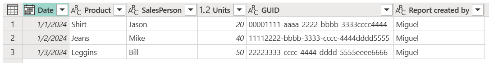
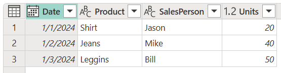
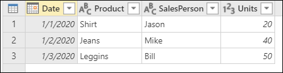
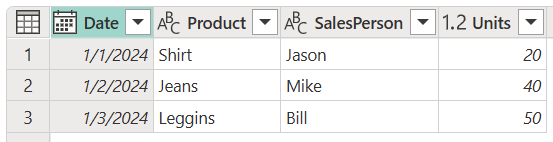
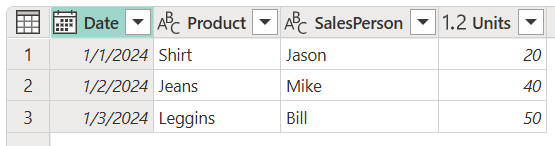

# Choose or remove columns

**Choose columns** and **Remove columns** are operations that help you define what columns your table needs to keep and which ones it needs to remove. This article will showcase how to use the **Choose columns** and **Remove columns** commands by using the following sample table for both operations.

The goal is to create a table that looks like the following image.

## Choose columns

On the **Home** tab, in the **Manage columns** group, select **Choose columns**.

:::image type="content" source="media/choose-remove-columns/choose-remove-columns-choose-columns-icon.png" alt-text="Choose columns command.":::

The **Choose columns** dialog box appears, containing all the available columns in your table. You can select all the fields that you want to keep and remove specific fields by clearing their associated check box. For this example, you want to remove the **GUID** and **Report created by** columns, so you clear the check boxes for those fields.

:::image type="content" source="media/choose-remove-columns/choose-remove-columns-choose-columns-window.png" alt-text="Choose columns dialog box.":::

After selecting **OK**, you'll create a table that only contains the **Date**, **Product**, **SalesPerson**, and **Units** columns.

## Remove columns

When you select **Remove columns** from the **Home** tab, you have two options:

* **Remove columns**: Removes the selected columns.
* **Remove other columns**: Removes all columns from the table *except* the selected ones.

:::image type="content" source="media/choose-remove-columns/choose-remove-columns-remove-columns-icon.png" alt-text="Remove columns menu options.":::

### Remove selected columns

Starting from the sample table, select the **GUID** and the **Report created** columns. Right-click to select any of the column headings. A new shortcut menu appears, where you can select the **Remove columns** command.

:::image type="content" source="media/choose-remove-columns/choose-remove-columns-remove-columns-right-click.png" alt-text="Table column shortcut menu.":::

After selecting **Remove columns**, you'll create a table that only contains the **Date**, **Product**, **SalesPerson**, and **Units** columns.

### Remove other columns

Starting from the sample table, select all the columns from the table except **GUID** and **Report created**. On the **Home** tab, select **Remove columns** > **Remove other columns**.

:::image type="content" source="media/choose-remove-columns/choose-remove-columns-remove-other-columns-icon.png" alt-text="Remove other columns command.":::

After selecting **Remove other columns**, you'll create a table that only contains the **Date**, **Product**, **SalesPerson**, and **Units** columns.

