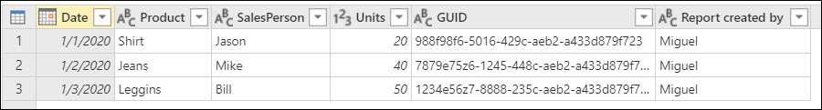
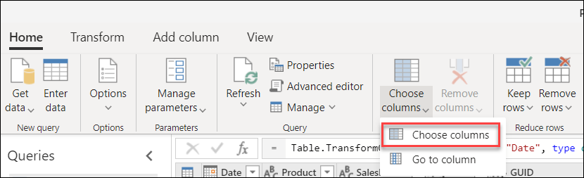
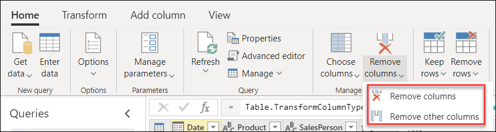
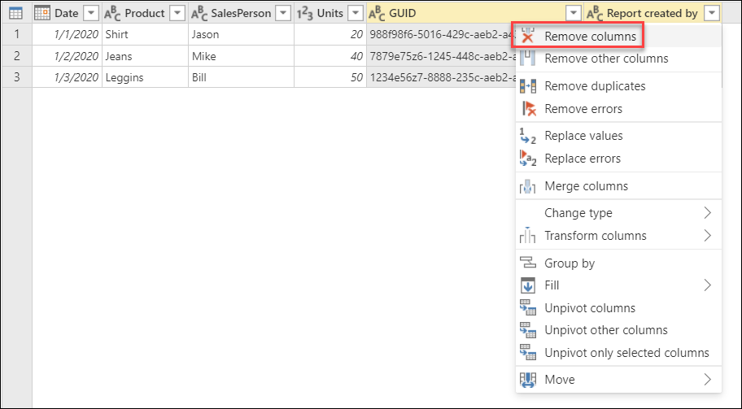
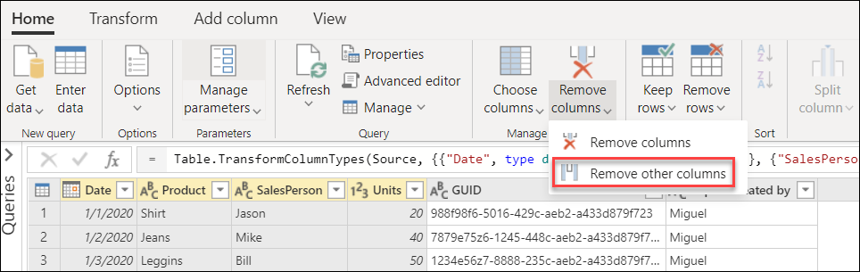

# Choose or remove columns
<!--We don't use the same image multiple times. We'll actually get build warnings for that in a month or so. Suggest naming the first instance and then harkening back to it, as shown below. I'm not sure whether this should be a table caption or a figure caption. We don't usually number a table or figure if there's only one in the article, but I want to be able to refer back to it.-->
**Choose columns** and **Remove columns** are operations that help you define what columns your table needs to keep and which ones it needs to remove. This article will showcase how to use the **Choose columns** and **Remove columns** commands by using the following sample table for both operations.
<!--This would be a good candidate for an HTML table.-->

The goal is to create a table that looks like the following.

*Table 1. Final table for the choose and remove columns example*

## Choose columns

On the **Home** tab, in the **Manage columns** group, select **Choose columns**.

The **Choose columns** dialog box appears, containing all the available fields (columns)<!--Edit okay?--> in your table. You can select all the fields that you want to keep and remove specific fields by clearing their associated check box. For this example, you want to remove the **GUID** and **Report created by** columns, so you clear the check boxes for those fields.

After selecting **OK**, you'll create a table that looks like Table 1, shown earlier in this article.
<!--

-->

## Remove columns

When you select **Remove columns** from the **Home** tab, you have two options:

* **Remove columns**: Removes the selected columns.
* **Remove other columns**: Removes all columns from the table *except*<!--Edit okay?--> the selected ones.

### Remove selected columns

Starting from the sample table, select the **GUID** and the **Report created** columns. Right-click to select any of the column headings. A new shortcut menu appears, where you can select the **Remove columns** command.

<!--
Alternatively, you can select **Remove columns** from the ribbon. The item found in this shortcut menu is exactly the same as the one found in the ribbon.
-->

After selecting **Remove columns**, you'll create a table that looks like Table 1, shown earlier in this article.
<!--

-->

### Remove other columns

Starting from the sample table, select all the columns from the table except **GUID** and **Report created**. On the **Home** tab, select **Remove columns** > **Remove other columns**.<!--Edit okay?-->

After selecting **Remove other columns**, you'll create a table that looks like Table 1, shown earlier in this article.
<!--

-->
