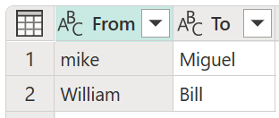
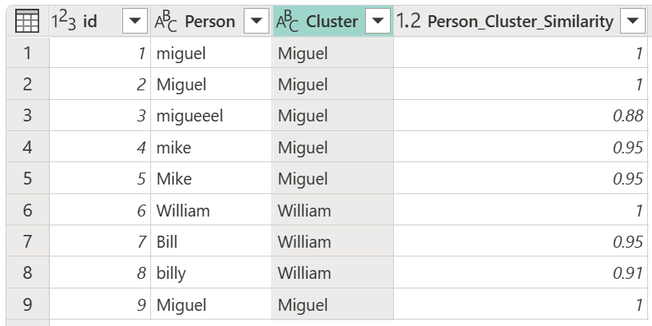

# Cluster values

Cluster values automatically create groups with similar values using a fuzzy matching algorithm, and then maps each column's value to the best-matched group. This transform is very useful when you're working with data that has many different variations of the same value and you need to combine values into consistent groups.

Consider a sample table with an **id** column that contains a set of IDs and a **Person** column containing a set of variously spelled and capitalized versions of the names Miguel, Mike, William, and Bill.

:::image type="content" source="media/cluster-values/fuzzy-grouping-sample-source-table.png" alt-text="Table with nine rows of entries that contain various spellings and captilizations of the name Miguel and William.":::

In this example, the outcome you're looking for is a table with a new column that shows the right groups of values from the **Person** column and not all the different variations of the same words.

:::image type="content" source="media/cluster-values/cluster-column-initial-result.png" alt-text="Clustered values as a new column called Cluster in the initial table.":::

> [!NOTE]
> The Cluster values feature is available only for Power Query Online.

## Create a Cluster column

To cluster values, first select the **Person** column, go to the **Add column** tab in the ribbon, and then select the **Cluster values** option.

:::image type="content" source="media/cluster-values/cluster-column-icon.png" alt-text="Cluster values icon inside the Add column tab in the Power Query online ribbon.":::

In the **Cluster values** dialog box, confirm the column that you want to use to create the clusters from, and enter the new name of the column. For this case, name this new column **Cluster**.

:::image type="content" source="media/cluster-values/cluster-column-window-default.png" alt-text="Cluster values window with the column Person selected and the New column named as Cluster.":::

The result of that operation yields the result shown in the next image.

:::image type="content" source="media/cluster-values/cluster-column-initial-result.png" alt-text="Clustered values as a new column called Cluster in the initial table.":::

>[!NOTE]
>For each cluster of values, Power Query picks the most frequent instance from the selected column as the "canonical" instance. If multiple instances occur with the same frequency, Power Query picks the first one.

## Using the fuzzy cluster options

The following options are available for clustering values in a new column:

* **Similarity threshold (optional)**: This option indicates how similar two values must be to be grouped together. The minimum setting of 0 causes all values to be grouped together. The maximum setting of 1 only allows values that match exactly to be grouped together. The default is 0.8.
* **Ignore case**: When comparing text strings, case is ignored. This option is enabled by default.
* **Group by combining text parts**: The algorithm tries to combine text parts (such as combining Micro and soft into Microsoft) to group values.
* **Show similarity scores**: Shows similarity scores between the input values and computed representative values after fuzzy clustering.
* **Transformation table (optional)**: You can select a transformation table that maps values (such as mapping MSFT to Microsoft) to group them together.

For this example, a new transformation table with the name **My transform table** is used to demonstrate how values can be mapped. This transformation table has two columns:

* **From**: The text string to look for in your table.
* **To**: The text string to use to replace the text string in the **From** column.

>[!IMPORTANT]
>It's important that the transformation table has the same columns and column names as shown in the previous image (they have to be named "From" and "To"), otherwise Power Query won't recognize this table as a transformation table, and no transformation will take place.

Using the previously created query, double-click the **Clustered values** step, then in the **Cluster values** dialog box, expand **Fuzzy cluster options**. Under *Fuzzy cluster options*, enable the **Show similarity scores** option. For **Transformation table (optional)**, select the query that has the transform table.

:::image type="content" source="media/cluster-values/cluster-column-fuzzy-cluster-options-with-transform-table.png" alt-text="Fuzzy cluster column with sample transformation table drop-down menu.":::

After selecting your transformation table and enabling the **Show similarity scores** option, select **OK**. The result of that operation will give you a table that contains the same **id** and **Person** columns as the original table, but also includes two new columns on the right called **Cluster** and **Person_Cluster_Similarity**. The **Cluster** column contains the properly spelled and capitalized versions of the names Miguel for versions of Miguel and Mike, and William for versions of Bill, Billy, and William. The **Person_Cluster_Similarity** column contains the similarity scores for each of the names.

