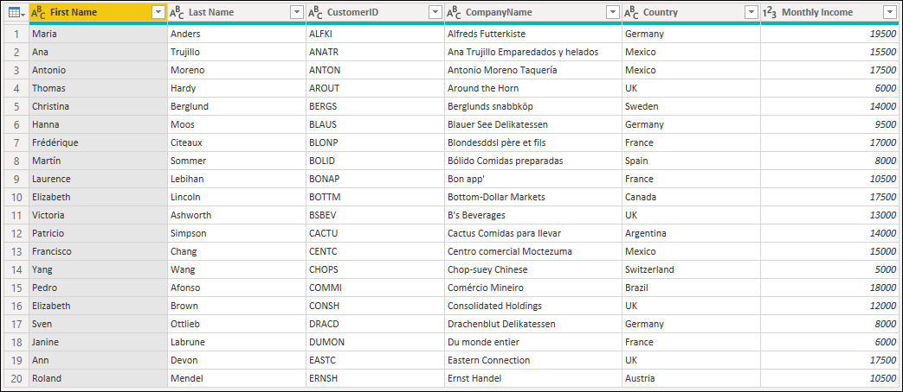
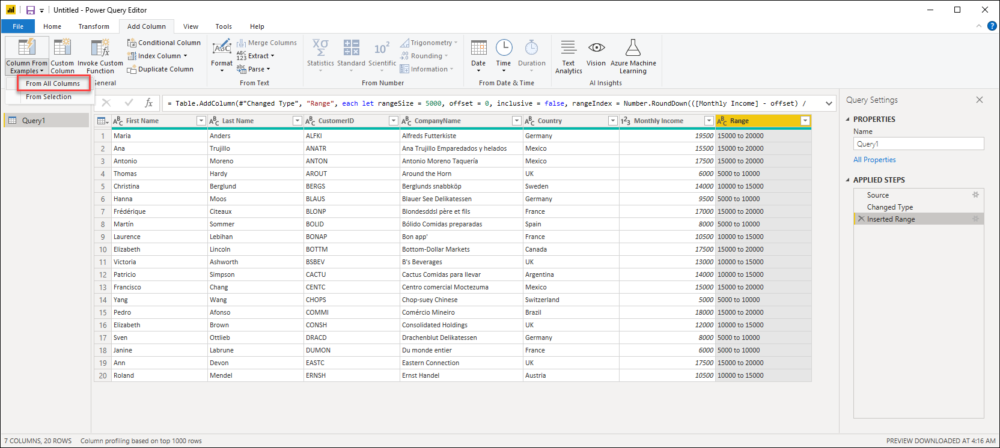
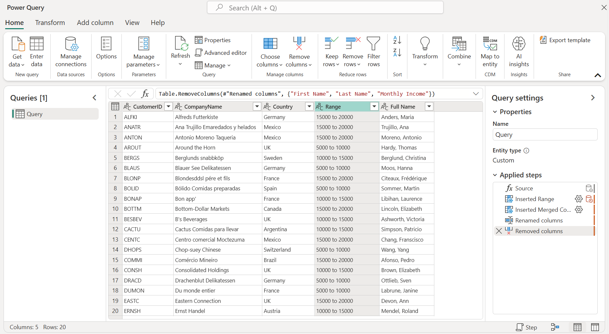

# Add a column from examples

When you add columns from examples, you can quickly and easily create new columns that meet your needs. This is useful for the following situations:

- You know the data you want in your new column, but you're not sure which transformation, or collection of transformations, will get you there.
- You already know which transformations you need, but you're not sure what to select in the UI to make them happen.
- You know all about the transformations you need by using a custom column expression in the M language, but one or more of those transformations aren't available in the UI.

The **Column from examples** command is located on the **Add column** tab, in the **General** group.

:::image type="content" source="media/column-from-example/add-column-from-example-icon.png" alt-text="Add column from examples command.":::

## Add a new column from examples

In this example, you start with the table shown in the following image.

Your goal in this example is to create two new columns:

- **Range**: Create bins for the **Monthly Income** column in discrete increments of 5,000.
- **Full Name**: Concatenate the **Last Name** and **First Name** columns to a single column.

:::image type="content" source="media/column-from-example/add-column-from-example-final-table.png" alt-text="Final table with income range and full name columns added.":::

### Column from examples, from selected columns

One of the options you have when creating your new column is to select which columns will be used in your calculations. For this example, you'll be creating the **Range** column from the values in the **Monthly Income** column.

To do this, select the **Monthly Income** column, select the **Column from examples** command, and then select **From selection**.

:::image type="content" source="media/column-from-example/add-column-from-example-from-selection.png" alt-text="Column from examples in selected column.":::

The preview pane displays a new, editable column where you can enter your examples. For the first example, the value from the selected column is 19500. So in your new column, enter the text **15000 to 20000**, which is the bin where that value falls.

:::image type="content" source="media/column-from-example/add-column-from-example-from-selection-buckets.png" alt-text="Entering data in the new range from example.":::

When Power Query finds a matching transformation, it fills the transformation results into the remaining rows using light-colored text. You can also see the M formula text for the transformation above the table preview.

After you select **OK**, you'll see your new column as part of your query. You'll also see a new step added to your query.

:::image type="content" source="media/column-from-example/add-column-from-example-from-selection-buckets-final.png" alt-text="New column from examples added to the table.":::

### Column from examples, from all columns

The next goal is to create a **Full Name** column by using the values from the **First Name** and **Last Name** columns.

To do this, select the **Column from examples** command, and then select **From all columns**.

Now you'll enter your first **Full Name** example as **Enders, Maria**.

:::image type="content" source="media/column-from-example/add-column-from-example-from-all-columns-full-name.png" alt-text="Full name first example for new column from example.":::

After you select **OK**, you'll see your new column as part of your query. You'll also see a new step added to your query.

:::image type="content" source="media/column-from-example/add-column-from-example-from-all-columns-full-name-final.png" alt-text="New Full Name column added to the table.":::

Your last step is to remove the **First Name**, **Last Name**, and **Monthly Income** columns. Your final table now contains the **Range** and **Full Name** columns with all the data you produced in the previous steps.

## Tips and considerations

When providing examples, Power Query offers a helpful list of available fields, values, and suggested transformations for the selected columns. You can view this list by selecting any cell of the new column.

:::image type="content" source="media/column-from-example/add-column-from-example-suggestions.png" alt-text="Column from example suggestions.":::

It's important to note that the **Column from examples** experience works only on the top 100 rows of your data preview. You can apply steps before the **Column from examples** step to create your own data sample. After the **Column from examples** column has been created, you can delete those prior steps; the newly created column won't be affected.

## List of supported transformations

Many, but not all, transformations are available when you use **Column from examples**. The following list shows the supported transformations.
<!--markdownlint-disable MD036-->
**General**

- Conditional Column

**Reference**
  
- Reference to a specific column, including trim, clean, and case transformations

**Text transformations**

- Combine (supports combination of literal strings and entire column values)
- Replace
- Length
- Extract
  - First Characters
  - Last Characters
  - Range
  - Text before Delimiter
  - Text after Delimiter
  - Text between Delimiters
  - Length
  - Remove Characters
  - Keep Characters

> [!NOTE]
> All Text transformations take into account the potential need to trim, clean, or apply a case transformation to the column value.

**Date transformations**

- Day
- Day of Week
- Day of Week Name
- Day of Year
- Month
- Month Name
- Quarter of Year
- Week of Month
- Week of Year
- Year
- Age
- Start of Year
- End of Year
- Start of Month
- End of Month
- Start of Quarter
- Days in Month
- End of Quarter
- Start of Week
- End of Week
- Day of Month
- Start of Day
- End of Day

**Time transformations**

- Hour
- Minute
- Second  
- To Local Time

> [!NOTE]
> All Date and Time transformations take into account the potential need to convert the column value to Date, Time, or DateTime.

**Number transformations**

- Absolute Value
- Arccosine
- Arcsine
- Arctangent
- Convert to Number
- Cosine
- Cube
- Divide
- Exponent
- Factorial
- Integer Divide
- Is Even
- Is Odd
- Ln
- Base-10 Logarithm
- Modulo
- Multiply
- Round Down
- Round Up
- Sign
- Sine
- Square Root
- Square
- Subtract
- Sum
- Tangent
- Bucketing/Ranges
<!--markdownlint-enable MD036-->
