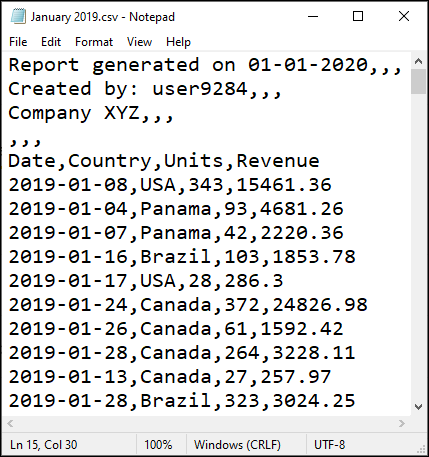
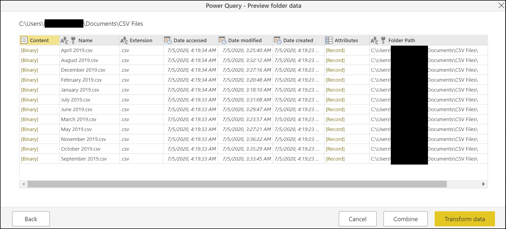
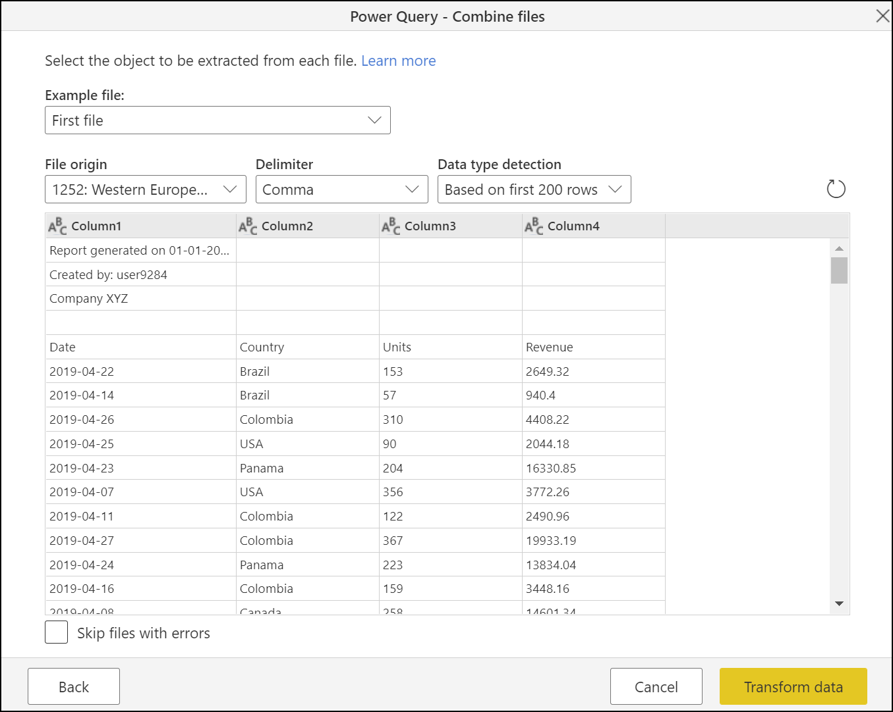
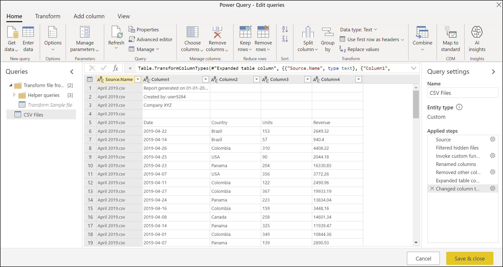
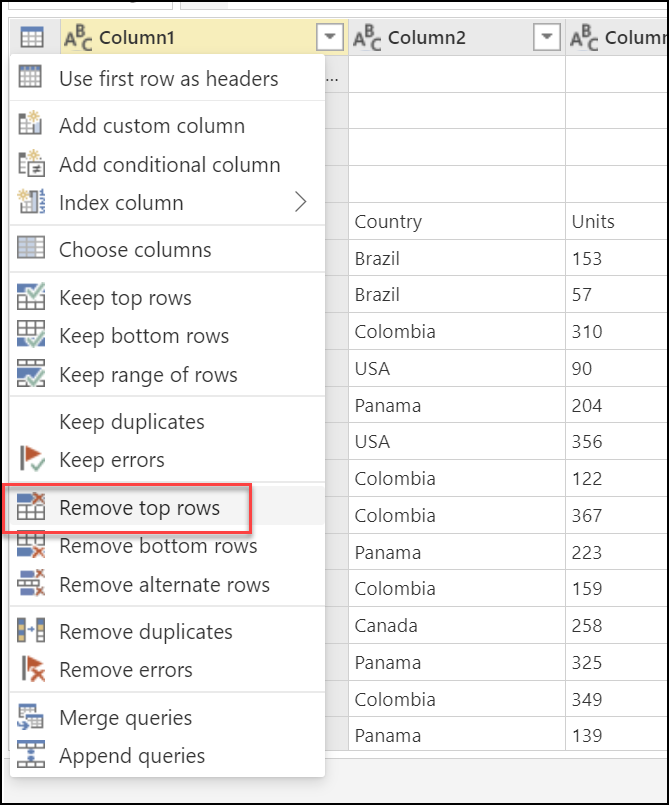
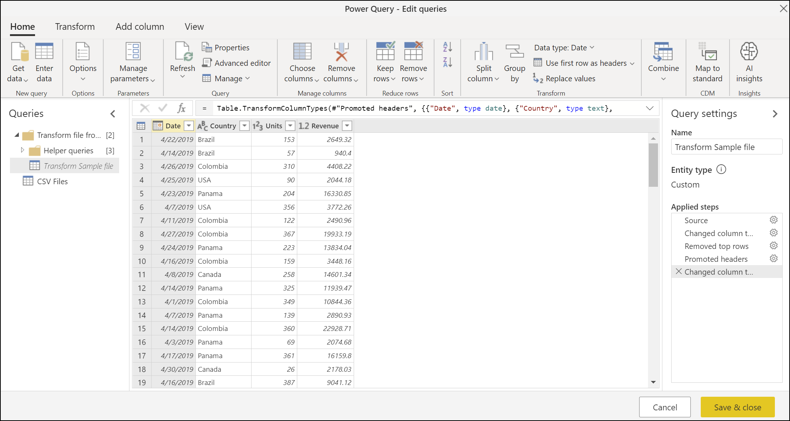
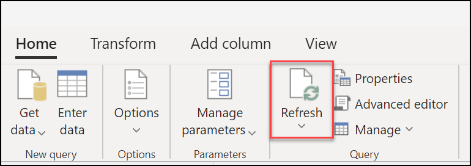
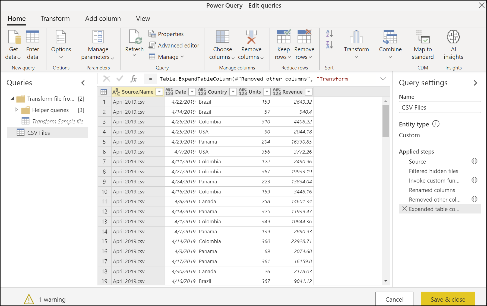
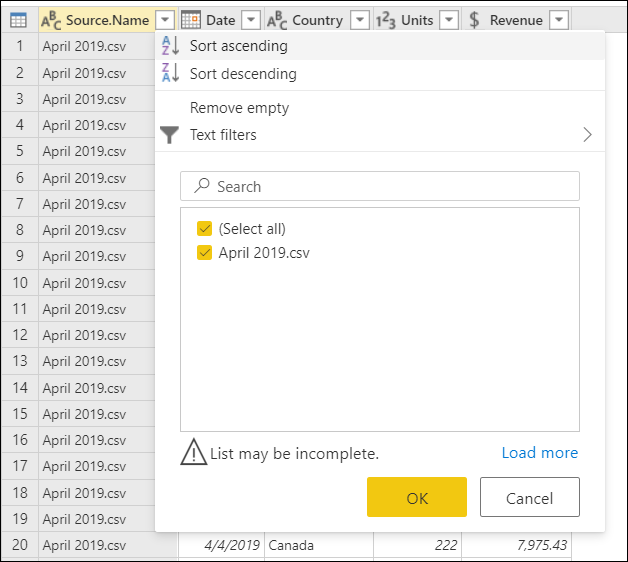

# Combine files: CSV documents

In Power Query, you have the *Combine files* experience to combine multiple files from a given data source. This article will showcase how the experience works when the files that you want to combine are CSV files. For an overview of the *Combine files* experience, see [Combine files: Overview](combine-files-overview.md). 

## About the sample files used

All CSV files used in this example have the same structure and same extension (csv). For the combine files experience, it's imperative that all files you want to combine have the same structure and extension.

For this example, there's a total of 12 CSV files. The following image shows the first 15 rows of the file for the month of January.

Each file contains sales data for one particular month of the calendar year 2019. The number of rows varies from file to file, but all files have a header section in the first four rows. Then they have the column headers in row 5 and the data for the table starts from row 6 downwards. 

The goal is to combine all 12 files into a single table that will look like the following table.

You can follow along with this example by downloading the sample files used in this article from the following [download link](https://aka.ms/PQCombineFilesSample). You can place those files inside the  data source of your choice, such as a local folder, SharePoint folder, Blob Storage, Azure Data Lake, or other data source that provides the *File system view*. 

For simplicity, this article will be using the *Folder* connector. To learn more about the Folder connector, see [Folder](Connectors/Folder.md).

## Table preview dialog

When connecting to the folder that hosts the files that you want to combine&mdash;in this example the name of that folder is **CSV Files**&mdash;you'll be prompted with the table preview dialog, which has your folder path on the top-left corner. Also, the data preview will show the *File system view*.

For this example, select the **Combine** button at the bottom of the window.

>[!Note]
>Depending on your situation, you could also choose to select the **Transform data** button to further filter and transform your data before combining the files. Selecting the **Combine** button is only recommended when you are certain that the folder contains only the files that you want to combine.

## Combine files dialog

After selecting the **Combine** button in the table preview dialog, you'll be prompted with the **Combine files** window.

>[!Note]
>Power Query automatically detects what connector to use based on the first file found in the list. To learn more about the CSV connector, see [Text/CSV](connectors/textcsv.md).

For this example, leave all the default settings, such as the **Example file** set to **First file**, **File origin**, **Delimiter**, and **Data type detection**.

Now select the **Transform data** button at the bottom-right of the screen to go to the **Output query**

## Output query

After selecting the **Transform data** button in the **Combine files** dialog, you'll be taken back to the Power Query Editor in the query that you initially created from the connection to the local folder. The following image shows what this output query will look like.

However, the data isn't in the correct shape. You need to remove the top four rows from each file before combining them. To make this change on each file before combining them, and not after the combination, go to the **Transform Sample file** query inside the **Queries pane** on the left hand-side of your screen.

### Modify the Transform Sample file query

Inside this **Transform Sample file** query, you'll see that the data, as shown in the image below, is for the month of April by looking at the values from the **Date** column, which has the format year-month-day (YYYY-MM-DD). 'April 2019.csv' is the first file that you saw in the **Table preview** dialog.

You now need to apply a new set of transformations to clean the data. This transformation will be automatically converted to a function inside the **Helper queries** group that will be applied to every file in the folder before combining the data from each file.

The transformations that need to be added to the *Transform Sample file* query are:

1. **Remove top rows**&mdash;to perform this operation, select the table contextual button on the top-left corner of the table, and then select the **Remove top rows** option from the menu. 

   

   Inside the **Remove top rows** window, insert the value **4**, and then select **OK**.

   

   After selecting **OK**, your table will no longer have the top four rows.

   

2. **Use first row as headers**&mdash;select the table contextual button again, but this time, select the **Use first row as headers** option.

   

   The result of that operation will promote the first row of the table to the new column headers. 

   

After this operation is completed, Power Query (by default) will try to automatically detect the data types of the columns and add a new **Changed column type** step.

### Revising the Output query

When you go back to the **CSV Files** query, you'll notice that the last step is giving you an error that reads `The column 'Column1' of the table wasn't found`. The reason behind this error is that the previous state of the query was doing an operation against a column by the name **Column1**. But because of the changes made to the **Transform Sample file** query, this column no longer exists. To learn more about errors, see [Dealing with Errors](dealing-with-errors.md).

>[!Note]
> If the data preview is still not showing you the correct data preview, you can select the **Refresh** button in the **Home** tab inside the **Query** group to refresh the data preview of your query.
>
>
>

You can remove this last step of the query from the **Applied steps** pane by selecting the delete icon on the left-hand side of the name of the step. After deleting this step, your query will be showing the correct results.

However, notice that none of the columns derived from the files (Date, Country, Units, Revenue) has a data type assigned to them. Assign the correct data type to each column using the following table:

Column Name | Data type|
------------|----------|
Date| Date
Country | Text
Units| Whole number
Revenue| Currency

After defining the data types for each column, you'll have the table ready to be loaded.

>[!Note]
>To read more about how to define or change column data types, see [Data types](data-types.md).

### Verification

To validate that all files have been combined, you can select the filter icon on the **Source.Name**, which will display all file names of the files that have been combined. If you get a warning such as `List may be incomplete`, select the **Load more** button or hyperlink at the bottom of the menu to display more available values in the column.

After selecting the **Load more** link, all available file names will be displayed.

