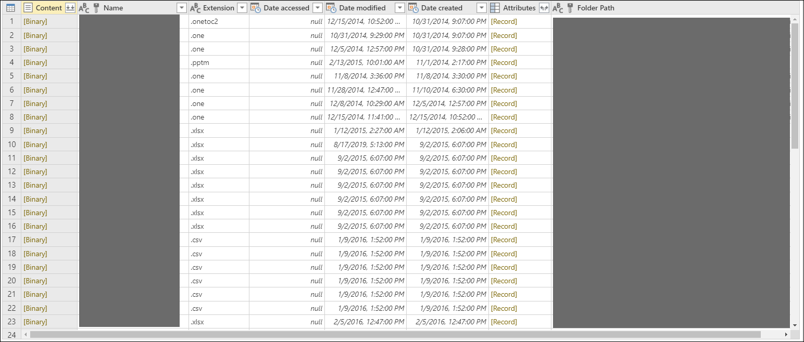
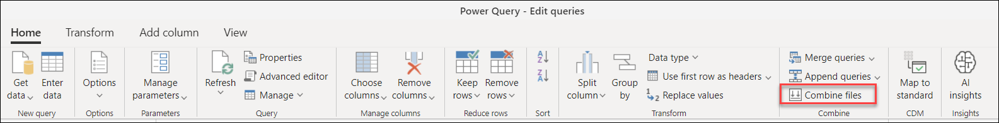
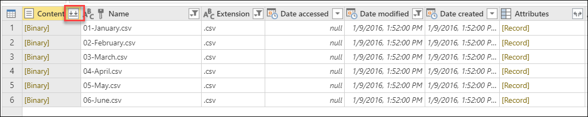
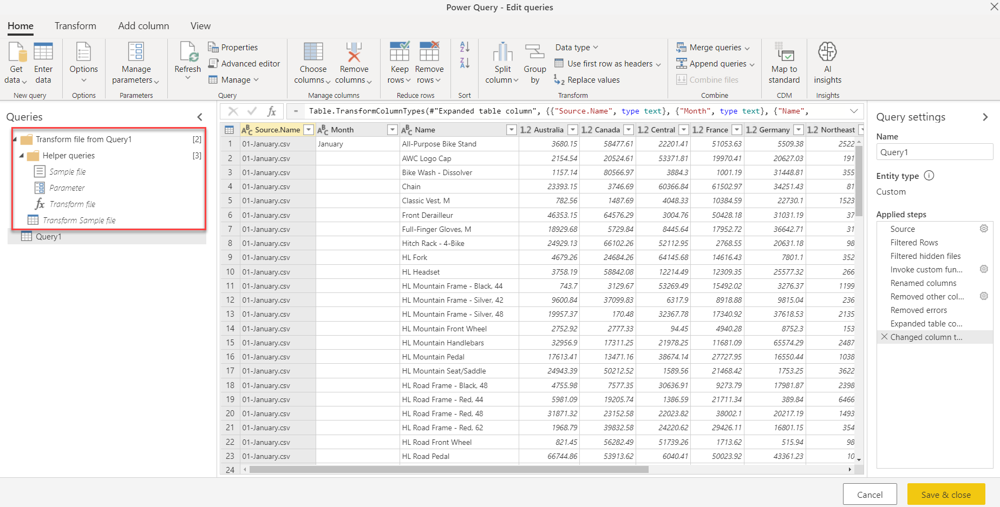

# Combine files in Power Query: overview

With Power Query you can combine multiple files with the same schema into a single logical table.

This is very useful when wanting to combine all the files you have in the same folder. For example, if you had a folder that contains monthly files with all the purchase orders for your company then this would be an easy way to consolidate the orders into a single view.

Files can come from a variety of sources such as but not limited to::
* [Local folder](folder.md)
* SharePoint site
* Azure Blob Storage
* [Azure Data Lake Storage (Gen1 and Gen2)](datalakestorage.md)

When working with files, you will notice that they share the same table schema commonly referred to as the *File system view*. Here's an example below:

In the *File system view* you'll get a column called **Content**, which represents the binary representation of a file.

>[!Note]
> Selecting any of the **Binary** values inside the **Content** column will automatically create a series of navigation steps to that specific file. Power Query will try to interpret the binary using one of the available connectors, such as TXT / CSV, Excel Workbook, JSON, XML, or other connector as it sees fit.

The combine files feature has the following steps or phases to reach the desired goal:
* [Table preview dialog](#table-preview-dialog)
* [Combine files dialog](#combine-files-dialog)
* [Combine files output](#combine-files-output)

## Table preview dialog

Upon connecting to a data source using any of the previously mentioned connectors, you'll be taken to the table preview dialog. You can then select **Combine** at the bottom-right section of the screen.

Alternatively, you can select **Transform Data** to access the Power Query Editor, where the list of files can be subset (for example, using filters on the folder path column to only include files from a specific subfolder). Then combine files by selecting the column containing the binaries (for example, in the **Content** column) and then selecting **Combine Files** from any of the following places:

* **Combine files button**&mdash;inside the **Combine** group in the **Home** tab.

* **Combine files icon**&mdash;next to the column header of the column with **Binary** values.

## Combine files dialog

After selecting the option to combine files, the **Combine files** dialog will appear.

At this point, combine files behaves as follows:
* Power Query analyzes the first file from the list and determines the correct file connector to use to open the file contents, such as text, Excel workbook, JSON file, or other connector as it sees fit.
* In the **Combine files** dialog, Power Query will provide the file connector experience exactly as if you were to connect directly to that sample file.
  * You can also pick a different sample file instead of the first file, by using the **Example file** dropdown menu.
  * Optionally, you can exclude files that result in errors from the final output.

In the following sample image, Power Query detects that the first file has a csv file type extension, so it uses the [CSV connector](connectors/textcsv.md) to interpret the file.

## Combine files output

After going through the **Combine files** dialog and finishing this process, Power Query then automatically performs the following actions:

1. Creates an exemplar query that performs all the required extraction steps for a single file. It uses the file that was selected as the sample file in the **Combine Files** dialog.

   This exemplar query will have the name **Transform Sample file** in the queries pane.

2. Creates a function query that parameterizes the file/binary input to the exemplar query. The exemplar query and the function query are linked, so that changes to the exemplar query are reflected in the function query.

   These queries will be organized under the **Helper queries** queries group.

3. Applies the function query to the original query with input binaries (for example, the folder query) so it applies the function query for binary inputs on each row, then expands the resulting data extraction as top-level columns.

4. In addition to the above queries, a new group with the prefix **Transform file from** with the initial query as the suffix is created with all the components that drive this combine files experience.

Using **Combine files**, you can easily combine all files within a given folder, as long as they have the same file type and structure (such as the same columns).
Also, you can easily apply additional transformation or extraction steps by modifying the automatically generated exemplar query, without having to worry about modifying or creating additional function query steps. Any changes to the exemplar query are automatically propagated to the linked function query.

>[!Note]
>You can modify the steps inside the exemplar query to change the function applied to each binary in your query. The exemplar query is linked to the function, so any changes made to the exemplar query will be reflected in the function query. 
>
>If any of the changes affect the column names or column data types, be sure to check the last step of your output query in the event that a **Change column type** step was added and is preventing you from visualizing your table because of a step-level error. To read more about working with errors, see [Dealing with errors](dealing-with-errors.md).  
