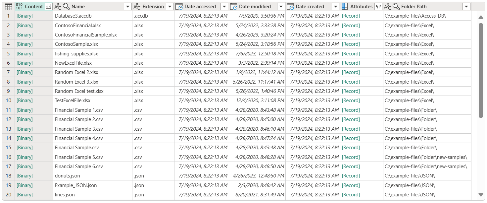
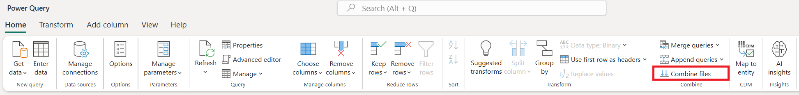
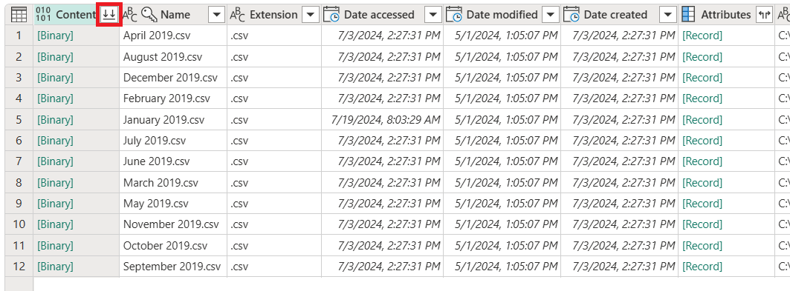
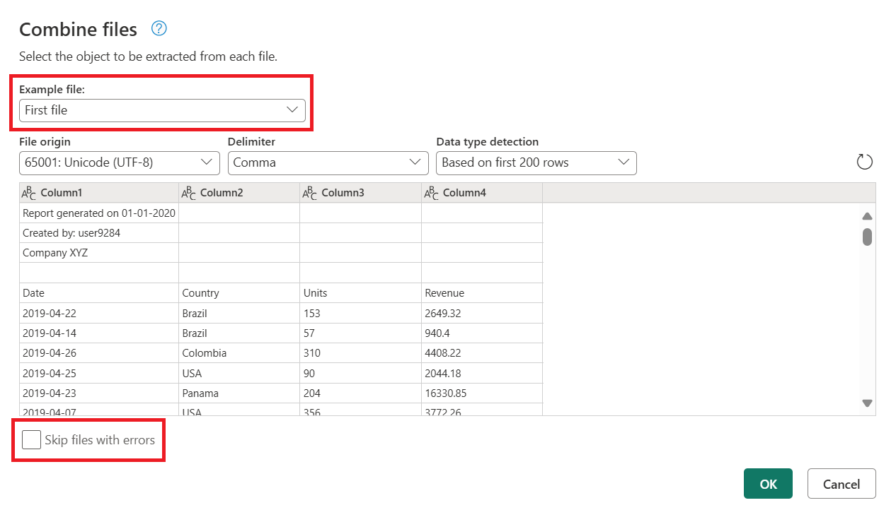
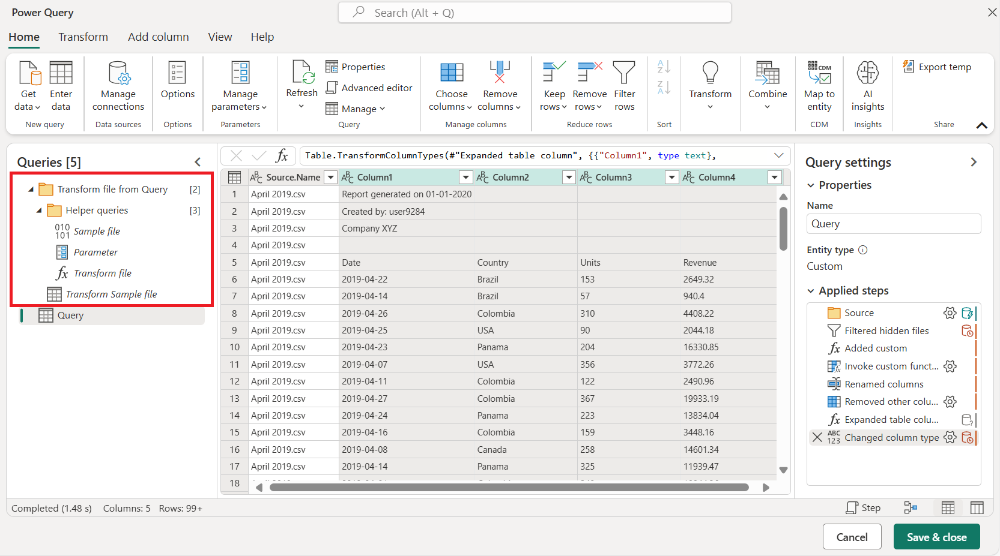

# Combine files overview

With Power Query, you can combine multiple files that have the same schema into a single logical table.

This feature is useful when you want to combine all the files you have in the same folder. For example, if you have a folder that contains monthly files with all the purchase orders for your company, you can combine these files to consolidate the orders into a single view.

Files can come from a variety of sources, such as (but not limited to):

* Local folders
* SharePoint sites
* Azure Blob storage
* Azure Data Lake Storage (Gen1 and Gen2)

When working with these sources, you'll notice that they share the same table schema, commonly referred to as the *file system view*. The following screenshot shows an example of the file system view.

In the file system view, the **Content** column contains the binary representation of each file.

>[!NOTE]
> You can filter the list of files in the file system view by using any of the available fields. It's good practice to filter this view to show only the files you need to combine, for example by filtering fields such as **Extension** or **Folder Path**. More information: [Folder](connectors/folder.md)

Selecting any of the \[Binary\] values in the **Content** column automatically creates a series of navigation steps to that specific file. Power Query will try to interpret the binary by using one of the available connectors, such as Text/CSV, Excel, JSON, or XML.

Combining files takes place in the following stages:

* [Table preview](#table-preview)
* [Combine files dialog box](#combine-files-dialog-box)
* [Combined files output](#combined-files-output)

## Table preview

When you connect to a data source by using any of the previously mentioned connectors, a table preview opens. If you're certain that you want to combine all the files in the folder, select **Combine** in the lower-right corner of the screen.

Alternatively, you can select **Transform data** to access the Power Query Editor and create a subset of the list of files (for example, by using filters on the folder path column to only include files from a specific subfolder). Then combine files by selecting the column that contains the binaries in the **Content** column and then selecting either:

* The **Combine files** command in the **Combine** group on the **Home** tab.

   

* The **Combine files** icon in the column header of the column that contains \[Binary\] values.

   

## Combine files dialog box

After you select the **Combine** or **Combine files** command, the **Combine files** dialog box opens and the following occurs:

1. Power Query analyzes the example file (by default, the first file in the list) and determines the correct file connector to use to open that file.
2. The dialog box provides the file connector experience exactly as if you were to connect directly to that example file.
   * If you want to use a different file for the example file, you can choose it from the **Example file** drop-down menu.
   * Optional: You can select **Skip files with errors** to exclude from the final output any files that result in errors.

In the following image, Power Query has detected that the first file has a .csv file name extension, so it uses the [Text/CSV](connectors/textcsv.md) connector to interpret the file.

## Combined files output

After the **Combine files** process is finished, Power Query automatically performs the following actions:

1. Creates an example query that performs all the required extraction steps for a single file. It uses the file that was selected as the example file in the **Combine files** dialog box.

   This example query has the name **Transform Sample file** in the **Queries** pane.

2. Creates a function query that parameterizes the file/binary input to the example query. The example query and the function query are linked, so that changes to the example query are reflected in the function query.

   These queries are listed in the **Helper queries** group.

3. Applies the function query to the original query with input binaries (for example, the folder query) so it applies the function query for binary inputs on each row, and then expands the resulting data extraction as top-level columns.

4. Creates a new group with the prefix **Transform file from** and the initial query as the suffix, and organizes all the components used to create these combined files in that group.

   

You can easily combine all files within a given folder, as long as they have the same file type and structure (including the same columns). You can also apply additional transformation or extraction steps by modifying the automatically generated example query, without having to worry about modifying or creating additional function query steps.

>[!NOTE]
>You can modify the steps inside the example query to change the function applied to each binary in your query. The example query is linked to the function, so any changes made to the example query will be reflected in the function query.
>
>If any of the changes affect column names or column data types, be sure to check the last step of your output query. Adding a **Change column type** step can introduce a step-level error that prevents you from visualizing your table. More information: [Dealing with errors](dealing-with-errors.md)

### See also

[Combine CSV files](combine-files-csv.md)
