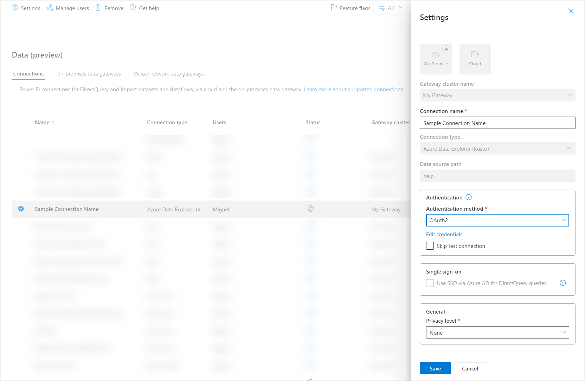

# Connections and authentication in Power Query Online

In Power Query Online, named connections provide you with a more flexible approach to create and manage connections. A named connection is the definition of a set of components to establish a connection to a particular data source. You can create multiple connections against the same data source with the only differentiation being the name you choose to assign.

## Creating a named connection

During the [Get Data experience in Power Query Online](/powerquery-docs/get-data-experience.md#1-connection-settings-and-authentication), you will find a dialog where you can enter a set of information in order to create and establish a connection to your data source. The process is standard for all connectors in Power Query, but some connectors might require more information in order to create such connection.

Using the SQL Database connector as an example, you can

>[!TIP]
> Some connectors provide an auto-login experience. You can learn more about this feature from the article on [auto-login](/powerquery-docs/auto-login-aad.md).

## Components of a connection

This is where I go deeper into how each component of the named connection is and why they exist.

1. **Data Source kind**: The data source for which the connection is being established to. E.g. SQL Server, File, Folder, Azure Data Lake Storage, etc.
2. **Data Source path**: This is a string that represents the values or parameters used to establish a connection to your data source. E.g. Server Name, Database Name
3. **Gateway**:
4. **Credentials**:
5. **Connector specific optional settings**:
6. **Privacy level**:

### Types of connections

There are two categories of connections:

|Connection Category Name|Icon|Description|
|-------------|-----|-----------|
|**Cloud**| |Any connection for data source that is cloud-based and does not use a gateway|
|**On-Premise**| |Any connection that requires a gateway|

This distinction can also be visualized in a portal like the **Connections** list in the Power BI service.

In this portal you are able to verify and modify the existing connections available to you.

>[!NOTE]
>For scenarios where you want to add or change a gateway to a dataflow, you can follow the steps to do so from the article on [change the gateway used in a dataflow project](/powerquery-docs/change-gateway-dataflow.md).