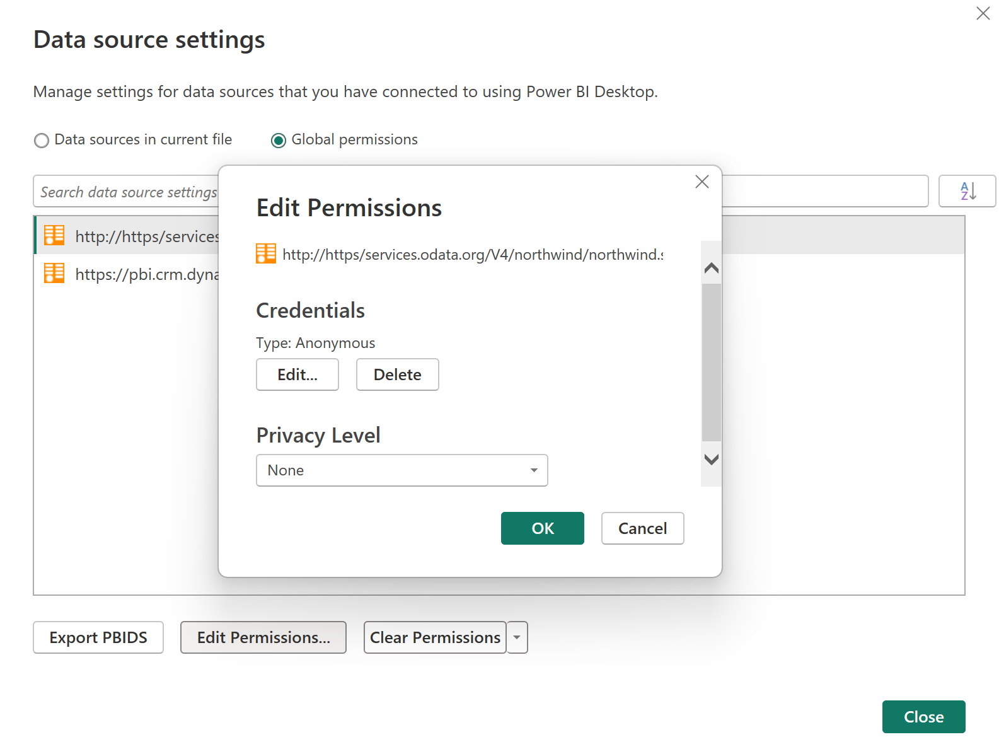
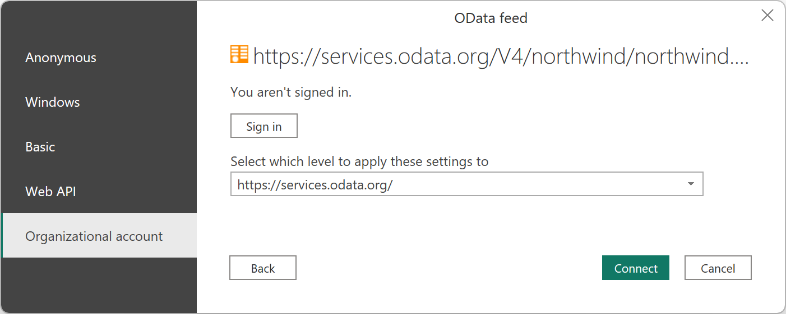
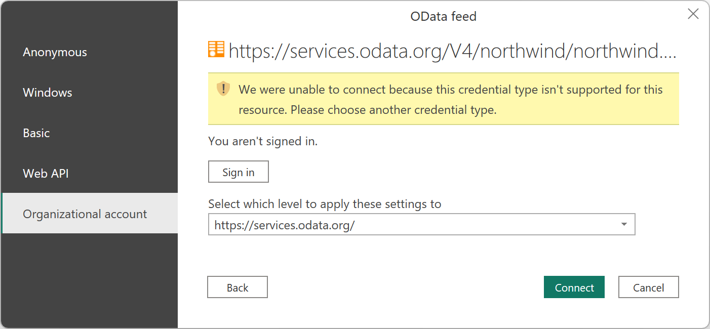
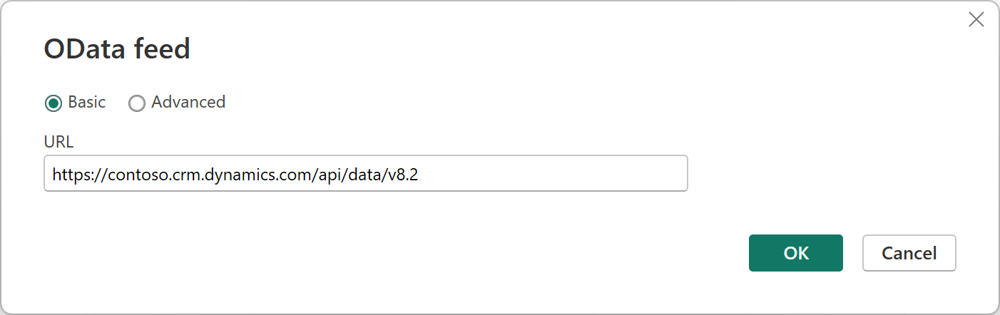
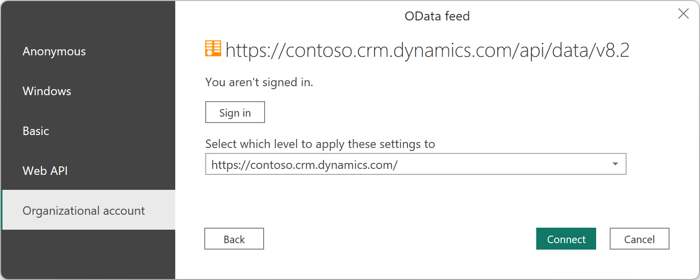

# Authentication with a data source

When you attempt to connect to a data source using a new connector for the first time, you might be asked to select the authentication method to use when accessing the data. After you've selected the authentication method, you won't be asked to select an authentication method for the connector using the specified connection parameters. However, if you need to change the authentication method later, you can do so.

## Select an authentication method

Different connectors show different authentication methods. For example, the OData Feed connector in Power BI Desktop and Excel displays the following authentication method dialog box.


If you're using a connector from an online app, such as the Power BI service or Power Apps, you'll see an authentication method dialog box for the OData Feed connector that looks something like the following image.


As you can see, a different selection of authentication methods is presented from an online app. Also, some connectors might ask you to enter the name of an on-premises data gateway to be able to connect to your data.

## Set the level of the authentication method

In connectors that require you to enter a URL, you'll be asked to select the level to which the authentication method will be applied. For example, if you select the Web connector with a URL of `https://contoso.com/2020data/List_of_countries_and_capitals`, the default level setting for your authentication method will be `https://contoso.com`.


The level you select for the authentication method you chose for this connector determines what part of a URL will have the authentication method applied to it. If you select the top-level web address, the authentication method you select for this connector will be used for that URL address or any subaddress within that address.

However, you might not want to set the top-level address to a specific authentication method because different subaddresses can require different authentication methods. One example might be if you were accessing two separate folders of a single SharePoint site and wanted to use different Microsoft accounts to access each one.


After you've set the authentication method for a connector's specific address, you won't need to select the authentication method for that connector using that URL address or any subaddress again. For example, let's say you select the `https://contoso.com/` address as the level you want the Web connector URL settings to apply to. Whenever you use a [Web connector](connectors/web/web.md) to access any webpage that begins with this address, you won't be required to select the authentication method again.

## Change the authentication method

In some cases, you might need to change the authentication method you use in a connector to access a specific data source.

**To edit the authentication method in Power BI Desktop or Excel**

1. Do one of the following:

    - In Power BI Desktop, on the **File** tab, select **Options and settings** > **Data source settings**.

        

    - In Excel, on the **Data** tab, select **Get Data** > **Data Source Settings**. 

        

2. In the **Data source settings** dialog box, select **Global permissions**, choose the website where you want to change the permission setting, and then select **Edit Permissions**.

3. In the **Edit Permissions** dialog box, under **Credentials**, select **Edit**. 

    

4. Change the credentials to the type required by the website, select **Save**, and then select **OK**.

You can also delete the credentials for a particular website in step 3 by selecting **Clear Permissions** for a selected website, or by selecting **Clear All Permissions** for all of the listed websites.

**To edit the authentication method in online services, such as for dataflows in the Power BI service and Microsoft Power Platform**

1. Select the connector, and then select **Edit connection**.

    

2. Make the required changes, and then select **Next**.

## Connecting with Azure Active Directory using the Web and OData connectors

When connecting to data sources and services that require authentication through OAuth or Azure Active Directory-based authentication, in certain cases where the service is configured correctly, you can use the built-in [Web](connectors/web/web.md) or [OData](connectors/odata-feed.md) connectors to authenticate and connect to data without requiring a service-specific or custom connector.

This section outlines connection symptoms when the service isn't configured properly. It also provides information on how Power Query interacts with the service when it's properly configured.

### Symptoms when the service isn't configured properly

If you run into the error **We were unable to connect because this credential type isn’t supported for this resource. Please choose another credential type**, this error means that your service doesn't support the authentication type.

One example of this is the Northwind OData service.

1) Enter the Northwind endpoint in the "Get Data" experience using the OData connector.

   

2) Select **OK** to enter the authentication experience. Normally, because Northwind isn’t an authenticated service, you would just use **Anonymous**. To demonstrate lack of support for Azure Active Directory, choose **Organizational account**, and then select **Sign in**.

   

3) You'll encounter the error, indicating that OAuth or Azure Active Directory authentication isn't supported in the service.

   

### Supported workflow

One example of a supported service working properly with OAuth is CRM, for example, `https://*.crm.dynamics.com/api/data/v8.2`.

1) Enter the URL in the "Get Data" experience using the OData connector.

   

2) Select **Organizational Account**, and then select **Sign-in** to proceed to connect using OAuth.

   

3) The request succeeds and the OAuth flow continues to allow you to authenticate successfully.

   

When you select **Sign-in** in Step 2 above, Power Query sends a request to the provided URL endpoint with an Authorization header with an empty bearer token.

```
GET https://*.crm.dynamics.com/api/data/v8.2 HTTP/1.1
Authorization: Bearer
User-Agent: Microsoft.Data.Mashup (https://go.microsoft.com/fwlink/?LinkID=304225)
Host: pbi.crm.dynamics.com
Connection: Keep-Alive
```

The service is then expected to respond with a **401** response with a **WWW-Authenticate** header indicating the Azure AD authorization URI to use. This response should include the tenant to sign into, or **/common/** if the resource isn’t associated with a specific tenant.

```
HTTP/1.1 401 Unauthorized
Cache-Control: private
Content-Type: text/html
Server: 
WWW-Authenticate: Bearer authorization_uri=https://login.microsoftonline.com/3df2eaf6-33d0-4a10-8ce8-7e596000ebe7/oauth2/authorize 
Date: Wed, 15 Aug 2018 15:02:04 GMT
Content-Length: 49
```

Power Query can then initiate the OAuth flow against the **authorization_uri**. Power Query requests an Azure AD Resource or Audience value equal to the domain of the URL being requested. This value would be the value you use for your Azure Application ID URL value in your API/service registration. For example, if accessing `https://api.myservice.com/path/to/data/api`, Power Query would expect your Application ID URL value to be equal to `https://api.myservice.com`.

The following Azure Active Directory client IDs are used by Power Query. You might need to explicitly allow these client IDs to access your service and API, depending on your overall Azure Active Directory settings.

| Client ID  | Title | Description |
| ---------- | ----- | ----------- |
| a672d62c-fc7b-4e81-a576-e60dc46e951d | Power Query for Excel | Public client, used in Power BI Desktop and Gateway. |
| b52893c8-bc2e-47fc-918b-77022b299bbc | Power BI Data Refresh | Confidential client, used in Power BI service. |
| 7ab7862c-4c57-491e-8a45-d52a7e023983 | Power Apps and Power Automate | Confidential client, used in Power Apps and Power Automate. |
| | | |

You might need to explicitly allow these client IDs to access your service and API, depending on your overall Azure Active Directory settings. Go to step 8 of [Add a scope](/azure/active-directory/develop/quickstart-configure-app-expose-web-apis#add-a-scope) for more details.

If you need more control over the OAuth flow (for example, if your service must respond with a `302` rather than a `401`), or if your application’s Application ID URL or Azure AD Resource value don't match the URL of your service, then you’d need to use a custom connector. For more information about using our built-in Azure AD flow, go to [Azure Active Directory authentication](HandlingAuthentication.md#azure-active-directory-authentication).
