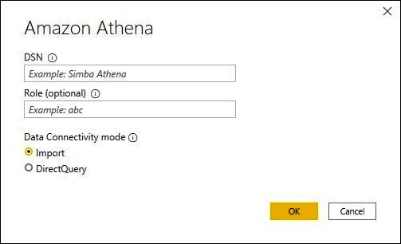
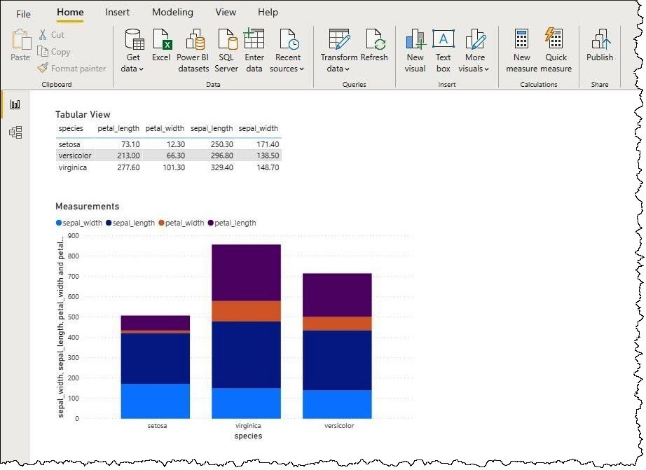

# Amazon Athena

> [!NOTE]
>The following connector article is provided by Amazon, the owner of this connector and a member of the Microsoft Power Query Connector Certification Program. If you have questions regarding the content of this article or have changes you would like to see made to this article, visit the Amazon website and use the support channels there.

## Summary

| Item | Description |
| ---- | ----------- |
| Release State | General Availability |
| Products | Power BI (Datasets) Power BI (Dataflows) Fabric (Dataflow Gen2) |
| Authentication Types Supported | DSN configuration   Organizational account |

## Prerequisites

* An [Amazon Web Services (AWS) account](https://aws.amazon.com/)
* [Permissions](https://docs.aws.amazon.com/athena/latest/ug/policy-actions.html) to use Athena
* Customers must install the [Amazon Athena ODBC driver](https://docs.aws.amazon.com/athena/latest/ug/connect-with-odbc.html) before using the connector

## Capabilities supported

* Import
* DirectQuery (Power BI Datasets)

## Connect to Amazon Athena

To connect to Athena data:

1. Launch Power BI Desktop.

2. In the **Home** tab, select **Get Data**.

3. In the search box, enter **Athena**.

4. Select **Amazon Athena**, and then select **Connect**.

    

5. On the **Amazon Athena** connection page, enter the following information:

    * For **DSN**, enter the name of the ODBC DSN that you want to use. For instructions on configuring your DSN, go to the [ODBC driver documentation](https://docs.aws.amazon.com/athena/latest/ug/connect-with-odbc.html#connect-with-odbc-driver-documentation).
    * For **Data Connectivity mode**, choose a mode that's appropriate for your use case, following these general guidelines:
        * For smaller datasets, choose **Import**. When using import mode, Power BI works with Athena to import the contents of the entire dataset for use in your visualizations.
        * For larger datasets, choose **DirectQuery**. In DirectQuery mode, no data is downloaded to your workstation. While you create or interact with a visualization, Microsoft Power BI works with Athena to dynamically query the underlying data source so that you're always viewing current data. More information: [Use DirectQuery in Power BI Desktop](/power-bi/connect-data/desktop-use-directquery)

    

6. Select **OK**.

7. At the prompt to configure data source authentication, select either **Use Data Source Configuration** or **AAD Authentication**. Enter any required sign-in information. Then select **Connect**.

    

    Your data catalog, databases, and tables appear in the **Navigator** dialog box.

    

8. In the **Display Options** pane, select the check box for the dataset that you want to use.

9. If you want to transform the dataset before you import it, go to the bottom of the dialog box and select **Transform Data**. This selection opens the Power Query Editor so that you can filter and refine the set of data you want to use.

10. Otherwise, select **Load**. After the load is complete, you can create visualizations like the one in the following image. If you selected **DirectQuery**, Power BI issues a query to Athena for the visualization that you requested.

    
