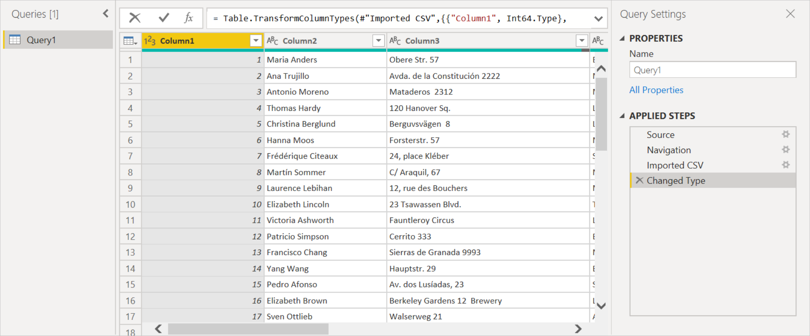
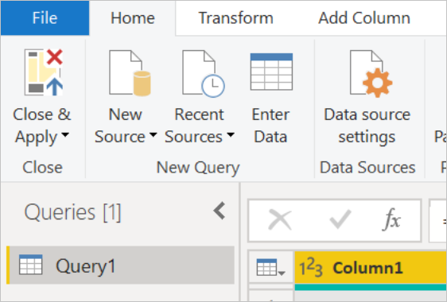
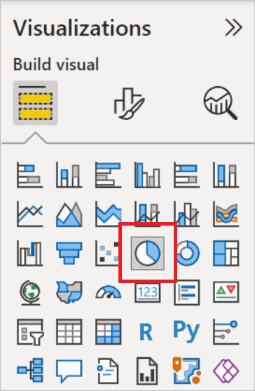
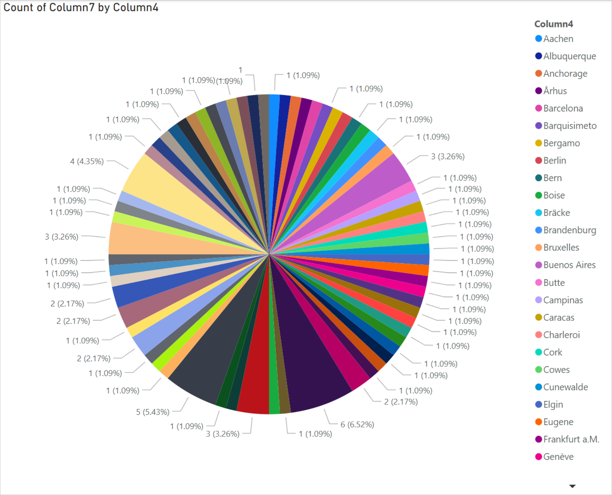

# Analyze data in Azure Data Lake Storage Gen2 by using Power BI

In this article, you'll learn how to use Power BI Desktop to analyze and visualize data that's stored in a storage account that has a hierarchical namespace (Azure Data Lake Storage Gen2).

## Prerequisites

Before you begin this tutorial, you must have the following prerequisites:

> [!div class="checklist"]
>
> * An Azure subscription. Go to [Get Azure free trial](https://azure.microsoft.com/pricing/free-trial/).
> * A storage account that has a hierarchical namespace. Follow the instructions at [Create a storage account](/azure/storage/common/storage-account-create) to create one. This article assumes that you've created a storage account named `contosoadlscdm`.
> * Ensure you are granted one of the following roles for the storage account: **Blob Data Reader**, **Blob Data Contributor**, or **Blob Data Owner**.
> * A sample data file named `Drivers.txt` located in your storage account. You can download this sample from [Azure Data Lake Git Repository](https://github.com/Azure/usql/tree/master/Examples/Samples/Data/AmbulanceData/Drivers.txt), and then upload that file to your storage account.
> * **Power BI Desktop**. You can download this application from the [Microsoft Download Center](https://www.microsoft.com/download/details.aspx?id=45331).

## Create a report in Power BI Desktop

1. Launch Power BI Desktop on your computer.

2. Follow the instructions in the [Azure Data Lake Storage Gen2 connector article](data-lake-storage.md#connect-to-azure-data-lake-storage-gen2-from-power-query-desktop) to connect to the sample data.

3. From the Power Query **Navigator**, select **Load**.

    

4. After the data has been successfully loaded into Power BI, the following fields are displayed in the **Fields** panel.

    

    However, to visualize and analyze the data, you might prefer the data to be available using the following fields.

    

    In the next steps, you'll update the query to convert the imported data to the desired format.

5. From the **Home** tab on the ribbon, select **Transform Data**. The Power Query editor then opens, displaying the contents of the file.

    

6. In the Power Query editor, under the **Content** column, select **Binary**. The file will automatically be detected as CSV and will contain the output as shown below. Your data is now available in a format that you can use to create visualizations.

    

7. From the **Home** tab on the ribbon, select **Close & Apply**.

    

8. Once the query is updated, the **Fields** tab displays the new fields available for visualization.

    

9. Now you can create a pie chart to represent the drivers in each city for a given country/region. To do so, make the following selections.

    From the **Visualizations** tab, select the symbol for a pie chart.

    

    In this example, the columns you're going to use are Column 4 (name of the city) and Column 7 (name of the country/region). Drag these columns from the **Fields** tab to the **Visualizations** tab as shown below.

    

    The pie chart should now resemble the one shown below.

    

10. If you select a specific country/region from the page level filters, the number of drivers in each city of the selected country/region will be displayed. For example, under the **Visualizations** tab, under **Page level filters**, select **Brazil**.

    

11. The pie chart is automatically updated to display the drivers in the cities of Brazil.

    

12. From the **File** menu, select **Save** to save the visualization as a Power BI Desktop file.

## Publish report to Power BI service

After you've created the visualizations in Power BI Desktop, you can share it with others by publishing it to the Power BI service. For instructions on how to do that, go to [Publish from Power BI Desktop](/power-bi/create-reports/desktop-upload-desktop-files).

## See also

* [Azure Data Lake Storage Gen2](data-lake-storage.md)
