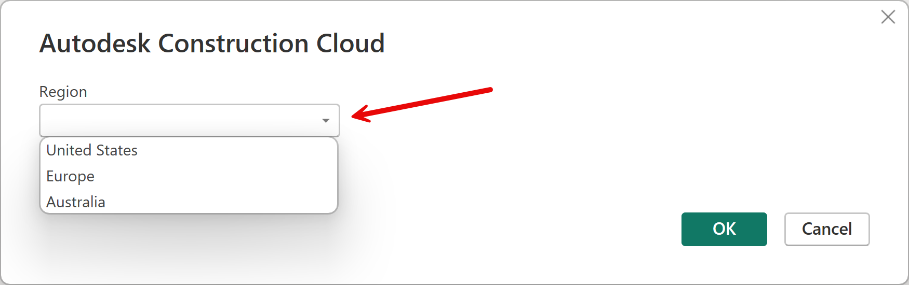

# Autodesk Construction Cloud (Beta)

>[!Note]
>The following connector article is provided by Autodesk, the owner of this connector and a member of the Microsoft Power Query Connector Certification Program. If you have questions regarding the content of this article or have changes you would like to see made to this article, visit the Autodesk website and use the support channels there.

## Summary

| Item | Description |
| ---- | ----------- |
| Release State | Beta |
| Products | Power BI (Datasets) Power BI (Dataflows)  |
| Authentication Types Supported | Autodesk account |
| Function Reference Documentation |&mdash; |

## Prerequisites

To use the Autodesk Construction Cloud connector, you must have an Autodesk account with a username and password and have access to the Executive Overview in a BIM360 or an ACC Account. You also need to run a Data Connector extraction manually or have the extractions scheduled to run in order to use this connector. The Connector pulls from the last ran extract.

## Capabilities Supported

* Import
* Supports US and EU Autodesk Construction Cloud servers

## Connect to Autodesk Construction Cloud data

To connect to Autodesk Construction Cloud data:

1. Select **Get Data** from the **Home** ribbon in Power BI Desktop. Select **Other** from the categories on the left, select **Autodesk Construction Cloud**, and then select **Connect**.

2. If this is the first time you're getting data through the Autodesk Construction Cloud connector, a preview connector notice will be displayed. Select **Don't warn me again with this connector** if you don't want this message to be displayed again, and then select **Continue**.

3. Select the Autodesk server **region** (US or EU), and then select **OK**.
  
   

4. To sign in to your Autodesk account, select **Sign in**.
  
   

5. In the Autodesk window that appears, provide your credentials to sign in to your Autodesk account.
  
   

6. Once you've successfully signed in, select **Connect**.

   

7. In **Navigator**, expand the Account you want to pull data from, select the desired tables, and then either select **Load** to load the data or **Transform Data** to continue transforming the data in the Power Query editor.

   
  
## Connect using Autodesk provided Power BI Templates

* Download the latest Power BI Templates here: [https://construction.autodesk.com/templates/power-bi/](https://construction.autodesk.com/templates/power-bi/).
* Only templates with **"...(Connector).."** in the file name are set up to work with this connector.

To use the Power BI Templates:

1. Open a template file.

2. Provide your ACC Account name and select the server region.

   

   >[!Note]
   >The **Account Name** is the name of the ACC account you want to connect to, not your user account name. You can find the Account name on the Account Admin portal just to the right of the Account Admin drop down or under **Settings**. The Account name also appears on the Insight (Account) page just to the right of the Insight dropdown in the upper left hand corner.

   

3. If prompted, follow steps 4 through 6 in the previous procedure to sign-in and connect.

## Limitations and issues

You should be aware of the following limitations and issues associated with accessing Autodesk data.

* Autodesk returns a 404 error status if you don't have any request in the last 30 days.
* This connector pulls data from the last run Data Connector extract and not the live data from the account.
