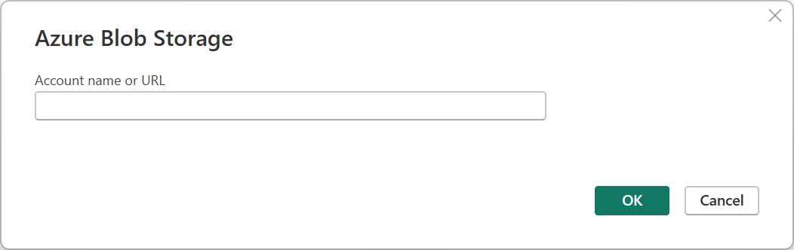

# Azure Blob Storage

## Summary

| Item | Description |
| ---- | ----------- |
| Release State | General Availability |
| Products | Excel Power BI (Datasets) Power BI (Dataflows) Fabric (Dataflow Gen2) Power Apps (Dataflows) Dynamics 365 Customer Insights Analysis Services |
| Authentication Types Supported | Anonymous Account key Organizational account Shared access signature (SAS) Service principal |
| Function Reference Documentation | [AzureStorage.BlobContents](/powerquery-m/azurestorage-blobcontents) [AzureStorage.Blobs](/powerquery-m/azurestorage-blobs) |

> [!NOTE]
> Some capabilities may be present in one product but not others due to deployment schedules and host-specific capabilities.

## Prerequisites

* An Azure subscription. Go to [Get Azure free trial](https://azure.microsoft.com/pricing/free-trial/).

* An Azure Blob Storage account. Follow the instructions at [Create a storage account](/azure/storage/common/storage-account-create?tabs=azure-portal). This article assumes that you've already created an Azure Blob Storage account, and uploaded data files to it.

> [!NOTE]
> If you're connecting to an Azure Blob Storage account from Power BI, the Azure Blob storage account must be in the same region as your Power BI account.

## Capabilities supported

* Import

## Connect to Azure Blob Storage from Power Query Desktop

To connect to Azure Blob Storage:

1. From **Get Data**, select the **Azure** category, select **Azure Blob Storage**, and then select **Connect**. More information: [Where to get data](../where-to-get-data.md)

   

2. In **Azure Blob Storage**, enter the account name or URL of your Azure Blob Storage account. Then select **OK**.

    

3. If this is the first time you're connecting to this account, select either the **Anonymous** or **Account key** authentication method to sign into the Azure Blob Storage account. More information: [Copy your account key from Azure Blob Storage](#copy-your-account-key-from-azure-blob-storage)

   

   For more information about using and managing authentication, go to [Authentication with a data source](../connectorauthentication.md).

   > [!NOTE]
   > If you are signing in from Excel, you can also select the shared access signature (SAS) authentication method.

4. Select **Connect**.

5. The **Navigator** dialog box shows the files that you uploaded to your Azure Blob Storage account. Select the containers you want to use, and then select either **Transform Data** to transform the data in Power Query or **Load** to load the data.

   

## Connect to Azure Blob Storage from Power Query Online

To connect to Azure Blob Storage:

1. From **Choose data source**, select the **Azure** category, and then select **Azure Blobs**.

   

2. In **Connection settings**, enter the account name or URL of your Azure Blob Storage account.

3. Optionally, enter the name of the on-premises data gateway you require.

4. Select the **Authentication kind** used to access your blob storage. If you've set blob storage for anonymous access, choose **Anonymous**. If you set blob storage to require an account key, choose **Account key**. More information: [Copy your account key from Azure Blob Storage](#copy-your-account-key-from-azure-blob-storage)

   

   For more information about using and managing authentication, go to [Authentication with a data source](../connectorauthentication.md).

5. Select **Next**.

6. The **Navigator** screen shows the files tht you uploaded to your Azure Blob Storage account. Select the containers you want to use, and then select **Transform data**.

   

## Copy your account key from Azure Blob Storage

To retrieve your Azure Blob Storage account key to use while authenticating your account in Power Query:

1. Sign in to the [Azure portal](https://portal.azure.com/).

2. Locate your Azure Blob Storage account.

3. In the storage account menu pane, under Security + networking, select Access keys.

   

4. In the **key1** section, locate the **Key** value. Select **Show** next to the key value.

5. Select the **Copy to clipboard** icon to copy the **Key** value.

   
