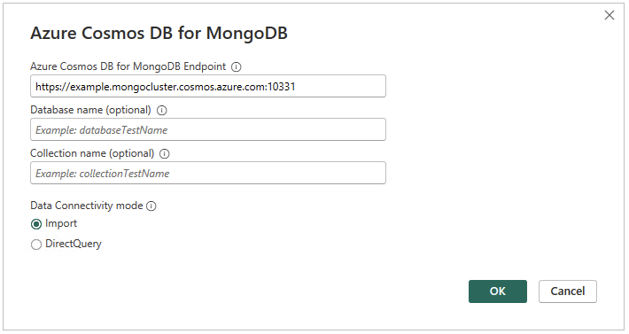
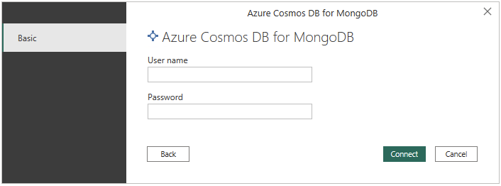
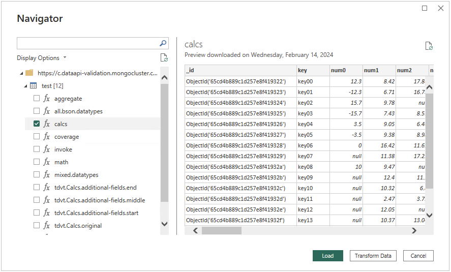
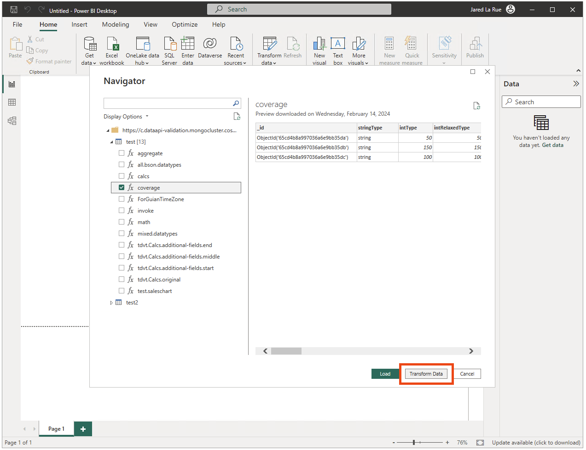
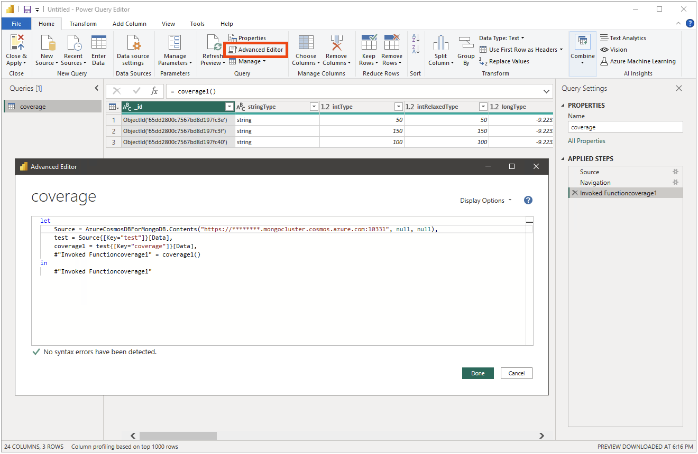
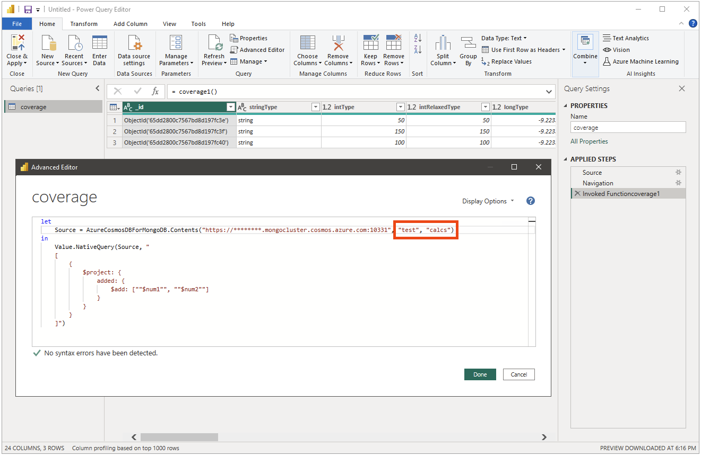
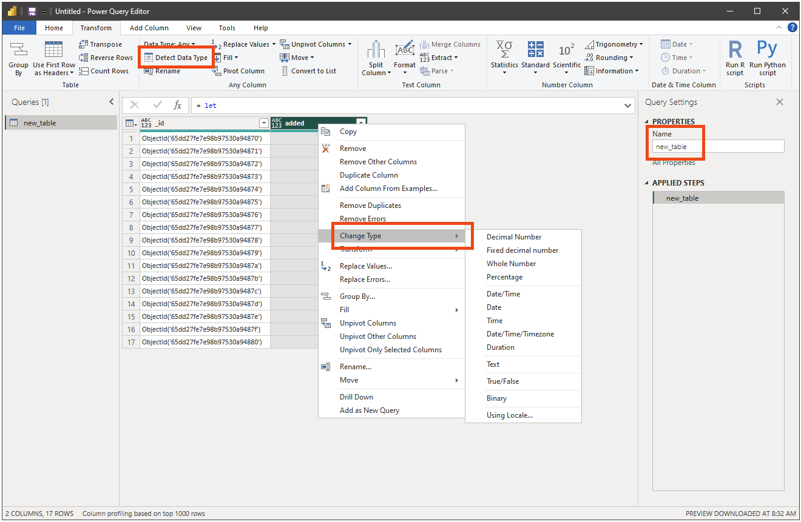
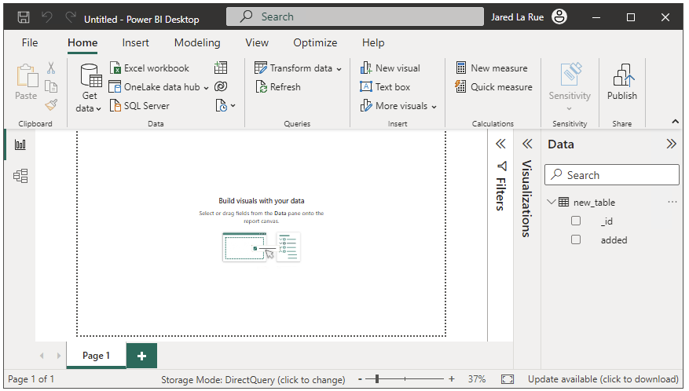

# Azure Cosmos DB for MongoDB

## Summary

| Item                             | Description                                                                                                                                                                    |
| -------------------------------- | ------------------------------------------------------------------------------------------------------------------------------------------------------------------------------ |
| Release state                    | Beta                                                                                                                                                                           |
| Products supported               | Power BI (Semantic models) Power BI (Dataflows)                                                                                                                            |
| Authentication types supported   | Basic (username / password) for all of  Power BI Desktop,  Power Query Online with gateway, and  Power Query Online                                                |
| Function Reference Documentation | [Direct Query Function Support](#direct-query-support) [Power Query M function reference](https://learn.microsoft.com/en-us/powerquery-m/power-query-m-function-reference) |

## Prerequisites

## Capabilities supported

- Import Mode
- Direct Query Mode (Power BI semantic models)
  - [Supported Power Query Functions](#direct-query-support)
- [Native Mongo Queries](#native-mongo-queries)

## Connect to Azure Cosmos DB for MongoDB database from Power Query Desktop

To connect to an Azure Cosmos DB for MongoDB from Power Query Desktop, take the following steps:

1. Select **Azure Cosmos DB for MongoDB** in the **Get Data** experience. The **Get Data** experience in Power Query Desktop varies between apps. For more information about the Power Query Desktop **Get Data** experience for your app, go to [Where to get data](../where-to-get-data.md).

1. In **Azure Cosmos DB for MongoDB**, provide the Cosmos DB endpoint. Optionally provide a **Database Name** and a **Collection Name**. If a database name is not provided, the upcoming **Navigator** screen will show all databases and their respective collections. Specifying both database and collection names will only show that collection. Specifying a collection name without a database name results in a connection error.

   

1. Select either the **Import** or **DirectQuery** data connectivity mode.

1. Select **OK**.

1. If this is the first time you're connecting to this database, input your username and password before selecting **Connect**.

   

1. In **Navigator**, select the database information you want. A list of collections will appear under each database. Select one or more collections then either select **Load** to load the data or **Transform Data** to continue transforming the data in Power Query Editor. Note that the list of databases and collections are affected if the optional **Database Name** and **Collection Name** were previously supplied.

   

## Connect to Azure Cosmos DB for MongoDB database from Power Query Online

**TO-DO** once connector is available for testing in Power BI Service

## Native Mongo Queries

The custom `Value.NativeQuery` function allows native MongoDB queries to be sent to the data source. The following example shows how to use the function to create a table when initially loading data. However, this function can be invoked at any time that the **Transform Data** option is available.

Note that **Native Mongo Queries** are only supported in **Direct Query** mode.

1. Using the **Navigator**, select at least one collection and choose **Transform Data**.

   

1. Choose **Advanced Editor**. The **Advanced Editor** dialog will appear showing the initial query that would be used to fetch all the data in the selected collection.

   

1. The `Value.NativeQuery` function takes two arguments: a Source, and the query itself. The Source variable is populated with all the information needed to connect to the database. If desired, update the name of the collection that the query will run against. The collection does not have to be the same as the one selected in the **Navigator**.

   

1. The second argument is a valid MongoDB query, enclosed in double-quotation marks. Quotation marks within the query are escaped with an additional quotation mark e.g. `"num1"` to `""$num1""`

1. Choose **Done** to transform the data.

1. As no schema information is returned by Cosmos DB after the query is executed, the resultant table will identify all column types as _any_. Either transform the columns using **Detect Data Type** or manually change the data type for columns of interest. Update the name of the resultant table if desired.

   

1. Once the **Power Query Editor** is closed and the changes applied, the resultant table will appear in the **Data** pane.

   

Refer to [Troubleshooting & Limitations](#troubleshooting--limitations) for limitations of the `Value.NativeQuery` function.

## Direct Query Support

**Direct Query** supports the following Power Query functions:

- Date.From, DateTime.From, DateTimeZone.From, Date.Day, Date.DayOfWeek, Date.DayOfYear, Date.Month, Date.WeekOfYear, Date.Year
- List.Average, List.Contains, List.First, List.Last, List.Max, List.Min, List.Sum
- Int64.From, Currency.From, Percentage.From, Text.From, Logical.From, Logical.FromText, Logical.ToText
- Number.Abs, Number.Mod, Number.Round, Number.RoundAwayFromZero, Number.RoundDown, Number.RoundTowardZero, Number.RoundUp
- Table.RowCount
- Time.Hour, Time.Minute, Time.Second
- Value.Add, Value.Divide, Value.Equals, Value.Multiply, Value.NullableEquals, Value.Subtract

## Troubleshooting & Limitations

- As [Power Query Text functions](https://learn.microsoft.com/en-us/powerquery-m/text-functions) are not yet supported, neither is using **Text Filters** on a column when **Transforming Data** in **Direct Query** mode.

  - Examples of such filters: _Begins With_, _Ends With_, _Contains_, etc.
  - An error message will appear similar to _Unsupported Operation: Unsupported function invocation: 'Text.StartsWith'_

- As not all Power Query functions are supported when using **Direct Query**, either switch to **Import Mode** or issue a **Native Mongo Query** that accomplishes the intent of the missing Power Query function(s).

- No schema information is returned when using **Native Mongo Queries**. All columns are considered `any` and will need to be manually transformed to the desired data type.

- The custom `Value.NativeQuery` function samples only the first document that is returned by the query in order to construct the resultant table. The consequence is that if there are additional fields in subsequent documents, those fields will _not_ be included in the resultant table. Either project specific columns or query a specific compensating view.

- The custom `Value.NativeQuery` function can only be used with **Direct Query** and not with **Import Mode**.

- Power BI drops the milliseconds from date types when applying a built in filter. Thus if a date type has milliseconds in it then those built in filters will not work.

- Field names that contain special characters are not supported (e.g. `$`, `.`, `@`, etc.).

- When a divide by 0 is encountered using **Direct Query**, the query will fail. This differs from the usual `#infinity` Power BI result, but aligns with MongoDB behavior.

- The following data types are currently considered as strings. As such, using values with these data types cannot be used for filtering in Direct Query, as the push down will fail:
  - decimal128
  - regularExpression
  - timestamp
