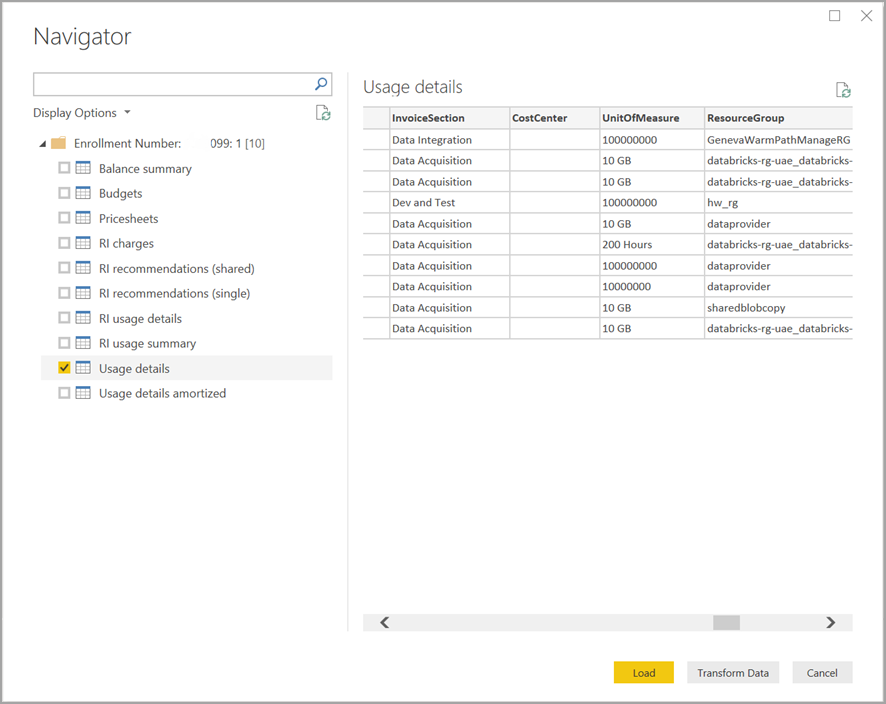

# Azure Cost Management

## Summary

| Item | Description |
| ---- | ----------- |
| Release State | General Availability |
| Products | Power BI (Datasets)<br/>Power BI (Dataflows)<br/>Fabric (Dataflow Gen2) |
| Authentication Types Supported | Organizational Account |
| Function Reference Documentation | &mdash; |

> [!NOTE]
> This connector replaces the previously available Azure Consumption Insights and Azure Cost Management (Beta) connectors. Any reports created with the previous connector must be recreated using this connector.

## Prerequisites

* An Azure subscription. Go to [Get Azure free trial](https://azure.microsoft.com/pricing/free-trial/).

* A direct [Microsoft Customer Agreement](https://azure.microsoft.com/pricing/purchase-options/microsoft-customer-agreement/) or an [Enterprise Agreement (EA)](https://azure.microsoft.com/pricing/enterprise-agreement/).

## Capabilities supported

* Import
* Advanced options
  * Start Date
  * End Date

## Connect to Azure Cost Management from Power Query Desktop

To connect to the **Azure Cost Management**:

1. In the **Home** ribbon, select **Get Data**.

2. Select **Azure** from the list of data categories.

3. Select **Azure Cost Management**.

    

4. In the dialog that appears, for the **Choose Scope** drop down, use **Manually Input Scope** for **Microsoft Customer Agreements**, or use **Enrollment Number** for **Enterprise Agreements (EA)**.

## Connect to a Microsoft Customer Agreement account

This section describes the steps necessary to connect to a Microsoft Customer Agreement account.

### Connect to a billing account

To connect to a billing account, you need to retrieve your **Billing account ID** from the Azure portal:

1. In the [Azure portal](https://portal.azure.com/), navigate to **Cost Management + Billing**.

2. Select your Billing profile.

3. Under **Settings** in the menu, select **Properties** in the sidebar.

4. Under **Billing profile**, copy the **ID**.

    :::image type="content" source="media/azure-cost-management/billing-profile.png" alt-text="Screenshot of Cost management billing profile":::

5. For **Choose Scope**, select **Manually Input Scope** and input the connection string as shown in the example below, replacing *{billingAccountId}* with the data copied from the previous steps.

    `/providers/Microsoft.Billing/billingAccounts/{billingAccountId}`

    Alternatively, for **Choose Scope**, select **Enrollment Number** and input the Billing Account ID string as copied from the previous steps.

6. Enter the number of months and select **OK**.

    :::image type="content" source="media/azure-cost-management/number-of-months.png" alt-text="Screenshot of Azure Cost Management with number of months input":::

    Alternatively, if you want to download less than a month's worth of data you can set *Number of months* to zero, then specify a date range using *Start Date* and *End Date* values that equate to less than 31 days.

7. When prompted, sign in with your Azure user account and password. You must have access to the Billing account scope to successfully access the billing data.

### Connect to a billing profile

To connect to a **billing profile**, you must retrieve your **Billing profile ID** and **Billing account ID** from the Azure portal:

1. In the [Azure portal](https://portal.azure.com/), navigate to **Cost Management + Billing**.

2. Select your Billing profile.

3. Under **Settings** in the menu, select **Properties** in the sidebar.

4. Under **Billing profile**, copy the **ID**.

5. Under **Billing account**, copy the **ID**.

    :::image type="content" source="media/azure-cost-management/copy-id.png" alt-text="Screenshot of Azure Cost Management billing account information":::

6. For **Choose Scope**, select **Manually Input Scope** and input the connection string as shown in the example below, replacing *{billingAccountId}* and *{billingProfileId}* with the data copied from the previous steps.

    `/providers/Microsoft.Billing/billingAccounts/{billingAccountId}/billingProfiles/{billingProfileId}`

7. Enter the number of months and select **OK**.

8. When prompted, sign in with your Azure user account and password. You must have access to the Billing profile to successfully access the billing profile data.

## Connect to an Enterprise Agreement account

To connect with an Enterprise Agreement (EA) account, you can get your enrollment ID from the Azure portal:

1. In the [Azure portal](https://portal.azure.com/), navigate to **Cost Management + Billing**.

2. Select your billing account.

3. On the **Overview** menu, copy the **Billing account ID**.

4. For **Choose Scope**, select **Enrollment Number** and paste the billing account ID from the previous step.

5. Enter the number of months and then select **OK**.

    

6. When prompted, sign in with your Azure user account and password. You must use an Enterprise Administrator account for Enterprise Agreements.

## Data available through the connector

Once you successfully authenticate, a **Navigator** window appears with the following available data tables:

| **Table** | **Description** |
| --- | --- |
| **Balance summary** | Summary of the balance for the current billing month for Enterprise Agreements (EA). |
| **Billing events** | Event log of new invoices, credit purchases, etc. Microsoft Customer Agreement only. |
| **Budgets** | Budget details to view actual costs or usage against existing budget targets. |
| **Charges** | A month-level summary of Azure usage, Marketplace charges, and charges billed separately. Microsoft Customer Agreement only. |
| **Credit lots** | Azure credit lot purchase details for the provided billing profile. Microsoft Customer Agreement only. |
| **Pricesheets** | Applicable meter rates for the provided billing profile or EA enrollment. |
| **RI charges** | Charges associated to your Reserved Instances over the last 24 months. This table is in the process of being deprecated, please use RI transactions |
| **RI recommendations (shared)** | Reserved Instance purchase recommendations based on all your subscription usage trends for the last 30 days. |
| **RI recommendations (single)** | Reserved Instance purchase recommendations based on your single subscription usage trends for the last 30 days. |
| **RI transactions** | List of transactions for reserved instances on billing account scope. |
| **RI usage details** | Consumption details for your existing Reserved Instances over the last month. |
| **RI usage summary** | Daily Azure reservation usage percentage. |
| **Usage details** | A breakdown of consumed quantities and estimated charges for the given billing profile on EA enrollment. |
| **Usage details amortized** | A breakdown of consumed quantities and estimated amortized charges for the given billing profile on EA enrollment. |

You can select a table to see a preview dialog. You can select one or more tables by selecting the boxes beside their name. Then either select **Load** to load the data or **Transform Data** to continue transforming the data in Power Query Editor.



When you select **Load**, the data is loaded into Power BI Desktop.

When the data you selected is loaded, the data tables and fields are shown in the **Fields** pane.

## Considerations and limitations

The following considerations and limitations apply to the Azure Cost Management connector:

* The Azure Cost Management connector doesn’t support pay-as-you-go Microsoft Customer Agreements or indirect Microsoft Customer Agreements. Microsoft Partner Agreements are also not supported. If you have an unsupported agreement, you can use Exports to save the cost data to a share and then connect to it using Power BI. More information: [Tutorial - Create and manage exported data from Azure Cost Management](/azure/cost-management-billing/costs/tutorial-export-acm-data?tabs=azure-portal)

* The Azure Cost Management connector uses OAuth 2.0 for authentication with Azure and identifies users who are going to use the connector. Tokens generated in this process are valid for a specific period. Power BI preserves the token for the next login. OAuth 2.0, is a standard for the process that goes on behind the scenes to ensure the secure handling of these permissions. To connect, you must use an [Enterprise Administrator](/azure/billing/billing-understand-ea-roles) account for Enterprise Agreements, or have [appropriate permissions](/microsoft-365/commerce/billing-and-payments/manage-billing-profiles) at the billing account or billing profile levels for Microsoft Customer Agreements.

* Data row requests exceeding one million rows is not supported by Power BI. Instead, you can try using the export feature described in [create and manage exported data in Azure Cost Management](/azure/cost-management-billing/costs/tutorial-export-acm-data).

* The Azure Cost Management data connector doesn't work with Office 365 GCC customer accounts.

* **Data refresh:** The cost and usage data is typically updated and available in the Azure portal and supporting APIs within 8 to 24 hours, so we suggest you constrain Power BI scheduled refreshes to once or twice a day.

* **Data source reuse:** If you have multiple reports that are pulling the same data, and don't need additional report-specific data transformations, you should reuse the same data source, which would reduce the amount of time required to pull the Usage Details data.

  For more information on reusing data sources, go to:

  * [Introduction to datasets across workspaces](/power-bi/connect-data/service-datasets-across-workspaces)
  * [Create reports based on datasets from different workspaces](/power-bi/connect-data/service-datasets-discover-across-workspaces)

You might receive a *400 bad request* from the **RI usage details** when you try to refresh the data if you've chosen a date parameter greater than three months. To mitigate the error, take the following steps:

1. In Power BI Desktop, select **Home > Transform data**.

2. In Power Query Editor, select the **RI usage details** dataset and select **Advanced Editor**.

3. Update the Power Query code as shown in the following paragraph(s), which will split the calls into three-month chunks. Make sure you note and retain your enrollment number, or billing account/billing profile ID.

   For **EA** use the following code update:
  
    ```powerquery-m
    let
        enrollmentNumber = "<<Enrollment Number>>",
        optionalParameters1 = [startBillingDataWindow = "-9", endBillingDataWindow = "-6"],
        source1 = AzureCostManagement.Tables("Enrollment Number", enrollmentNumber, 5, optionalParameters1),
        riusagedetails1 = source1{[Key="riusagedetails"]}[Data],
        optionalParameters2 = [startBillingDataWindow = "-6", endBillingDataWindow = "-3"],
        source2 = AzureCostManagement.Tables("Enrollment Number", enrollmentNumber, 5, optionalParameters2),    
        riusagedetails2 = source2{[Key="riusagedetails"]}[Data],
        riusagedetails = Table.Combine({riusagedetails1, riusagedetails2})
    in
        riusagedetails
    ```

    For **Microsoft Customer Agreements** use the following update:

    ```powerquery-m
    let
        billingProfileId = "<<Billing Profile Id>>",
        optionalParameters1 = [startBillingDataWindow = "-9", endBillingDataWindow = "-6"],
        source1 = AzureCostManagement.Tables("Billing Profile Id", billingProfileId, 5, optionalParameters1),
        riusagedetails1 = source1{[Key="riusagedetails"]}[Data],
        optionalParameters2 = [startBillingDataWindow = "-6", endBillingDataWindow = "-3"],
        source2 = AzureCostManagement.Tables("Billing Profile Id", billingProfileId, 5, optionalParameters2),    
        riusagedetails2 = source2{[Key="riusagedetails"]}[Data],
        riusagedetails = Table.Combine({riusagedetails1, riusagedetails2})
    in
        riusagedetails
    
    ```

4. Once you've updated the code with the appropriate update from the previous step, select **Done** and then select **Close & Apply**.
