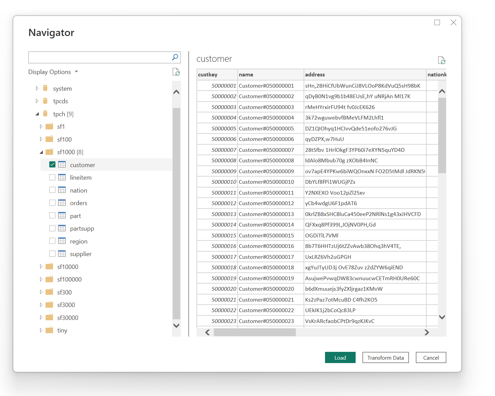

# Azure HDInsight on AKS Trino (Beta)

## Summary

|Item|Description|
|-|-|
|Release State|Preview|
|Products|Power BI (Datasets) Power BI (Dataflows)|
|Authentication Types Supported|Azure Active Directory (Microsoft Entra ID)|

## Prerequisites

By default, Power BI installs a Azure HDInsight on AKS Trino driver.

## Capabilities supported

* Import
* DirectQuery (Power BI Datasets)
* Advanced options
  * Native SQL statement
  * Session properties
  * Set default catalog/schema

## Connect to Azure HDInsight on AKS Trino from Power Query Desktop

To make the connecton, take the following steps:

1. Select the **Azure HDInsight on AKS Trino** option in the connector selection.

2. In the **Azure HDInsight on AKS Trino** dialog that appears, provide the Trino URL.

   

3. Select either the **DirectQuery** (recommended for Trino big data) or **Import** data connectivity mode.

   

4. Select OK.

5. If this is the first time you're connecting to this Trino cluster, select **Sign in** to authenticate. Then select **Connect**.

   

6. In **Navigator**, expand the catalog and schema to reveal the table you want, then either select **Load** to load the data or **Transform Data** to continue transforming the data in Power Query Editor.

   

## Connect using advanced options

Both Power Query Desktop and Power Query Online provide a set of advanced options that you can add to your query if needed. The following table lists all of the advanced options you can set in Power Query Desktop and Power Query Online.

|Advanced option|Description|
|-|-|
|SQL statement|For information, go to [Import data from a database using native database query](../native-database-query.md).|
|Session properties|Allows Trino session properties to be passed with the connection to the Trino cluster. Session property should specify key value pairs separated by a colon, and each pair should be separated by a comma. Example: `distributed_sort:true,colocated_join:false`|
|Default catalog/schema|Providing a catalog and schema sets the context of the connection to within a specific Trino catalog and schema.|

Once you've selected the advanced options you require, select OK in Power Query Desktop or Next in Power Query Online to connect to your SQL Server database.

## Known issues and limitations

### Types Support

The Trino connector only supports the Trino types listed here. Other types, such as **uuid**, **P4HyperLogLog** will need to be transformed or cast to be usable with the connector.

* bigint
* integer
* smallint
* tinyint
* real
* double
* decimal
* boolean
* char
* varchar
* date
* timestamp
* array
* map
* varbinary
