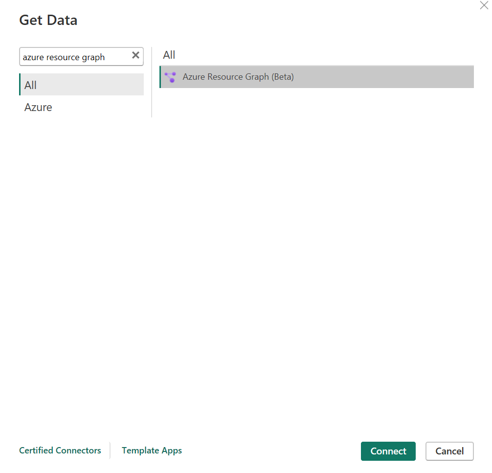

# Azure Resource Graph (Preview)

## Summary

| Item | Description |
| ---- | ----------- |
| Release State | Public Preview |
| Products | Power BI Datasets (Desktop + Service) Power BI (Dataflows) Fabric (Dataflow Gen2) |
| Authentication Types Supported | Organizational Account |

> [!NOTE]
> Some capabilities might be present in one product but not others due to deployment schedules and host-specific capabilities.

## Prerequisites

* An Azure subscription. Go to [Get Azure free trial](https://azure.microsoft.com/pricing/free-trial/).

* You must have appropriate rights in [Azure role-based access control (Azure RBAC)](/azure/role-based-access-control/overview) with at least read access to the resources you want to query.

## Capabilities supported

* Import
* Advanced options
  * Scope by subscription(s) and/or management group(s)

> [!NOTE]
> If you participated in the ARG Connector Private Preview, be sure to delete the AzureResourceGraph.mez preview file. Failure to do so might result in your testing custom connector being used by Power Query inadvertently instead of the newly certified connector.

## Connect to Azure Resource Graph from Power Query Desktop

To connect to Azure Resource Graph from Power Query Desktop:

1. In **Get Data**, select **Azure Resource Graph**, and then select **Connect**. More information: [Where to get data](../where-to-get-data.md)

2. In the **Azure Resource Graph** dialog box, fill in the query and any optional fields, such as **Scope**.

> [!NOTE]
> You can scope queries to either subscription or management group level, **if neither option is chosen the query will execute at the tenant level by default.**

3. If you're connecting to this site for the first time, select **Sign in** and input your credentials. Then select **Connect**.

4. In **Navigator**, select the tables you require, then either load or transform the data.

## Connect to Azure Resource Graph from Power Query Online

To connect to Azure Resource Graph from Power Query Online:

1. In **Choose data source**, search for **Azure Resource Graph**, and then select **Azure Resource Graph**. More information: [Where to get data](../where-to-get-data.md)

2. In **Connect to data source**, fill in the query and any optional fields, such as **Scope**.

3. Sign in to your organizational account.

4. When you've successfully signed in, select **Next**.

5. In **Choose data**, select the data you require, and then select **Transform Data**.

> [!NOTE]
> Expect longer wait times are large query results.

## Connect using advanced options

Power Query provides an advanced option that you can add to your query if needed.

|Advanced option|Description|
|---------------|-----------|
|Scope|Specify whether you want to query at the subscription or management level. If you don't select either subscription or management, the query automatically applies to the tenant level by default.|
|Subscription Id(s)|Specify any specific subscriptions you want to query against. Enter each subscription ID separated by commas. This field is required if you select the subscription scope.|
|Management Group Id(s)|Specify any specific management groups you want to query against. Enter each management group separated by commas. This field is required if you select management group scope.|
|$resultTruncated|If you would like to retrieve more than 1000 records, set **$resultTruncated** to FALSE. By default, ARG returns only up to 1000 records.|

## See also

* [Azure Resource Graph Overview](/azure/governance/resource-graph/overview)
* [Starter Azure Resource Graph query samples](/azure/governance/resource-graph/samples/starter?tabs=azure-cli)
