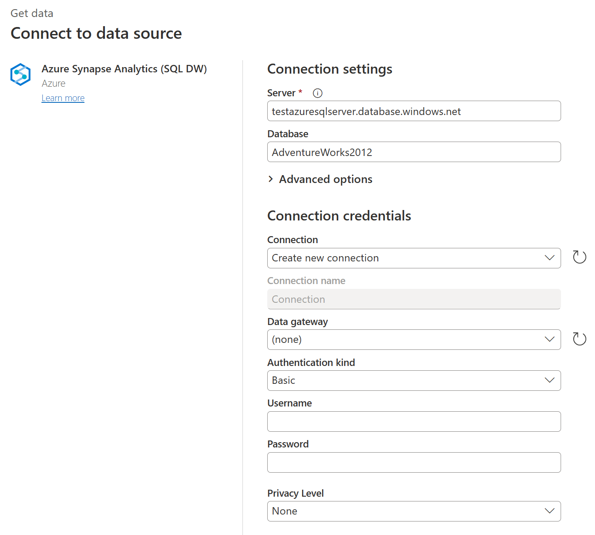
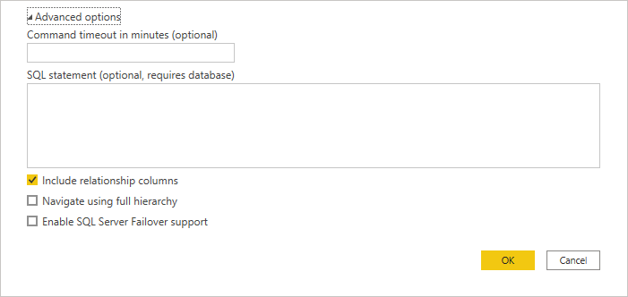

# Azure Synapse Analytics (SQL DW)

## Summary

| Item | Description |
| ---- | ----------- |
| Release State | General Availability |
| Products | Excel Power BI (Datasets) Power BI (Dataflows) Fabric (Dataflow Gen2) Power Apps (Dataflows) Dynamics 365 Customer Insights Analysis Services |
| Authentication Types Supported | Windows (Power BI Desktop, Excel, online service with gateway) Database (Power BI Desktop, Excel) Microsoft Account (all) Basic (online service) |
| Function Reference Documentation | [Sql.Database](/powerquery-m/sql-database) [Sql.Databases](/powerquery-m/sql-databases) |

>[!Note]
> Some capabilities may be present in one product but not others due to deployment schedules and host-specific capabilities.

## Prerequisites

By default, Power BI installs an OLE DB driver for Azure Synapse Analytics (SQL DW). However, for optimal performance, we recommend that the customer installs the [SQL Server Native Client](/sql/relational-databases/native-client/applications/installing-sql-server-native-client) before using the Azure Synapse Analytics (SQL DW) connector. SQL Server Native Client 11.0 and SQL Server Native Client 10.0 are both supported in the latest version.

## Capabilities Supported

* Import
* DirectQuery (Power BI Datasets)
* Advanced options
  * Command timeout in minutes
  * Native SQL statement
  * Relationship columns
  * Navigate using full hierarchy
  * SQL Server failover support

## Connect to Azure Synapse Analytics (SQL DW) from Power Query Desktop

To make the connection from Power Query Desktop:

1. Select the **Azure Synapse Analytics (SQL DW)** option in the connector selection.

2. In the **SQL Server database** dialog that appears, provide the name of the server and database (optional). In this example, `TestAzureSQLServer` is the server name and `AdventureWorks2012` is the database.

    

3. Select either the **Import** or **DirectQuery** data connectivity mode.

   You can also select and enter advanced options that will modify the connection query, such as a command timeout or a native query (SQL statement). More information: [Connect using advanced options](#connect-using-advanced-options)

4. Select **OK**.

5. If this is the first time you're connecting to this database, select the authentication type, input your credentials, and select the level to apply the authentication settings to. Then select **Connect**.

   

   For more information about authentication methods, go to [Authentication with a data source](../connectorauthentication.md).

   >[!Note]
   >  If the connection is not encrypted, you'll be prompted with the following dialog.

   

   Select **OK** to connect to the database by using an unencrypted connection, or follow the instructions in [Enable encrypted connections to the Database Engine](/sql/database-engine/configure-windows/enable-encrypted-connections-to-the-database-engine) to set up encrypted connections to Azure Synapse Analytics (SQL DW).

6. In **Navigator**, select the database information you want, then either select **Load** to load the data or **Transform Data** to continue transforming the data in Power Query Editor.

## Connect to Azure Synapse Analytics (SQL DW) from Power Query Online

To make the connection from Power Query Online:

1. Select the **Azure Synapse Analytics (SQL DW)** option in the connector selection.

2. In the **Azure Synapse Analytics (SQL DW)** dialog that appears, provide the name of the server and database (optional). In this example, `TestAzureSQLServer` is the server name and `AdventureWorks2012` is the database.

   

   You can also select and enter advanced options that will modify the connection query, such as a command timeout or a native query (SQL statement). More information: [Connect using advanced options](#connect-using-advanced-options)

3. If this is the first time you're connecting to this database, select the authentication kind and input your credentials.

4. If required, select the name of your on-premises data gateway.

5. If the connection is not encrypted, clear the **Use Encrypted Connection** check box.

6. Select **Next** to continue.

7. In **Navigator**, select the data you require, and then select **Transform data**.

## Connect using advanced options

Both Power Query Desktop and Power Query Online provide a set of advanced options that you can add to your query if needed.

The following table lists all of the advanced options you can set in Power Query Desktop and Power Query Online.

| Advanced option | Description |
| --------------- | ----------- |
| Command timeout in minutes | If your connection lasts longer than 10 minutes (the default timeout), you can enter another value in minutes to keep the connection open longer. This option is only available in Power Query Desktop. |
| SQL statement | For information, go to [Import data from a database using native database query](../native-database-query.md). |
| Include relationship columns | If checked, includes columns that might have relationships to other tables. If this box is cleared, you won’t see those columns. |
| Navigate using full hierarchy | If checked, the navigator displays the complete hierarchy of tables in the database you're connecting to. If cleared, the navigator displays only the tables whose columns and rows contain data. |
| Enable SQL Server Failover support | If checked, when a node in the Azure SQL [failover group](/azure/azure-sql/database/auto-failover-group-overview?tabs=azure-powershell) isn't available, Power Query moves from that node to another when failover occurs. If cleared, no failover occurs. |

Once you've selected the advanced options you require, select **OK** in Power Query Desktop or **Next** in Power Query Online to connect to your Azure SQL database.

## Troubleshooting

### Always Encrypted columns

Power Query doesn't support 'Always Encrypted' columns.
