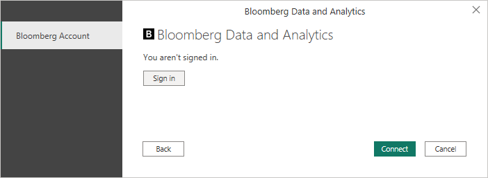

# Bloomberg Data and Analytics

> [!NOTE]
>The following connector article is provided by Bloomberg, the owner of this connector and a member of the Microsoft Power Query Connector Certification Program. If you have questions regarding the content of this article or have changes you would like to see made to this article, visit the Bloomberg website and use the support channels there.

## Summary

| Item | Description |
| ---- | ----------- |
| Release State | General Availability |
| Products | Power BI (Datasets) Power BI (Dataflows) Fabric (Dataflow Gen2) |
| Authentication Types Supported | Organizational account |

## Prerequisites

Your organization must subscribe to Bloomberg PORT Enterprise and you must be a Bloomberg Anywhere user and have a Bloomberg biometric authentication device (B-Unit).

## Capabilities Supported

* Import

## Connect to Bloomberg Data and Analytics

To connect to Bloomberg Data and Analytics:

1. In Power BI Desktop, select **Home** > **Get Data**.

2. Select **Other** from the categories on the left, select **Bloomberg Data and Analytics**, and then select **Connect**.

   

3. If this is the first time you're connecting to the Bloomberg Data and Analytics connector, a third-party notice will be displayed. Select **Don't warn me again with this connector** if you don't want this message to be displayed again, and then select **Continue**.

4. Enter a Bloomberg Query Language (BQL) query to specify what data you want to get. To learn more about BQL, contact your Bloomberg Sales representative. Select **OK**.

   

5. To sign in to your Bloomberg account, select **Sign in**.

   

6. In the window that appears, provide your credentials to sign in to your Bloomberg account. If you entered an email address and a password, select **Next**.

   

7. Enter your B-Unit code and select **Log In**.

   

8. Once you've successfully signed in, select **Connect**.

   

Once the connection is established, you will see data available for preview in **Navigator**.

You can **Load** the selected table, or you can select **Transform Data** to edit the query, which opens Power Query Editor. You can then filter and refine the set of data you want to use, and then load that refined set of data into Power BI Desktop.

