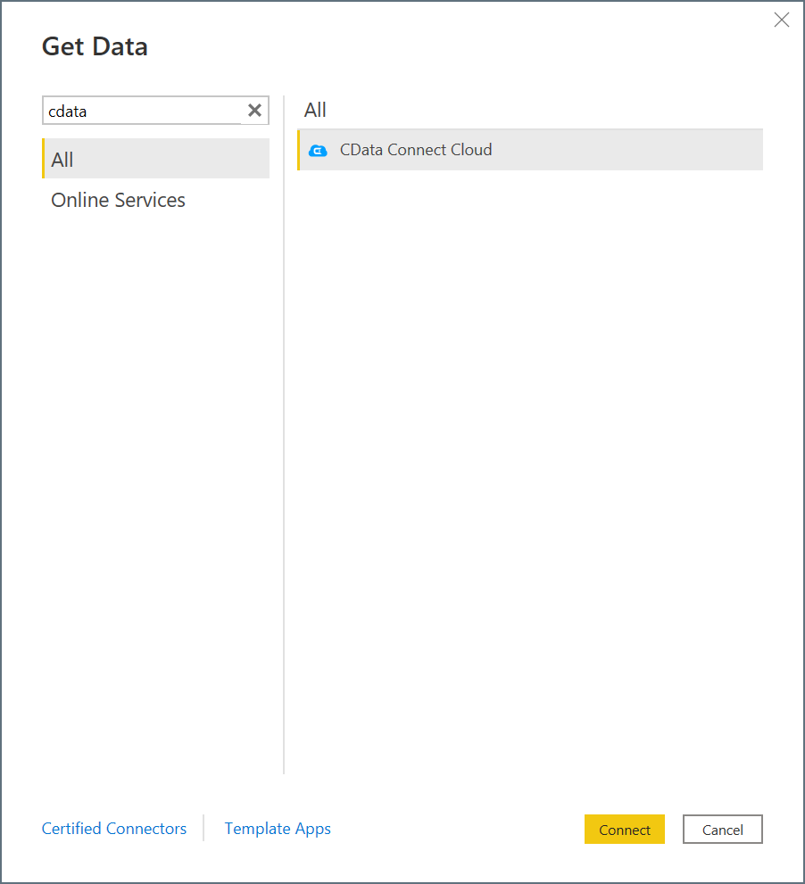
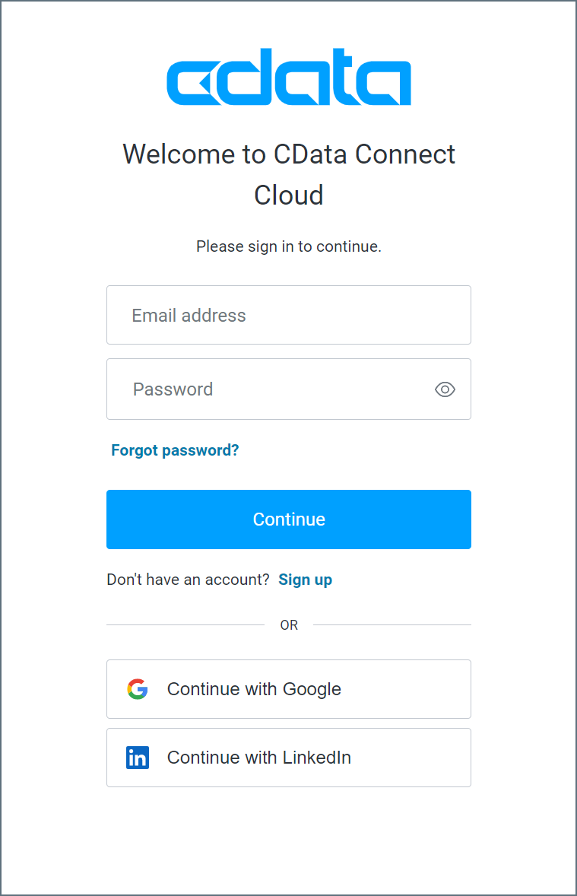

# CData Connect Cloud

> [!NOTE]
> The following connector article is provided by CData, the owner of this connector and a member of the Microsoft Power Query Connector Certification Program. If you have questions regarding the content of this article or have changes you would like to see made to this article, visit the CData website and use the support channels there.

## Summary

| Item | Description |
| ---- | ----------- |
| Release State | General Availability |
| Products Supported | Power BI (Datasets)   Power BI (Dataflows) Fabric (Dataflow Gen2) |
| Authentication Types Supported | CData account (OAuth) |
| Function Reference Docs | &mdash; |

## Prerequisites

* A [CData Connect Cloud](https://cloud.cdata.com/) account
* At least one [connection](https://cloud.cdata.com/docs/Connections.html) configured in your CData Connect Cloud account

## Capabilities supported

* Import

## Connect to CData Connect Cloud

Follow these steps to connect to your CData Connect Cloud account:

1. In Power BI Desktop, select **Get Data**.

2. In the search field, enter **CData**.

3. Select **CData Connect Cloud** in the list and then select **Connect**.

    

4. In the **CData Connect Cloud** connection window, select **Sign in**.

    

5. In the sign-in window, enter your CData Connect Cloud sign-in information, and then select **Continue**.

    

6. Select **Connect** in the connection window.

    

The **Navigator** window appears and allows you to import your data.

## Import data

With the **Navigator** window open, follow these steps to access your CData Connect Cloud data:

1. Expand the **CData Connect Cloud** tree. Your connections appear as subtrees.

2. Select the data from each connection that you want to import.

3. Select **Load** or **Transform Data**.

    * **Load** instructs the connector to execute the underlying query to CData Connect Cloud.
    * **Transform Data** launches the Power Query editor and allows you to adjust the query before loading the data. When you're finished using the Power Query editor, select **Close & Apply** in the navigation ribbon to apply your changes and load the data.
