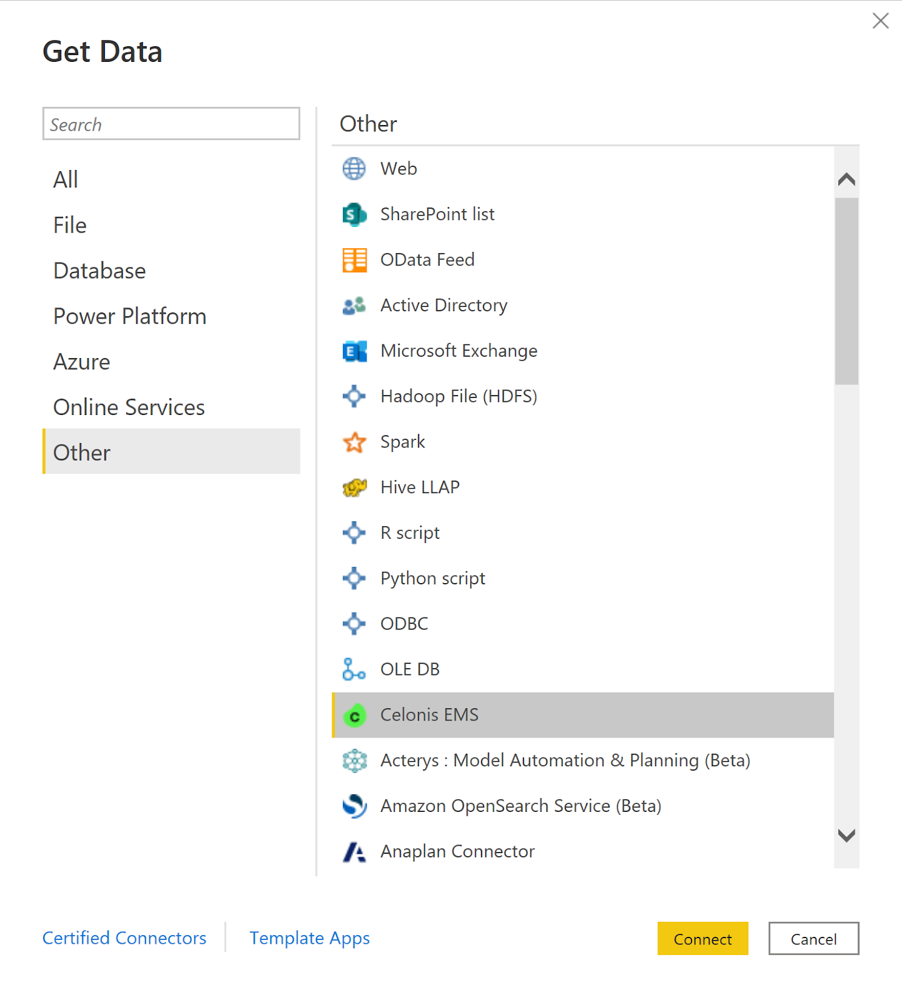
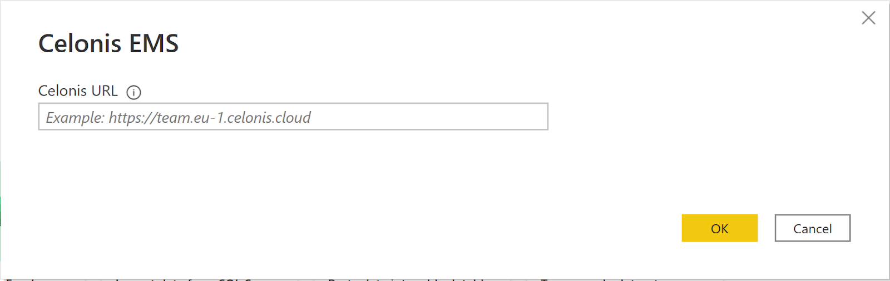
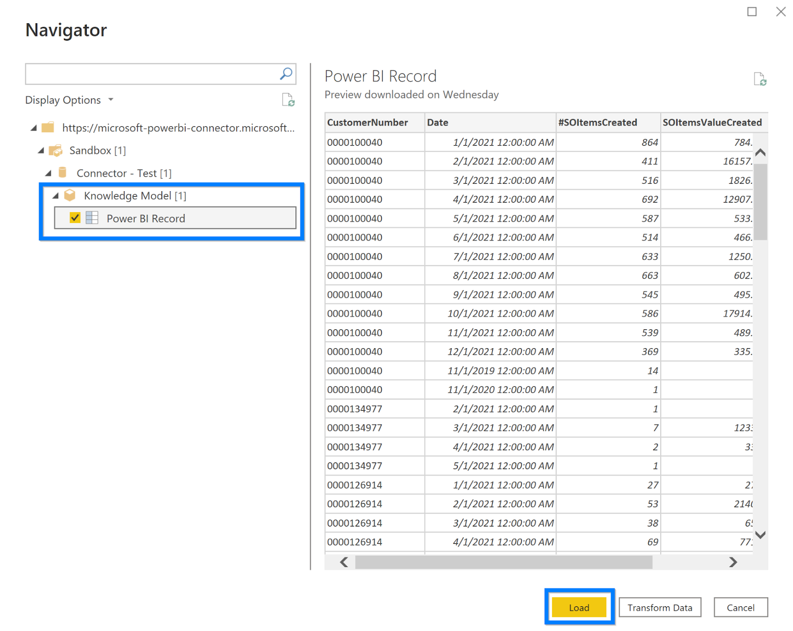

# Celonis EMS (Beta)

  

## Summary

| Item | Description |
| ---- | ----------- |
| Release State | Beta |
| Products | Power BI (Datasets)   Power BI (Dataflows) |
| Authentication Types Supported | Organizational Account |
| Function Reference Documentation | [Web.Contents](https://learn.microsoft.com/en-us/powerquery-m/web-contents)   [Parquet.Document](xxx)   [Json.Document](https://learn.microsoft.com/en-us/powerquery-m/json-document)   [Json.FromValue](https://learn.microsoft.com/en-us/powerquery-m/json-fromvalue)|

  

## Prerequisites

Before you can sign in to [Celonis EMS](https://www.celonis.com/ems/platform/?utm_source=google&utm_medium=cpc&utm_campaign=evergreen&utm_content=en_maxconvvalueems_platform_eta&creative=605673291817&keyword=celonis%20ems&matchtype=e&network=g&device=c&_bt=605673291817&_bk=celonis%20ems&_bm=e&_bn=g&_bg=134342462066&gclid=CjwKCAjw1ICZBhAzEiwAFfvFhD5aEPA6iavBUsBG1p0WeGEVi9OF5qcOaohHqNgpbuWa-f9ZHwCtHhoCSqYQAvD_BwE), you must have a Celonis EMS account (username/password).

## Capabilities Supported

* Import
* Navigate using full hierarchy

  

## Connect to Celonis EMS from Power Query Desktop

  

To make the connection, take the following steps:

1. Select **Get Data** from the Home ribbon in Power BI Desktop. Select **Celonis EMS** in the connector selection and then click **Connect**.

  

  

1. The **Celonis EMS** dialog will appear to enter the Celonis EMS Team URL with an example URL as shown below. Enter your Celonis EMS Team URL and click **OK**.

  

1. Enter your **Application Key** or your **Personal API Key** generated in the Celonis EMS.

  
4. Once you're done, select **Connect**.

  
5. Upon a successful connection, the **Navigator** opens with the list of packages available in the given EMS team. Select the **Knowledge Model Record** you want to import and click **Load**.

## Limitations and issues

You should be aware of the following limitations and issues associated with accessing Celonis EMS data:

* Celonis EMS has a built-in limit of 200 K rows and 20 columns returned per Record.

* Only defined records can be imported. Auto-generated records are excluded here.

