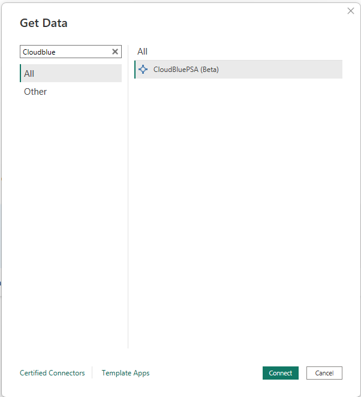
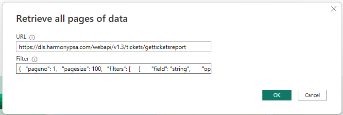
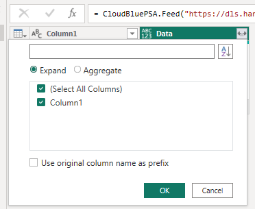
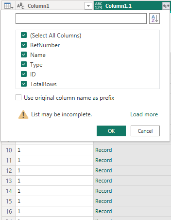
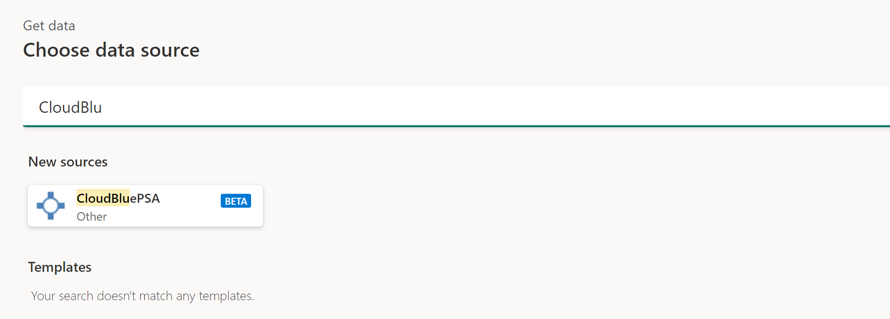
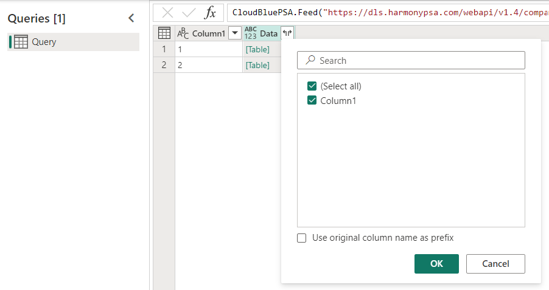
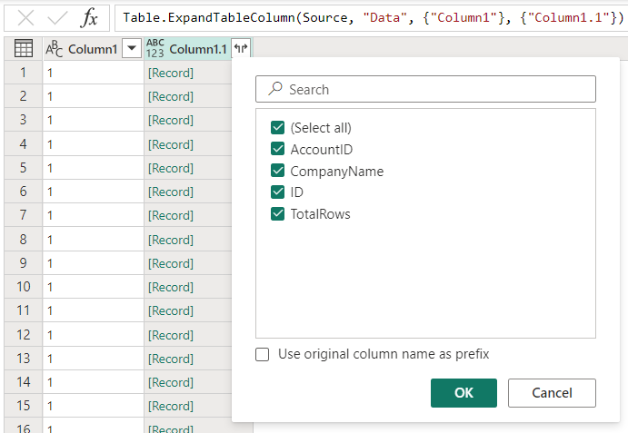

# CloudBluePSA (Beta)

> [!Note]
> The following connector article is provided by CloudBluePSA, the owner of this connector and a member of the Microsoft Power Query Connector Certification Program. If you have questions regarding the content of this article or have changes you would like to see made to this article, visit the CloudBluePSA website and use the support channels there.

## Summary

| Item | Description |
| ---- | ----------- |
| Release State | Beta |
| Products | Power BI (Datasets) Power BI (Dataflows) Fabric (Dataflow Gen2) |
| Authentication Types Supported | API Key |
| Function Reference Documentation | [CloudBluePSA Connector.Help](https://help.harmonypsa.com/articles/#!cloudblue-psa-4-28-publication/using-the-power-bi-connector) |

## Prerequisites

Before you can use the CloudBluePSA connector, you must have a CloudBluePSA instance (username/password) and an API key. Sign in to your PSA instance, which is usually at a URL similar to `YOUR_COMPANY_NAME.cloudbluepsa.io`, and then navigate to **Setup > Employees > Find employees** and add a new API user, which gives you an API key.

## Capabilities

* Import

## Connect to CloudBluePSA from Power Query Desktop

To connect to CloudBluePSA data:

1. Select **Get Data** from the **Home** ribbon in Power BI Desktop.

1. Select the **Search** box and start typing **CloudBluePSA**. Then select **CloudBluePSA** from the list on the right, and select **Connect**.

   > [!div class="mx-imgBorder"]
   > 

1. In the **Retrieve all pages of data** window that appears, copy and paste the **URL** generated on the **GET** side of the API endpoint of your choice. Then in **Filter**, copy and paste the constructed filter on the same API endpoint. For example:

   **URL:**\
   `https://INSTANCE_URL/webapi/v1.3/tickets/getticketsreport`

   **Filter:**\ 
   `{  "pageno": 1,  "pagesize": 10,  "filters": [{"field": "Type", "op": "cn", "data": "n"}], "filterop": "AND",  "sortcolumn": "Name",  "sortorder": "Asc",  "resulttype": "Json",  "includeccysymbols": true,  "gridcolumns": "RefNumber,Type,Name"}`

   > [!div class="mx-imgBorder"]
   > 

1. Select **OK**.

1. Provide your **API key** generated in CloudBluePSA and select **Connect**.

1. You need to select **Transform Data** and this selection opens the Power Query editor.  

1. Expand the **Data** column, then select **OK**.

   > [!div class="mx-imgBorder"]
   > 

1. Expand the **Column1.1** column. This time, on the list of columns, all the grid columns included in the filter are displayed. Select as many columns as required, and then select **OK**. 
All the selected data is now displayed, and can be reshaped and used to create reports as required.

   > [!div class="mx-imgBorder"]
   > 

1. Select **Close & Apply**. You can now start using your data.

## Connect to CloudBluePSA from PowerQuery Online

To connect to CloudBluePSA:

1. From **Choose data source**, start typing in the search box: **CloudBluePSA**.

   > [!div class="mx-imgBorder"]
   > 

1. In **Connect to data source**, provide the **URL** and **Filter** as defined and generated in your instance, as shown in the example inside each text box. Finally paste your **API key** in the **Account Key** field.

   > [!div class="mx-imgBorder"]
   > 

1. Select **Next**.

1. In the **Navigator** screen, select the **Expand** button next to the **Data** column, and then select **OK**.

   > [!div class="mx-imgBorder"]
   > 

1. Two new columns now appear. Select the **Expand** button next to the **Column1.1** column and then select **OK**. You can now start using your data.

   > [!div class="mx-imgBorder"]
   > 

## Additional Resources

You might also find the following CloudBluePSA information useful:

* [CloudBluePSA Help Center](https://help.harmonypsa.com/home/)
* [Connecting Power BI to the API](https://help.harmonypsa.com/articles/#!cloudblue-psa-4-28-publication/connecting-powerbi-to-the-api)
* [API](https://help.harmonypsa.com/articles/#!cloudblue-psa-4-28-publication/api)
  * [Creating an API Key](https://help.harmonypsa.com/articles/#!cloudblue-psa-4-28-publication/creating-an-api-key)
  * [Using the API](https://help.harmonypsa.com/articles/#!cloudblue-psa-4-28-publication/using-the-api)
