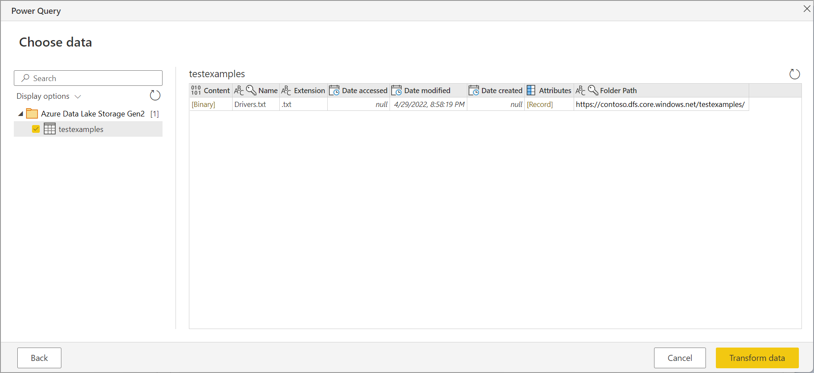

# Azure Data Lake Storage Gen2

## Summary

| Item | Description |
| ---- | ----------- |
| Release State | General Availability |
| Products | Power BI (Datasets) Power BI (Dataflows) Fabric (Dataflow Gen2) Power Apps (Dataflows) Dynamics 365 Customer Insights Analysis Services |
| Authentication Types Supported | Organizational Account Account Key Shared Access Signature (SAS) Key Service Principal |
| Function Reference Documentation | [AzureStorage.DataLake](/powerquery-m/azurestorage-datalake) [AzureStorage.DataLakeContents](/powerquery-m/azurestorage-datalakecontents) |

>[!Note]
> Some capabilities may be present in one product but not others due to deployment schedules and host-specific capabilities.

## Prerequisites

* An Azure subscription. Go to [Get Azure free trial](https://azure.microsoft.com/pricing/free-trial/).

* A storage account that has a hierarchical namespace. Follow the instructions at [Create a storage account](/azure/storage/common/storage-account-create) to create one. This article assumes that you've created a storage account named `myadlsg2`.

* Ensure you're granted one of the following roles for the storage account: **Blob Data Reader**, **Blob Data Contributor**, or **Blob Data Owner**.

* A sample data file named `Drivers.txt` located in your storage account. You can download this sample from [Azure Data Lake Git Repository](https://github.com/Azure/usql/tree/master/Examples/Samples/Data/AmbulanceData/Drivers.txt), and then upload that file to your storage account.

## Capabilities supported

* Import
* File System View
* CDM Folder View

## Connect to Azure Data Lake Storage Gen2 from Power Query Desktop

1. Select the **Azure Data Lake Storage Gen2** option in the **Get Data** selection, and then select **Connect**. More information: [Where to get data](../where-to-get-data.md)

    

2. In the **Azure Data Lake Storage Gen2** dialog box, provide the URL to your Azure Data Lake Storage Gen2 account, container, or subfolder using the container endpoint format. URLs for Data Lake Storage Gen2 have the following pattern:

    https://\<_accountname_>.dfs.core.windows.net/\<_container_>/\<_subfolder_>

    You can also select whether you want to use the file system view or the Common Data Model folder view.

    Select **OK** to continue.

    

3. If this is the first time you're using this URL address, you'll be asked to select the authentication method.

   If you select the Organizational account method, select **Sign in** to sign into your storage account. You'll be redirected to your organization's sign-in page. Follow the prompts to sign into the account. After you've successfully signed in, select **Connect**.

   If you select the Account key method, enter your account key and then select **Connect**.

    

4. The **Navigator** dialog box shows all files under the URL you provided. Verify the information and then select either **Transform Data** to transform the data in Power Query or **Load** to load the data.

    

## Connect to Azure Data Lake Storage Gen2 from Power Query Online

1. Select the **Azure Data Lake Storage Gen2** option in the **Get Data** selection, and then select **Connect**. More information: [Where to get data](../where-to-get-data.md)

   

2. In **Connect to data source**, enter the URL to your Azure Data Lake Storage Gen2 account. Refer to [Limitations](#limitations) to determine the URL to use.

3. Select whether you want to use the file system view or the Common Data Model folder view.

4. If needed, select the on-premises data gateway in **Data gateway**.

5. Select **Sign in** to sign into the Azure Data Lake Storage Gen2 account. You'll be redirected to your organization's sign-in page. Follow the prompts to sign in to the account.

6. After you've successfully signed in, select **Next**.

7. The **Choose data** page shows all files under the URL you provided. Verify the information and then select **Transform Data** to transform the data in Power Query.

   

## Limitations

### Subfolder or file not supported in Power Query Online

Currently, in Power Query Online, the Azure Data Lake Storage Gen2 connector only supports paths with container, and not subfolder or file. For example, https://\<_accountname_>.dfs.core.windows.net/\<_container_> will work, while https://\<_accountname_>.dfs.core.windows.net/\<_container_>/\<_filename_> or https://\<_accountname_>.dfs.core.windows.net/\<_container_>/\<_subfolder_> will fail.

### Refresh authentication

Microsoft doesn't support dataflow or dataset refresh using OAuth2 authentication when the Azure Data Lake Storage Gen2 (ADLS) account is in a different tenant. This limitation only applies to ADLS when the authentication method is OAuth2, that is, when you attempt to connect to a cross-tenant ADLS using an Azure AD account. In this case, we recommend that you use a different authentication method that isn't OAuth2/AAD, such as the Key authentication method.

### Proxy and firewall requirements

When you create a dataflow using a gateway, you might need to change some of your proxy settings or firewall ports to successfully connect to your Azure data lake. If a dataflow fails with a gateway-bound refresh, it might be due to a firewall or proxy issue on the gateway to the Azure storage endpoints.

If you're using a proxy with your gateway, you might need to configure the Microsoft.Mashup.Container.NetFX45.exe.config file in the on-premises data gateway. More information: [Configure proxy settings for the on-premises data gateway](/data-integration/gateway/service-gateway-proxy).

To enable connectivity from your network to the Azure data lake, you might need to enable list specific IP addresses on the gateway machine. For example, if your network has any firewall rules in place that might block these attempts, you'll need to unblock the outbound network connections for your Azure data lake. To enable list the required outbound addresses, use the **AzureDataLake** service tag. More information: [Virtual network service tags](/azure/virtual-network/service-tags-overview)

Dataflows also support the "Bring Your Own" data lake option, which means you create your own data lake, manage your permissions, and you explicitly connect it to your dataflow. In this case, when you're connecting to your development or production environment using an Organizational account, you must enable one of the following roles for the storage account: Blob Data Reader, Blob Data Contributor, or Blob Data Owner.

## See also

* [Analyze data in Azure Data Lake Storage Gen2 by using Power BI](analyze-data-in-adls-gen2.md)
* [Introduction to Azure Data Lake Storage Gen2](/azure/storage/blobs/data-lake-storage-introduction)
