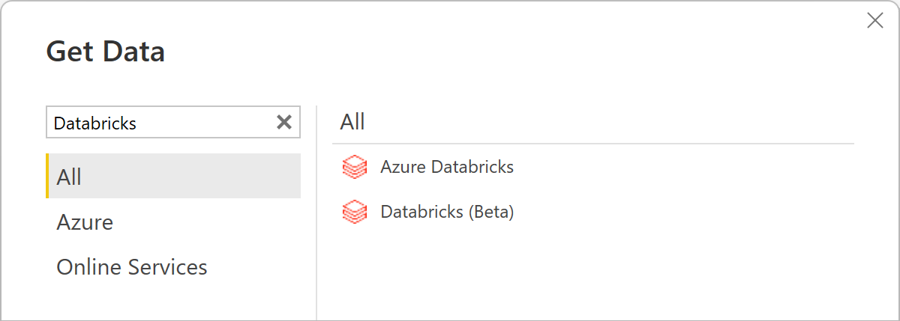
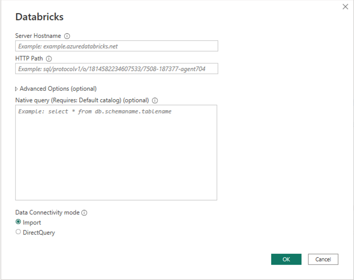
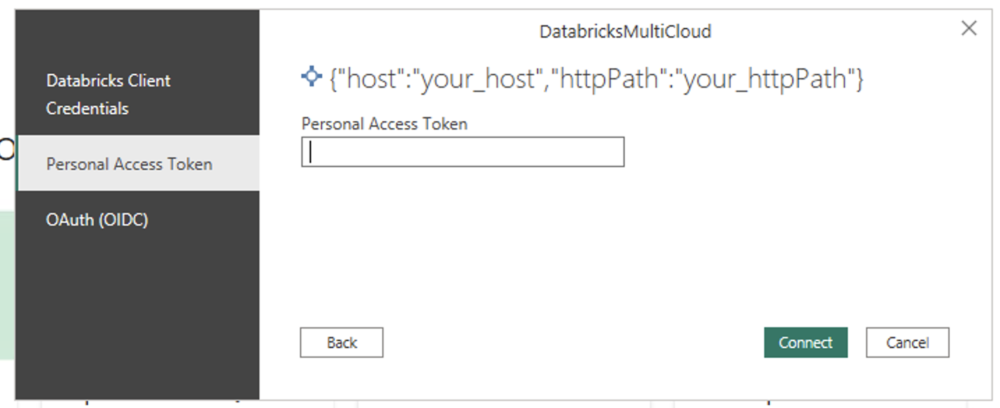
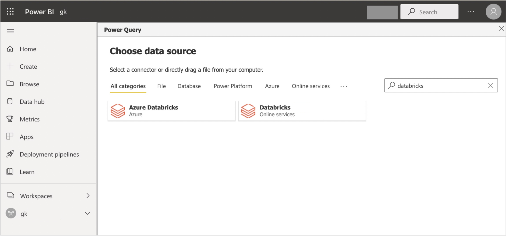

# Databricks

>[!Note]
>The following connector article is provided by Databricks, the owner of this connector and a member of the Microsoft Power Query Connector Certification Program. If you have questions regarding the content of this article or have changes you would like to see made to this article, visit the Databricks website and use the support channels there.

## Summary

| Item | Description |
| ---- | ----------- |
| Release State | General Availability |
| Products | Power BI (Datasets) Power BI (Dataflows) |
| Authentication Types Supported | Azure Active Directory Organizational Account Personal Access Token |

>[!Note]
>Some capabilities may be present in one product but not others due to deployment schedules and host-specific capabilities.

## Prerequisites

This connector is only for use with a Databricks SQL Warehouse running on AWS and using OAuth. If you're using Azure Databricks, use the [Azure Databricks](databricks-azure.md) connector. If you aren't using OAuth with your Databricks SQL Warehouse (on AWS or GCP), use the [Azure Databricks](databricks-azure.md) connector too. Databricks Community Edition isn't supported.

## Capabilities supported

* Import
* DirectQuery (Power BI only)

## Connect to Databricks from Power Query Desktop

To connect to Databricks from Power Query Desktop, take the following steps:

 In the Get Data experience, search for **Databricks** to shortlist the **Databricks** connector. You should only use the **Databricks** connector here for your Databricks SQL Warehouse data (running on AWS) if you're using OAuth for authentication.

    

2. Provide the **Server hostname** and **HTTP Path** for your Databricks SQL Warehouse. Refer to [Configure the Databricks ODBC and JDBC drivers](/azure/databricks/integrations/bi/jdbc-odbc-bi) for instructions to look up your "Server hostname" and "HTTP Path". Enter this information accordingly. You can optionally supply a default catalog and/or database under **Advanced options**. Select **OK** to continue.

    

3. Provide your credentials to authenticate with your Databricks SQL Warehouse. You have three options for credentials:

    * Username / Password. This option isn't available if your organization/account uses 2FA/MFA.
    * Personal Access Token. Refer to [Personal access tokens](/azure/databricks/sql/user/security/personal-access-tokens) for instructions on generating a Personal Access Token (PAT).
    * OAuth (OIDC). Sign in to your organizational account using the browser popup.

      

    > [!NOTE]
    > Once you enter your credentials for a particular Databricks SQL Warehouse, Power BI Desktop caches and reuses those same credentials in subsequent connection attempts. You can modify those credentials by going to **File > Options and settings > Data source settings**. More information: [Change the authentication method](../ConnectorAuthentication.md#change-the-authentication-method)

4. Once you successfully connect, the **Navigator** shows the data available to you on the cluster. You can choose either **Transform Data** to transform the data using Power Query or **Load** to load the data in Power Query Desktop.

    

## Connect to Databricks data from Power Query Online

To connect to Databricks from Power Query Online, take the following steps:

1. In the Get Data experience, select the **Dataflow** category. (Refer to [Creating a dataflow](/power-bi/transform-model/dataflows/dataflows-create) for instructions.) Shortlist the available Databricks connector with the search box. Select the **Databricks** connector for your Databricks SQL Warehouse.

    

2. Enter the **Server hostname** and **HTTP Path** for your Databricks SQL Warehouse. Refer to [Configure the Databricks ODBC and JDBC drivers](/azure/databricks/integrations/bi/jdbc-odbc-bi) for instructions to look up your "Server hostname" and "HTTP Path". You can optionally supply a default catalog and/or database under **Advanced options**.

    

3. Provide your credentials to authenticate with your Databricks SQL Warehouse. There are three options for credentials:

    * Basic. Use this option when authenticating with a user name and password. This option isn't available if your organization/account uses 2FA/MFA.
    * Account Key. Use this option when authenticating using a Personal Access Token. Refer to [Personal access tokens](/azure/databricks/sql/user/security/personal-access-tokens) for instructions on generating a Personal Access Token (PAT).
    * Organizational account. Use this option when authenticating with OAuth. Sign in to your organizational account using the browser popup.

4. Once you successfully connect, the **Navigator** appears and displays the data available on the server. Select your data in the navigator. Then select **Next** to transform the data in Power Query.

    
