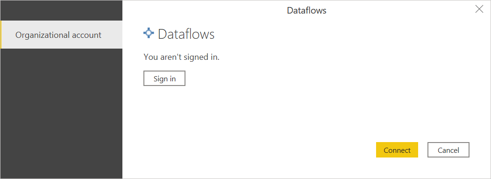
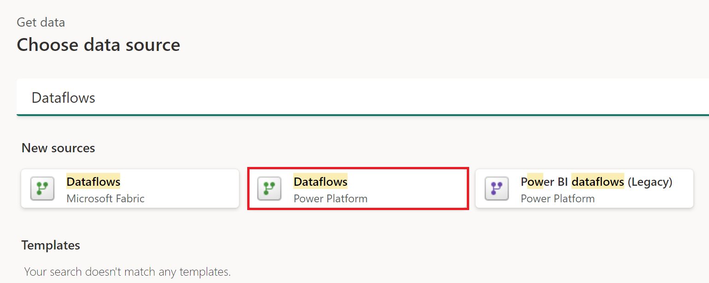

# Dataflows

## Summary

| Item | Description |
| ---- | ----------- |
| Release State | General Availability |
| Products | Excel Power BI (Datasets) Power BI (Dataflows) Fabric (Dataflow Gen2) Power Apps (Dataflows) Dynamics 365 Customer Insights (Dataflows)|
| Authentication types | Organizational account |

>[!Note]
>Some capabilities may be present in one product but not others due to deployment schedules and host-specific capabilities.

## Prerequisites

You must have an existing Dataflow with maker permissions to access the portal, and read permissions to access data from the dataflow.

## Capabilities supported

* Import
* DirectQuery (Power BI Datasets)

>[!Note]
>DirectQuery requires Power BI premium. More information: [Premium features of dataflows](/power-bi/transform-model/dataflows/dataflows-premium-features)

## Get data from Dataflows in Power BI Desktop

To get data from Dataflows in Power BI Desktop:

1. Select **Get data** from the **Home** tab.

2. In the **Get Data** dialog box, select **Power Platform > Dataflows**, and then select **Connect**.

   

3. If this attempt is the first time you're connecting to this site, select **Sign in** and input your credentials. Then select **Connect**.

   

4. In **Navigator**, select the Dataflow you require, then either load or transform the data.

   

## Get data from Dataflows in Power Query Online

To get data from Dataflows in Power Query Online:

1. From the **Data sources** page, select **Dataflows**.

   

2. Adjust the connection name.

   

3. If necessary, enter an on-premises data gateway if you're going to be using on-premises data. For example, if you're going to combine data from Dataflows and an on-premises SQL Server database.

4. Sign in to your organizational account.

5. When you've successfully signed in, select **Next**.

6. In the navigation page, select the data you require, and then select **Transform Data**.

## Frequently asked questions

_**DirectQuery is not working for me in Power BI&mdash;what should I do?**_

To get DirectQuery to run, you need to have Power BI Premium and adjust a few configuration items in your Power BI workspace. These actions are explained in the [dataflows premium features](/power-bi/transform-model/dataflows/dataflows-premium-features) article.

_**My dataflow table doesn't show up in the dataflow connector in Power BI**_

You're probably using a Dataverse table as the destination for your standard dataflow. Use the [Dataverse/CDS connector](../connectors/dataverse.md) instead or consider switching to an analytical dataflow.

_**There's a difference in the data when I remove duplicates in dataflows&mdash;how can I resolve this?**_

There could be a difference in data between design-time and refresh-time. We don't guarantee which instance is being kept during refresh time. For information on how to avoid inconsistencies in your data, go to [Working with duplicates](../working-with-duplicates.md).

_**I am using the Dataflow connector in direct query mode, is case insensitive search supported?**_

No, case insensitive search on columns is not supported in direct query mode. If you need to use case insensitive search, you can use import mode instead. For more information, see [DirectQuery in Power BI](/power-bi/connect-data/desktop-directquery-about).

_**I'm getting data via the dataflow connector, but I'm receiving a 429 error code&mdash;how can I resolve this?**_

When you are receiving an error code 429, it's possibly due to exceeding the limit of 1000 requests per minute. This error typically resolves by itself if you wait a minute or two after the cooldown period ended. This limit is in place to prevent dataflows and other Power BI functionality from having a degraded performance. Consequences due to the continued high load on the service might result in additional degraded performance, so we ask users to significantly reduce the number of requests to less than 1000 (limit) or fix your script/model to this specific limit (1000) to efficiently mitigate impact and avoid further issues. You should also avoid nested joins that re-request dataflow data; instead, stage data and perform merges within your dataflow instead of your dataset.

### See also

* [Using the output of Dataflows from other Power Query experiences](../dataflows/using-output-power-platform-dataflows-other-azure.md)
* [Best practices for designing and developing complex dataflows](../dataflows/best-practices-developing-complex-dataflows.md)
* [Best practices for reusing dataflows across environments and workspaces](../dataflows/best-practices-reusing-dataflows.md)
