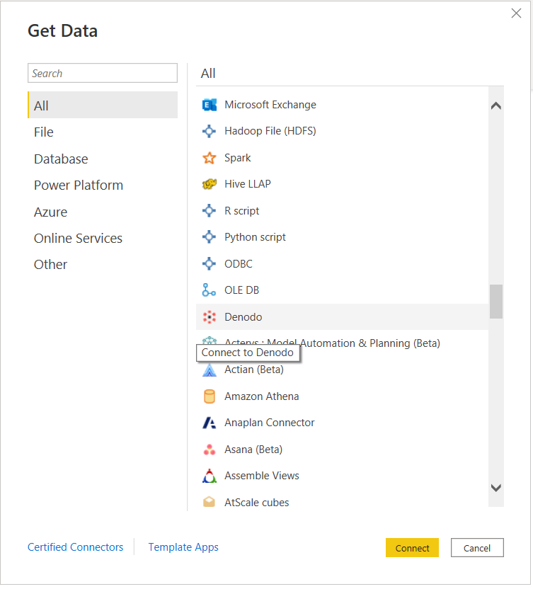
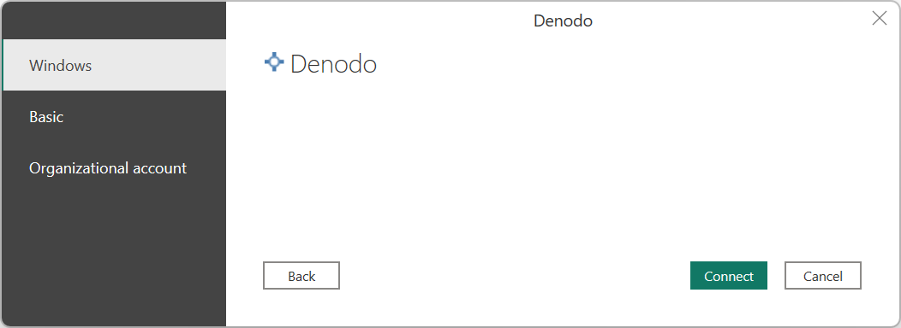
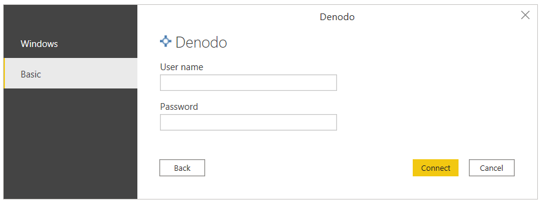

# Denodo

> [!NOTE]
>The following connector article is provided by Denodo, the owner of this connector and a member of the Microsoft Power Query Connector Certification Program. If you have questions regarding the content of this article or have changes you would like to see made to this article, visit the Denodo website and use the support channels there.

## Summary

| Item | Description |
| ---- | ----------- |
| Release State | General Availability |
| Products | Power BI (Datasets)<br/>Power BI (Dataflows)<br/>Fabric (Dataflow Gen2) |
| Authentication Types Supported | Basic <br/>Windows<br/> |

> [!NOTE]
> Some capabilities may be present in one product but not others due to deployment schedules and host-specific capabilities.

## Prerequisites

To use this connector, you must have installed the Denodo platform, and configured and started its service. In case of a connection using an ODBC DSN, you must have correctly configured the connection in the ODBC Data Source Administrator.

## Capabilities supported

* Import
* DirectQuery (Power BI Datasets)

## Connect to an ODBC data source from Power Query Desktop

To make the connection, take the following steps:

1. In order to connect to data, select **Get Data** from the **Home** ribbon and select **Denodo** in the **Database** section.

   

2. There are two ways to connect to the data source of your choice:

    * Through DSN (ODBC data source name)
    * Using a connection string

   In the **DSN or Connection String** section of the **Denodo Connector** dialog box, provide the **Data source name (DSN)** or the **Connection String** depending on the type of connection you prefer.

   

    When creating a Denodo-compatible connection string, you must take into account that the **Driver** field must be omitted, as this is transparently set at connection time by the connector itself.

    The connection string must contain three mandatory parameters: **SERVER**, **PORT** and **DATABASE**:

    ```http
    SERVER=<Server name>;PORT=<Port number>;DATABASE=<Database name>
    ```

    Additionally, it can contain an optional parameter: **SSLmode**:

    ```http
    SERVER=<Server name>;PORT=<Port number>;DATABASE=<Database name>;SSLmode=<SSL mode>
    ```

    Authentication parameters must be omitted, as authentication is configured in later steps.

   > [!NOTE]
   > When writing the connection string, it must be taken into account:
   >
   > * The connection string must keep the correct order of its parameters: SERVER, PORT, DATABASE and SSLMode.
   > * The name of these parameters must always be written in the same way. For example, if you choose to write them in upper case, they must always be written in upper case; if you decide to write them capitalized (writing the first letter of a word in uppercase and the rest of the letters in lowercase) they must always be written that way.
   >
   > Doing otherwise could prevent Power BI from recognizing different Denodo datasets in a report as belonging to the same Denodo data source and, as a consequence, request separate authentication credentials for each of them.

3. The second section, **Enable debug mode**, is an optional field that allows you to add trace information to log files. These files are created by Power BI Desktop when you enable tracing in the application using the **Diagnostics** tab in the **Options** menu. Note that the default value for **Enable debug mode** is false, and in this scenario, there will be no trace data in the log files from Denodo Power BI custom connector.

4. The third section, **Native Query**, is an optional field where you can enter a query. If this query field is used, the resulting dataset will be the result of the query instead of a table or a set of tables.

    You can write a query that queries only one of the databases that the datasource is associated with.

    ``` sql
    SELECT title, name FROM film JOIN language ON film.language_id = language.language_id WHERE film.language_id = 1
    ```

    If you want to write a query that queries more than one database, you have to specify in the query the database that owns each table.

    ``` sql
    SELECT i_item_sk, country FROM sakila.country, ewd.item
    ```

5. The last section in **Denodo Connector** is **Data connectivity mode**, where you can choose between Import mode or DirectQuery mode.

6. Once you're done, select **OK**.

7. Before showing the navigator window that displays a preview of the available data in Denodo Virtual DataPort, you'll be asked for authentication. The Denodo Power BI custom connector supports two authentication types: Windows and Basic.

   * **Windows**: When you choose to use Windows authentication, Power BI Desktop connects to Virtual DataPort using Kerberos authentication.

      

      In this case:

      * Kerberos authentication must be enabled in the Virtual DataPort server.

      * The Denodo Virtual DataPort database that the data source connects to must be configured with the option **ODBC/ADO.net authentication type** set to **Kerberos**.

      * Power BI Desktop must be running in the Windows domain, because the ODBC driver requests the Kerberos ticket from the operating system's ticket cache.

      * Make sure the **Advanced Options** page of the DSN configuration contains all the needed configuration for using Kerberos as an authentication method.

        

   * **Basic**: This authentication type allows you to connect Power BI Desktop to your Virtual DataPort data using your Virtual DataPort server credentials.

      

8. Once you're done, select **Connect**.

9. In **Navigator**, select the data you need from the database you want and choose **Load**, or choose **Transform Data** if you're going to modify the incoming data.

   

## Connect to an ODBC data source from Power BI service using the on-premises data gateway

To make the connection, take the following steps:

1. Configure the on-premises data gateway (enterprise gateway) that acts as a bridge, providing quick and secure data transfer between on-premises data (data in your Power BI Desktop application, not in the cloud) and the Power BI service.

2. Sign in and register your gateway. In the on-premises data gateway app, select the **Status** tab to verify that your gateway is online and ready to be used.

   

3. Using the gateway settings page in Power BI service, create a data source for the Denodo Power BI custom connector.

   

   In order to create the data source, you have to specify the way to connect to the data source of your choice:
      * Through DSN
      * Using a connection string

   You also have to specify the authentication mode. The available authentication methods are:
      * **Windows**: When you choose to use Windows authentication, Power BI service connects to Virtual DataPort using Kerberos authentication. You need:
         * In **Data Source Settings**, enter the username and password to create the Kerberos ticket.
         * Kerberos authentication must be enabled in the Virtual DataPort server.
         * The Denodo Virtual DataPort database that the data source connects to must be configured with the option **ODBC/ADO.net authentication type** set to **Kerberos**.
         * Make sure the **Advanced Options** page of the DSN configuration contains all the needed configuration for using Kerberos as an authentication method.

           

      * **Basic**: This authentication type allows you to create a data source in Power BI service to connect to your Virtual DataPort data using your Virtual DataPort server credentials.

4. If you use Windows authentication, under **Advanced settings** for the data source you can enable the single sign-on (SSO) authentication schema in order to use the same credentials of the user accessing your reports in Power BI for accessing the required data in Denodo.

   

   There are two options for enabling SSO: **Use SSO via Kerberos for DirectQuery queries** and **Use SSO via Kerberos for DirectQuery And Import queries**. If you're working with _DirectQuery_ based reports, both options use the SSO credentials of the user that signs in to the Power BI service. The difference comes when you work with _Import_ based reports. In this scenario, the former option uses the credentials entered in the data source page (**Username** and **Password** fields), while the latter uses the credentials of the dataset owner.

   It's important to note that there are particular prerequisites and considerations that you must take into account in order to use the Kerberos-based SSO. Some of these essential requirements are:

   * Kerberos constrained delegation must be enabled for the Windows user running the Microsoft Power BI Gateway, and configuration of both the local Active Directory and Azure Active Directory environments should be performed according to the instructions offered by Microsoft for this purpose.

     By default, the Microsoft Power BI Gateway sends the user principal name (UPN) when it performs an SSO authentication operation. Therefore, you'll need to review the attribute that you'll use as a login identifier in Denodo Kerberos Authentication and, if it's different from `userPrincipalName`, adjust the gateway settings according to this value.

   * The Microsoft Power BI Gateway configuration file called `Microsoft.PowerBI.DataMovement.Pipeline.GatewayCore.dll.config`, stored at `\Program Files\On-premises data gateway` has two properties called `ADUserNameLookupProperty` and `ADUserNameReplacementProperty` that allow the gateway to perform local Azure AD lookups at runtime. The `ADUserNameLookupProperty` must specify against which attribute of the local AD it must map the user principal name that comes from Azure AD. So, in this scenario, `ADUserNameLookupProperty` should be `userPrincipalName`. Then, once the user is found, the `ADUserNameReplacementProperty` value indicates the attribute that should be used to authenticate the impersonated user (the attribute that you'll use as the login identifier in Denodo).

     You should also take into account that changes in this configuration file are at the gateway level, and therefore will affect any source with which SSO authentication is done through the Microsoft Power BI Gateway.

5. Once a data source is created for the Denodo connector, you can refresh Power BI reports. To publish a report on powerbi.com, you need to:
   * Open the report in Power BI Desktop.
   * Select **File** > **Publish** > **Publish to Power BI**.
   * Save the report on the computer.
   * Select the workspace where you want to publish.

## Troubleshooting

### Loading data when a field in a Denodo view has more than 42 relations with other views.

If a Denodo view being imported as a data source into Power BI has more than 42 relations with other views, Power BI might display the following error when accessing the data transformation window: 

`Preview.Error: The type of the current preview value is too complex to display.`

This error is due to a limitation in the Microsoft Power Query platform. In order to work around it, select the failing data source (_query_) in the data transformation window and access the advanced editor with **View** > **Advanced Editor**. Then edit the data source expression in M language adding the following property to the `options` argument of the `Denodo.Contents` function call:

```
CreateNavigationProperties=false
```

So your call would look similar to:

```
  Source = Denodo.Contents(<dsn>, null, [CreateNavigationProperties=false])
```

This property will instruct Power BI not to try and generate navigation properties from the relationships registered for the Denodo view accessed in this data source. So if you need some of these relationships to be actually present in your Power BI data model, _you will need to manually register them afterwards_.
