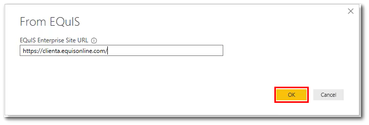

# EQuIS

>[!Note]
>The following connector article is provided by EarthSoft, the owner of this connector and a member of the Microsoft Power Query Connector Certification Program. If you have questions regarding the content of this article or have changes you would like to see made to this article, visit the EarthSoft website and use the support channels there.

## Summary

| Item | Description |
| ------- | ---------- |
| Release State | Generally Available |
| Products | Power BI (Datasets) Power BI (Dataflows) |
| Authentication Types Supported | Basic Web API (API Token) Organizational Account |
| Function Reference Documentation | &mdash; |

## Prerequisites

To use the EQuIS connector, you must have a valid user account in an EQuIS Enterprise site (version 7.0.0.19300 or later) that includes a REST API license. Your user account must be a member of the REST API role. To verify user account configuration, go to the **Roles** tab in your [user profile](https://help.earthsoft.com/index.htm?ent-user_profile_editor.htm) and verify that you are a member of the REST API role.

## Capabilities supported

* Import

## Connect to EQuIS from Power BI Desktop

To connect to an EQuIS Enterprise site from Power BI Desktop, take the following steps:

1. Select the EQuIS connector in the connector list, then select **Connect**.
2. Enter the URL of the EQuIS Enterprise site you are connecting to, then select **OK**.

3. Select the appropriate type of authentication:
    - **Basic**: Enter your EQuIS username and password for the given EQuIS Enterprise site.
    - **API Token**: Enter an API Token that you generated in EQuIS Enterprise (visit [User Profile](https://help.earthsoft.com/index.htm?ent-user_profile_editor.htm)).
    - **Organizational Account**: If your EQuIS Enterprise site is appropriately configured, you may authenticate with Azure Active Directory
4. In **Navigator**, browse to the dataset or report you want to load, then select **Load** or **Transform Data**. Visit [Using EQuIS Data](https://help.earthsoft.com/index.htm?pbi-power-bi-adding-datasets.htm) for more information about available datasets. 

## Additional Information

* For best functionality and performance, EarthSoft recommends that you use the EQuIS connector with the latest build of EQuIS Enterprise.
* When using reports in a facility group, non-administrator users must have permission to all facilities contained in the facility group.
* Only "grid" reports will be available in the **Navigator**.
* All datasets consumed by the EQuIS connector will use camelCase for column names.
* The current version of the EQuIS connector will retrieve a dataset in a single API request (this logic may be optimized in a future version of the connector).
