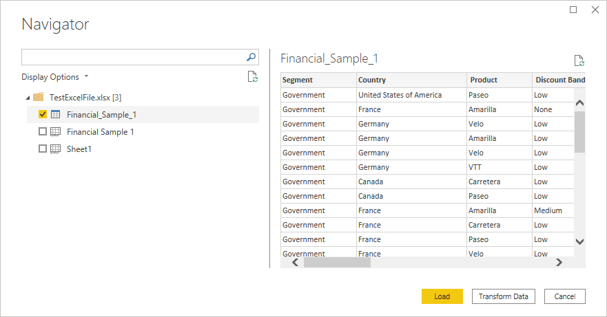
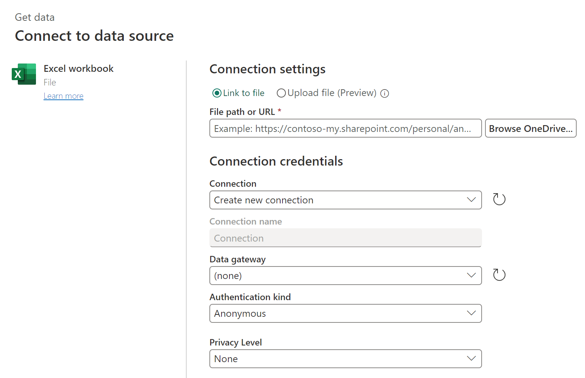
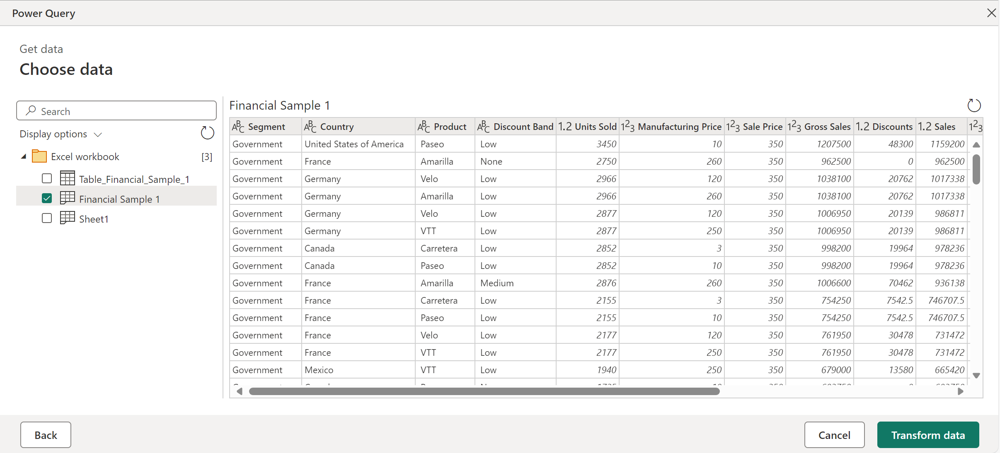
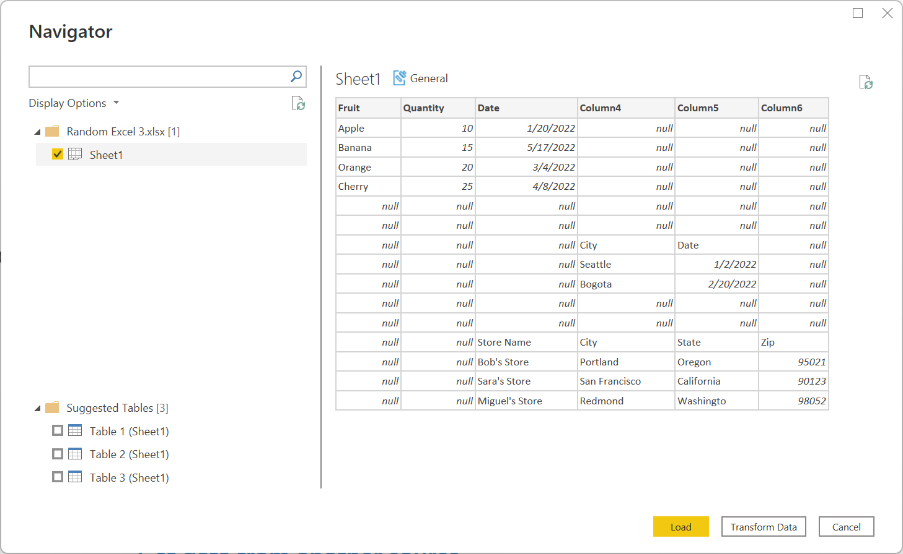

# Excel

## Summary

| Item | Description |
| ---- | ----------- |
| Release State | General Availability |
| Products | Excel<br/>Power BI (Semantic models)<br/>Power BI (Dataflows)<br/>Fabric (Dataflow Gen2)<br/>Power Apps (Dataflows)<br/>Dynamics 365 Customer Insights<br/>Analysis Services |
| Authentication Types Supported | Anonymous (online)<br/>Basic (online)<br/>Organizational account (online) |
| Function Reference Documentation | [Excel.Workbook](/powerquery-m/excel-workbook)<br/>[Excel.CurrentWorkbook](/powerquery-m/excel-currentworkbook) |

> [!NOTE]
> Some capabilities may be present in one product but not others due to deployment schedules and host-specific capabilities.

## Prerequisites

To connect to a legacy workbook (such as .xls or .xlsb), the Access Database Engine OLEDB (or ACE) provider is required. To install this provider, go to the [download page](/power-bi/connect-data/desktop-access-database-errors) and install the relevant (32 bit or 64 bit) version. If you don't have it installed, you'll see the following error when connecting to legacy workbooks:

```The 'Microsoft.ACE.OLEDB.12.0' provider is not registered on the local machine. The 32-bit (or 64-bit) version of the Access Database Engine OLEDB provider may be required to read this type of file. To download the client software, visit the following site: https://go.microsoft.com/fwlink/?LinkID=285987.```

ACE can't be installed in cloud service environments. So if you're seeing this error in a cloud host (such as Power Query Online), you'll need to use a gateway that has ACE installed to connect to the legacy Excel files.

## Capabilities Supported

* Import

## Connect to an Excel workbook from Power Query Desktop

To make the connection from Power Query Desktop:

1. Select the **Excel** option in the connector selection.
2. Browse for and select the Excel workbook you want to load. Then select **Open**.

   

   If the Excel workbook is online, use the [Web connector](web/web.md) to connect to the workbook.

3. In **Navigator**, select the workbook information you want, then either select **Load** to load the data or **Transform Data** to continue transforming the data in Power Query Editor.

   

## Connect to an Excel workbook from Power Query Online

To make the connection from Power Query Online:

1. Select the **Excel** option in the connector selection.

2. In the Excel dialog box that appears, provide the path to the Excel workbook.

   

3. If necessary, select an on-premises data gateway to access the Excel workbook.

4. If this is the first time you've accessed this Excel workbook, select the authentication kind and sign in to your account (if needed).

5. In **Navigator**, select the workbook information you want, and then  **Transform Data** to continue transforming the data in Power Query Editor.

   

## Suggested tables

If you connect to an Excel Workbook that doesn't specifically contain a single table, the Power Query navigator will attempt to create a suggested list of tables that you can choose from. For example, consider the following workbook example that contains data from A1 to C5, more data from D8 to E10, and more from C13 to F16.


When you connect to the data in Power Query, the Power Query navigator creates two lists. The first list contains the entire workbook sheet, and the second list contains three suggested tables.

If you select the entire sheet in the navigator, the workbook is displayed as it appeared in Excel, with all of the blank cells filled with **null**.

[](./media/excel/entire-workbook-sheet.png#lightbox)

If you select one of the suggested tables, each individual table that Power Query was able to determine from the layout of the workbook is displayed in the navigator. For example, if you select **Table 3**, the data that originally appeared in cells C13 to F16 is displayed.

[](./media/excel/table-three-only.png#lightbox)

> [!NOTE]
>If the sheet changes enough, the table might not refresh properly. You might be able to fix the refresh by importing the data again and selecting a new suggested table.

## Troubleshooting

### Numeric precision (or "Why did my numbers change?")

When importing Excel data, you may notice that certain number values seem to change slightly when imported into Power Query. For example, if you select a cell containing 0.049 in Excel, this number is displayed in the formula bar as 0.049. But if you import the same cell into Power Query and select it, the preview details display it as 0.049000000000000002 (even though in the preview table it's formatted as 0.049). What's going on here?

The answer is a bit complicated, and has to do with how Excel stores numbers using something called *binary floating-point notation*. The bottom line is that there are certain numbers that Excel can't represent with 100% precision. If you crack open the .xlsx file and look at the actual value being stored, you'll see that in the .xlsx file, 0.049 *is* actually stored as 0.049000000000000002. This is the value Power Query reads from the .xlsx, and thus the value that appears when you select the cell in Power Query. (For more information on numeric precision in Power Query, go to the "Decimal number" and "Fixed decimal number" sections of [Data types in Power Query](../data-types.md).)

### Connecting to an online Excel workbook

If you want to connect to an Excel document hosted in Sharepoint, you can do so via the [Web](web/web.md) connector in Power BI Desktop, Excel, and Dataflows, and also with the Excel connector in Dataflows. To get the link to the file:

1. Open the document in Excel Desktop.
2. Open the **File** menu, select the **Info** tab, and then select **Copy Path**.
3. Copy the address into the **File Path or URL** field, and remove the **?web=1** from the end of the address.

### Legacy ACE connector

Power Query reads legacy workbooks (such as .xls or .xlsb) using the Access Database Engine (or ACE) OLEDB provider. Because of this, you may come across unexpected behaviors when importing legacy workbooks that don't occur when importing OpenXML workbooks (such as .xlsx). Here are some common examples.

#### Unexpected value formatting

Because of ACE, values from a legacy Excel workbook might be imported with less precision or fidelity than you expect. For example, imagine your Excel file contains the number 1024.231, which you've formatted for display as "1,024.23". When imported into Power Query, this value is represented as the text value "1,024.23" instead of as the underlying full-fidelity number (1024.231). This is because, in this case, ACE doesn't surface the underlying value to Power Query, but only the value as it's displayed in Excel.

#### Unexpected null values

When ACE loads a sheet, it looks at the first eight rows to determine the data types of the columns. If the first eight rows aren't representative of the later rows, ACE may apply an incorrect type to that column and return nulls for any value that doesn't match the type. For example, if a column contains numbers in the first eight rows (such as 1000, 1001, and so on) but has non-numerical data in later rows (such as "100Y" and "100Z"), ACE concludes that the column contains numbers, and any non-numeric values are returned as null.

#### Inconsistent value formatting

In some cases, ACE returns completely different results across refreshes. Using the example described in the [formatting section](#unexpected-value-formatting), you might suddenly see the value 1024.231 instead of "1,024.23". This difference can be caused by having the legacy workbook open in Excel while importing it into Power Query. To resolve this problem, close the workbook.

### Missing or incomplete Excel data

Sometimes Power Query fails to extract all the data from an Excel Worksheet. This failure is often caused by the Worksheet having **incorrect dimensions** (for example, having dimensions of `A1:C200` when the actual data occupies more than three columns or 200 rows).

#### How to diagnose incorrect dimensions

To view the dimensions of a Worksheet:

1. Rename the xlsx file with a .zip extension.
2. Open the file in File Explorer.
3. Navigate into xl\worksheets.
4. Copy the xml file for the problematic sheet (for example, Sheet1.xml) out of the zip file to another location.
5. Inspect the first few lines of the file. If the file is small enough, open it in a text editor. If the file is too large to be opened in a text editor, run the following command from a Command Prompt: **more Sheet1.xml**.
6. Look for a `<dimension .../>` tag (for example, `<dimension ref="A1:C200" />`).

If your file has a dimension attribute that points to a single cell (such as `<dimension ref="A1" />`), Power Query uses this attribute to find the starting row and column of the data on the sheet.

However, if your file has a dimension attribute that points to multiple cells (such as `<dimension ref="A1:AJ45000"/>`), Power Query uses this range to find the starting row and column **as well as the ending row and column**. If this range doesn't contain all the data on the sheet, some of the data won't be loaded.

#### How to fix incorrect dimensions

You can fix issues caused by incorrect dimensions by doing one of the following actions:

* Open and resave the document in Excel. This action will overwrite the incorrect dimensions stored in the file with the correct value.
* Ensure the tool that generated the Excel file is fixed to output the dimensions correctly.
* Update your M query to ignore the incorrect dimensions. As of the December 2020 release of Power Query, `Excel.Workbook` now supports an `InferSheetDimensions` option. When true, this option will cause the function to ignore the dimensions stored in the Workbook and instead determine them by inspecting the data.

    Here's an example of how to provide this option:

    `Excel.Workbook(File.Contents("C:\MyExcelFile.xlsx"), [DelayTypes = true, InferSheetDimensions = true])`

### Sluggish or slow performance when loading Excel data

Slow loading of Excel data can also be caused by incorrect dimensions. However, in this case, the slowness is caused by the dimensions being much larger than they need to be, rather than being too small. Overly large dimensions will cause Power Query to read a much larger amount of data from the Workbook than is actually needed.

To fix this issue, you can refer to [Locate and reset the last cell on a worksheet](https://support.office.com/en-us/article/locate-and-reset-the-last-cell-on-a-worksheet-c9e468a8-0fc3-4f69-8038-b3c1d86e99e9) for detailed instructions.

### Poor performance when loading data from SharePoint

When retrieving data from Excel on your machine or from SharePoint, consider both the volume of the data involved, as well as the complexity of the workbook.

You'll notice performance degradation when retrieving very large files from SharePoint. However, this is only one part of the problem. If you have significant business logic in an Excel file being retrieved from SharePoint, this business logic may have to execute when you refresh your data, which could cause complicated calculations. Consider aggregating and pre-calculating data, or moving more of the business logic out of the Excel layer and into the Power Query layer.

### Errors when using the Excel connector to import CSV files

Even though CSV files can be opened in Excel, they're not Excel files. Use the [Text/CSV connector](text-csv.md) instead.

### Error when importing "Strict Open XML Spreadsheet" workbooks

You might see the following error when importing workbooks saved in Excel's "Strict Open XML Spreadsheet" format:

`DataFormat.Error: The specified package is invalid. The main part is missing.`

This error happens when the [ACE driver](excel.md#legacy-ace-connector) isn't installed on the host computer. Workbooks saved in the "Strict Open XML Spreadsheet" format can only be read by ACE. However, because such workbooks use the same file extension as regular Open XML workbooks (.xlsx), we can't use the extension to display the usual `the Access Database Engine OLEDB provider may be required to read this type of file` error message.

To resolve the error, install the ACE driver. If the error is occurring in a cloud service, you'll need to use a gateway running on a computer that has the ACE driver installed.

### "File contains corrupted data" errors

You might see the following error when importing certain Excel workbooks.

`DataFormat.Error: File contains corrupted data.`

Usually this error indicates there is a problem with the format of the file.

However, sometimes this error can happen when a file appears to be an Open XML file (such as .xlsx), but the ACE driver is actually needed in order to process the file. Go to the [Legacy ACE connector](excel.md#legacy-ace-connector) section for more information about how to process files that require the ACE driver.

## Known issues and limitations

Power Query Online is unable to access encrypted files. Since Excel files labeled with sensitivity types other than "Public" or "Non-Business" are encrypted, they aren't accessible through Power Query Online.
