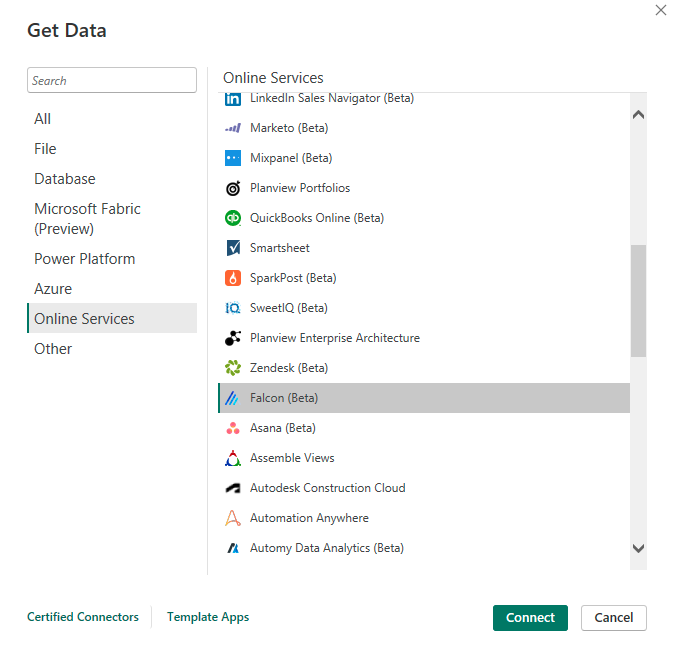
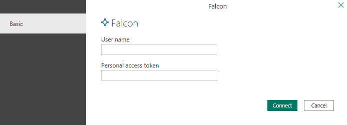
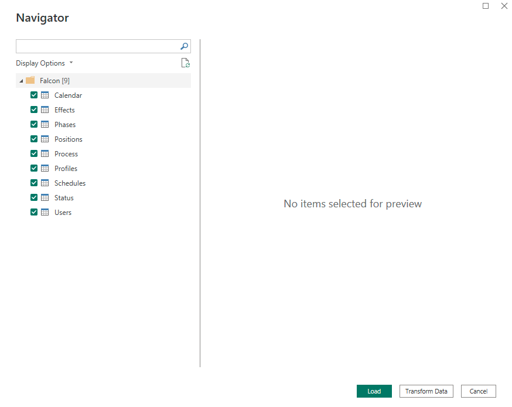

# Falcon (Beta)

> [!NOTE]
> The following connector article is provided by Nordantech, the owner of this connector and a member of the Microsoft Power Query Connector Certification Program. If you have questions regarding the content of this article or have changes you would like to see made to this article, visit the Nordantech website and use the support channels there.

## Summary

| Item                           | Description                                                             |
| ------------------------------ | ----------------------------------------------------------------------- |
| Release State                  | Beta                                                                    |
| Products                       | Power BI (Datasets) Power BI (Dataflows) Fabric (Dataflow Gen2) |
| Authentication Types Supported | Basic                                                                   |

## Prerequisites

Before you can use the Falcon connector, you must have a Falcon account and a [personal access token](https://docs.nordantech.com/#section/Authentication/Authentication-with-personal-access-token) with access to the hub you want to connect to. You can [create your personal access tokens](https://support.nordantech.com/en/articles/5988219-personal-access-tokens) directly in Falcon.

If you want your personal sandbox environment, just create a test hub in the production environment and use it to test your connection. You can use the [registration](https://www.nordantech.com/#registration) on our website or simply sign in to [Falcon](https://app.nordantech.com/) with your user name and password and create a new hub.

## Capabilities supported

-   Import

## Connect to Falcon from Power Query Desktop

To connect to Falcon from Power Query Desktop, take the following steps:

1. In the **Get data** section, select **Online Services** from the categories on the left, select **Falcon (Beta)** and then **Connect**.

    

2. Enter your **User name** (email or alias) and your **Personal access token** and then select **Connect**.

    

3. Upon a successful connection, the **Navigator** opens with the list of tables provided by the connector. Select all tables and then select **Load**.

    

4. Now all data is available live from Falcon and you can start creating any dashboards and analyses using Power BI.
