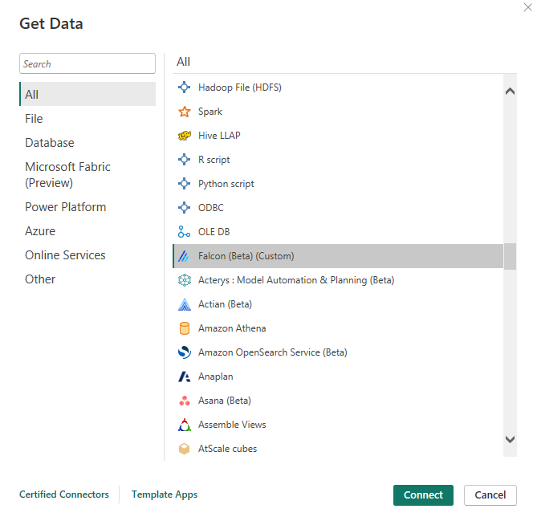
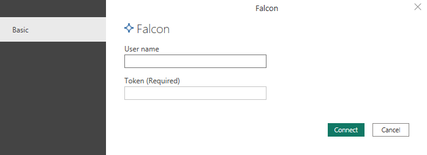
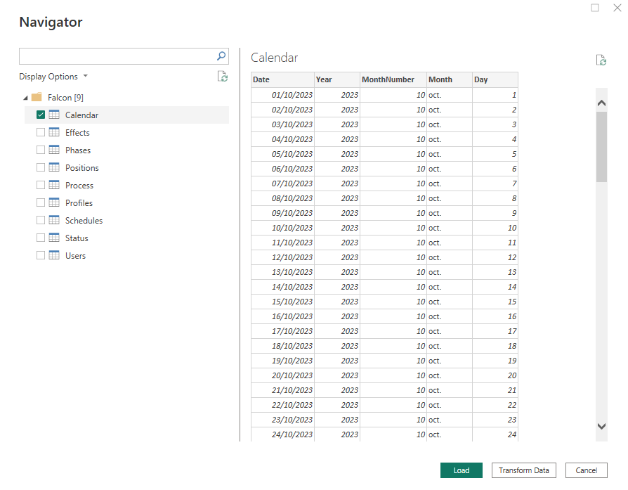

# Falcon

## Summary

| Item | Description |
| ---- | ----------- |
| Release State | General Availability |
| Products | Power BI (Datasets) Power BI (Dataflows) Fabric (Dataflow Gen2) |
| Authentication Types Supported | Falcon Account |
| Function Reference Documentation | &mdash; |

## Prerequisites

Before you can sign in to Falcon connector, you must have an Falcon account (username/password) and a personal access token.

## Capabilities supported

* Import

## Connect to Falcon from Power Query Desktop

To connect to Falcon data from Power Query Desktop, take the following steps::

1. Launch Power BI Desktop and enter the **Get Data** section.

2. From the **Other** category, select **Falcon**, and then select **Connect**.

   

3. In the sign in screen, enter your Falcon email and your personal access token. Select **Connect**.

   

4. In **Navigator** section, select any of the 9 tables provided by Falcon and then select **load**.
   * Calendar
   * Effect
   * Phases
   * Positions
   * Process
   * Profiles
   * Schedules
   * Status
   * Users

   
