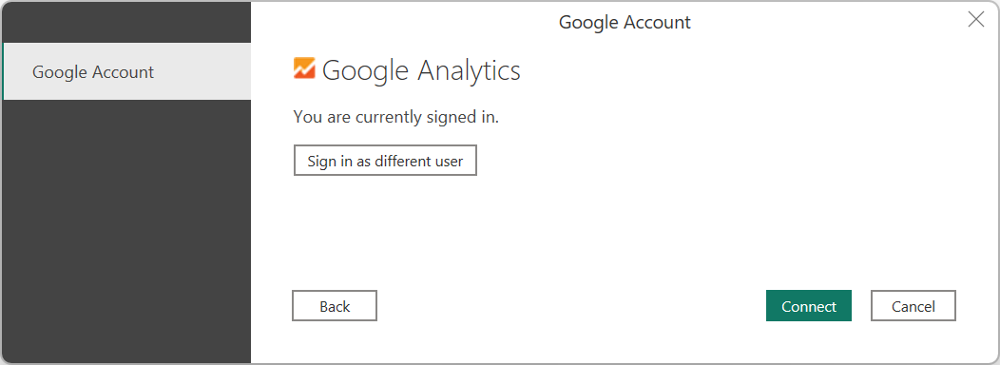

# Google Analytics

## Summary

| Item | Description |
| ---- | ----------- |
| Release State | General Availability |
| Products | Power BI (Datasets)<br/>Power BI (Dataflows)<br/>Fabric (Dataflow Gen2)<br/>Power Apps (Dataflows)<br/>Customer Insights (Dataflows) |
| Authentication Types Supported | Google Account |
| Function Reference Documentation | [GoogleAnalytics.Accounts](/powerquery-m/googleanalytics-accounts) |

> [!NOTE]
> Some capabilities may be present in one product but not others due to deployment schedules and host-specific capabilities.

> [!NOTE]
> Effective July 2023, Google has deprecated use of the Google Analytics API. For more information, go to the [Google announcement](https://support.google.com/analytics/answer/11583528?hl=en). The Power Query Google Analytics connector supports the legacy Universal Analytics scenario through V4 of the now-deprecated Google Universal Analytics API by using the `Implementation = "1.0"` setting. The connector also supports Google Analytics 4 scenarios through V1 of the Google Analytics Data API by using the now-default `Implementation = "2.0"` setting.

> [!NOTE]
> Effective July 2021, Google discontinued support for sign-ins to Google accounts from embedded browser frameworks. Due to this change, you need to [update](https://powerbi.microsoft.com/downloads/) your Power BI Desktop version to June 2021 or later to support signing in to Google.

## Prerequisites

Before you can sign in to Google Analytics, you must have a Google Analytics account (username/password).

## Capabilities Supported

* Import
* Google Analytics 4 (Data API)
* Google Universal Analytics (deprecated)

## Connect to Google Analytics data from Power Query Desktop

To connect to Google Analytics data:

1. Select **Get Data** from the **Home** ribbon in Power BI Desktop. Select **Online Services** from the categories on the left, and then select **Google Analytics**. Then select **Connect**.

   

2. If this is the first time you're getting data through the Google Analytics connector, a third-party notice is displayed. Select **Don't warn me again with this connector** if you don't want this message to be displayed again. Then select **Continue**.

3. To connect to Google Analytics data through the legacy "Universal Analytics" API, select Implementation 1.0. To connect to Google Analytics data through the new Google Analytics Data API with support for Google Analytics 4, select Implementation 2.0 (Beta). 

4. To sign in to your Google Analytics account, select **Sign in**.

   

5. In the **Sign in with Google** window that appears, provide your credentials to sign in to your Google Analytics account. You can either supply an email address or phone number. Then select **Next**.

   

6. Enter your Google Analytics password and select **Next**.

   

7. When asked if you want Power BI Desktop to access your Google account, select **Allow**.

   

8. Once you've successfully signed in, select **Connect**.

   

Once the connection is established, you’ll see a list of the accounts you have access to. Drill through the account, properties, and views to see a selection of values, categorized in display folders.

You can **Load** the selected table, which brings the entire table into Power BI Desktop, or you can select **Transform Data** to edit the query, which opens Power Query Editor. You can then filter and refine the set of data you want to use, and then load that refined set of data into Power BI Desktop.


## Connect to Google Analytics data from Power Query Online

To connect to Google Analytics data:

1. Select **Google Analytics** from the **Power Query - Choose data source** page.

2. From the connection page, enter a connection name and choose an on-premises data gateway if necessary.

   

3. Select **Sign in** to sign in to your Google account.

4. In the **Sign in with Google** window that appears, provide your credentials to sign in to your Google Analytics account. You can either supply an email address or phone number. Then select **Next**.

   > [!NOTE]
   > Currently, the Google Analytics sign-in dialog boxes indicate that you are signing in to Power Query Desktop. This wording will be changed in the future.

   

5. Enter your Google Analytics password and select **Next**.

   

6. When asked if you want Power BI Desktop to access your Google account, select **Allow**.

   

7. Once you've successfully signed in, select **Next**.

   Once the connection is established, you’ll see a list of the accounts you have access to. Drill through the account, properties, and views to see a selection of values, categorized in display folders.

8. Select **Transform data** to edit the query in Power Query Editor. You can then filter and refine the set of data you want to use, and then load that refined set of data into Power Apps.

## Limitations and issues

You should be aware of the following limitations and issues associated with accessing Google Analytics data.

### Google Analytics quota limits for Power BI

The standard limitations and quotas for Google Analytics AP requests is documented in [Limits and Quotas on API Requests](https://developers.google.com/analytics/devguides/config/mgmt/v3/limits-quotas). However, Power BI Desktop and Power BI service allow you to use the following enhanced number of queries.

* Queries per day: 1,500,000
* Queries per 100 seconds: 4,000

## Troubleshooting

### Validating Unexpected Data

When date ranges are very large, Google Analytics will return only a subset of values. You can use the process described in this section to understand what dates are being retrieved, and manually edit them. If you need more data, you can append multiple queries with different date ranges. If you're not sure you're getting back the data you expect to see, you can also use [Data Profiling](../data-profiling-tools.md) to get a quick look at what's being returned.

To make sure that the data you're seeing is the same as you would get from Google Analytics, you can execute the query yourself in Google's interactive tool. To understand what data Power Query is retrieving, you can use [Query Diagnostics](../RecordingQueryDiagnostics.md#diagnose-step) to understand what query parameters are being sent to Google Analytics.

If you follow the instructions for Query Diagnostics and run **Diagnose Step** on any **Added Items**, you can see the generated results in the Diagnostics **Data Source Query** column. We recommend running this with as few additional operations as possible on top of your initial connection to Google Analytics, to make sure you're not losing data in a Power Query transform rather than what's being retrieved from Google Analytics.

Depending on your query, the row containing the emitted API call to Google Analytics may not be in the same place. But for a simple Google Analytics only query, you'll generally see it as the last row that has content in that column.

In the **Data Source Query** column, you'll find a record with the following pattern:

```
Request:
GET https://www.googleapis.com/analytics/v3/data/ga?ids=ga:<GA Id>&metrics=ga:users&dimensions=ga:source&start-date=2009-03-12&end-date=2020-08-11&start-index=1&max-results=1000&quotaUser=<User>%40gmail.com HTTP/1.1

<Content placeholder>

Response:
HTTP/1.1 200 OK
Content-Length: -1

<Content placeholder>
```

From this record, you can see you have your [Analytics view (profile) ID](https://developers.google.com/analytics/devguides/reporting/core/v3/reference#ids), your list of [metrics](https://developers.google.com/analytics/devguides/reporting/core/v3/reference#metrics) (in this case, just `ga:users`), your list of [dimensions](https://developers.google.com/analytics/devguides/reporting/core/v3/reference#dimensions) (in this case, just referral source), the [start-date](https://developers.google.com/analytics/devguides/reporting/core/v3/reference#startDate) and [end-date](https://developers.google.com/analytics/devguides/reporting/core/v3/reference#endDate), the [start-index](https://developers.google.com/analytics/devguides/reporting/core/v3/reference#startIndex), [max-results](https://developers.google.com/analytics/devguides/reporting/core/v3/reference#maxResults) (set to 1000 for the editor by default), and the [quotaUser](https://developers.google.com/analytics/devguides/reporting/core/v3/reference#quotaUser).

You can copy these values into the [Google Analytics Query Explorer](https://ga-dev-tools.appspot.com/query-explorer/) to validate that the same data you're seeing returned by your query is also being returned by the API.

If your error is around a date range, you can easily fix it. Go into the [Advanced Editor](/power-query/power-query-ui#the-advanced-editor). You'll have an M query that looks something like this (at a minimum&mdash;there may be other transforms on top of it).

```powerquery-m
let
    Source = GoogleAnalytics.Accounts(),
    #"<ID>" = Source{[Id="<ID>"]}[Data],
    #"UA-<ID>-1" = #"<ID>"{[Id="UA-<ID>-1"]}[Data],
    #"<View ID>" = #"UA-<ID>-1"{[Id="<View ID>"]}[Data],
    #"Added Items" = Cube.Transform(#"<View ID>",
        {
            {Cube.AddAndExpandDimensionColumn, "ga:source", {"ga:source"}, {"Source"}},
            {Cube.AddMeasureColumn, "Users", "ga:users"}
        })
in
    #"Added Items"
```

You can do one of two things. If you have a **Date** column, you can filter on the Date. This is the easier option. If you don't care about breaking it up by date, you can Group afterwards.

If you don't have a **Date** column, you can manually manipulate the query in the Advanced Editor to add one and filter on it. For example:

```powerquery-m
   let
      Source = GoogleAnalytics.Accounts(),
      #"<ID>" = Source{[Id="<ID>"]}[Data],
      #"UA-<ID>-1" = #"<ID>"{[Id="UA-<ID>-1"]}[Data],
      #"<View ID>" = #"UA-<ID>-1"{[Id="<View ID>"]}[Data],
      #"Added Items" = Cube.Transform(#"<View ID>",
          {
              {Cube.AddAndExpandDimensionColumn, "ga:date", {"ga:date"}, {"Date"}},
              {Cube.AddAndExpandDimensionColumn, "ga:source", {"ga:source"}, {"Source"}},
              {Cube.AddMeasureColumn, "Organic Searches", "ga:organicSearches"}            
         }),
      #"Filtered Rows" = Table.SelectRows(#"Added Items", each [Date] >= #date(2019, 9, 1) and [Date] <= #date(2019, 9, 30))
   in
      #"Filtered Rows"
```

## Next steps

* [Google Analytics Dimensions & Metrics Explorer](https://ga-dev-tools.appspot.com/dimensions-metrics-explorer/)
* [Google Analytics Core Reporting API](https://developers.google.com/analytics/devguides/reporting/core/v3/)
