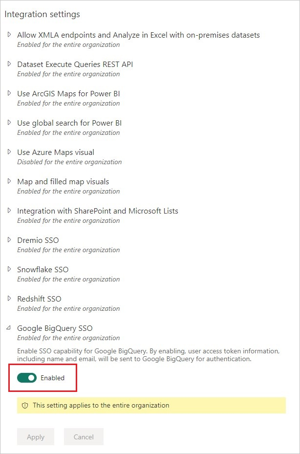
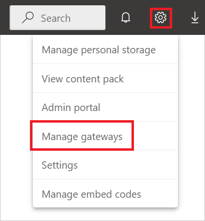

# Google BigQuery (Azure AD) (Beta)

## Summary

| Item | Description |
| ---- | ----------- |
| Release State | Beta |
| Products Supported | Power BI (Datasets) Power BI (Dataflows) Power Apps (Dataflows) |
| Authentication Types Supported | Azure Active Directory |

>[!Note]
>Some capabilities may be present in one product but not others due to deployment schedules and host-specific capabilities.

## Prerequisites

You'll need an Azure Active Directory account to sign in to Google BigQuery (Azure AD).

## Capabilities supported

* Import
* DirectQuery (Power BI Datasets)

## Connect to Google BigQuery (Azure AD) data from Power Query Desktop

To connect to Google BigQuery (Azure AD) from Power Query Desktop, take the following steps:

1. In the Get Data experience, search for and select **Google BigQuery (Azure AD)**.

2. Specify a **Billing Project ID**, which is required for the use of this connector. If you want to use any advanced options, select **Advanced options**. Otherwise, select **OK** to continue. More information: [Connect using advanced options](#connect-using-advanced-options)

3. The Google BigQuery (Azure AD) connector supports connecting through an Azure Active Directory account. Select **Sign In** to continue.

4. Once signed in, select **Connect** to continue.

5. Once you successfully connect, a **Navigator** window appears and displays the data available on the server. Select your data in the navigator. Then select either **Transform Data** to transform the data in Power Query or **Load** to load the data in Power BI Desktop.

## Connect to Google BigQuery (Azure AD) data from Power Query Online

To connect to Google BigQuery (Azure AD) from Power Query Online, take the following steps:

1. In the Get Data experience, select the **Database** category, and then select **Google BigQuery (Azure AD)**.

2. In the **Google BigQuery Database** dialog, you may need to either create a new connection or select an existing connection. If you're using on-premises data, select an on-premises data gateway. Then select **Sign in**.

3. If you want to use any advanced options, select **Advanced options**. More information: [Connect using advanced options](#connect-using-advanced-options)

4. Once signed in, select **Next** to continue.

5. Once you successfully connect, a **Navigator** window appears and displays the data available on the server. Select your data in the navigator. Then select **Next** to transform the data in Power Query.

## Connect using advanced options

Both Power Query Desktop and Power Query Online provide a set of advanced options that you can add to your query if needed.

The following table lists all of the advanced options you can set in Power Query Desktop and Power Query Online.

| Advanced option | Description |
| --------------- | ----------- |
| Use Storage Api | A flag that enables using the [Storage API of Google BigQuery](https://cloud.google.com/bigquery/docs/reference/storage). This option is true by default. This option can be set to false to not use the Storage API and use REST APIs instead. |
| Connection timeout duration | The standard connection setting (in seconds) that controls how long Power Query waits for a connection to complete. You can change this value if your connection doesn't complete before 15 seconds (the default value.) |
| Command timeout duration | How long Power Query waits for a query to complete and return results. The default depends on the driver default. You can enter another value in minutes to keep the connection open longer. |
| Native query | For information, go to [Import data from a database using native database query](../native-database-query.md). In this version of native database query functionality, you need to use fully qualified table names in the format `Database.Schema.Table`, for example `SELECT * FROM DEMO_DB.PUBLIC.DEMO_TABLE`. This option is only available in Power Query Desktop. |

Once you've selected the advanced options you require, select **OK** in Power Query Desktop or **Next** in Power Query Online to connect to your Google BigQuery data.

## Limitations and considerations

This section describes any limitations or considerations of the Google BigQuery (Azure AD) connector.

### Connecting to Google BigQuery (Azure AD) in Power BI Desktop

There are a few limits and considerations to keep in mind when using the Google BigQuery connector with Power BI.

#### Nested fields

To optimize performance considerations, Google BigQuery does well with large datasets when denormalized, flattened, and nested.

The Google BigQuery (Azure AD) connector supports nested fields, which are loaded as text columns in JSON format.

Users should select **Transform Data** and then use the JSON parsing capabilities in the Power Query Editor to extract the data.

1. Under the **Transforms** ribbon tab, the **Text Column** category, select **Parse** and then **JSON**.
2. Extract the JSON record fields using the **Expand Column** option.

### Unable to authenticate with Google BigQuery Storage API

The Google BigQuery (Azure AD) connector uses [Google BigQuery Storage API](https://cloud.google.com/bigquery/docs/reference/storage) by default. This feature is controlled by the advanced option called [UseStorageApi](#connect-using-advanced-options). You might encounter issues with this feature if you use granular permissions. In this scenario, you might see the following error message or fail to get any data from your query:

`ERROR [HY000] [Microsoft][BigQuery] (131) Unable to authenticate with Google BigQuery Storage API. Check your account permissions`

You can resolve this issue by adjusting the user permissions for the BigQuery Storage API correctly. These storage API permissions are required to access data correctly with BigQueryStorage API:

* `bigquery.readsessions.create`: Creates a new read session via the BigQuery Storage API.
* `bigquery.readsessions.getData`: Reads data from a read session via the BigQuery Storage API.
* `bigquery.readsessions.update`: Updates a read session via the BigQuery Storage API.

These permissions typically are provided in the `BigQuery.User` role. More information, [Google BigQuery Predefined roles and permissions](https://cloud.google.com/bigquery/docs/access-control)

If the above steps don't resolve the problem, you can disable the BigQuery Storage API.

### Unable to use DateTime type data in DirectQuery mode

There's a known issue where the DateTime type isn't supported through DirectQuery. Selecting a column with the DateTime type will cause an "Invalid query" error or a visual error.

## Enable Azure AD Single Sign-On (SSO) for Google BigQuery

We support Azure AD SSO through both Power BI Service (cloud) and also through the on-premises data gateway. For more information about enabling Azure AD SSO for all connectors, go to [Overview of single sign-on (SSO) for on-premises data gateways in Power BI](/power-bi/connect-data/service-gateway-sso-overview). Confirm directly with your Google contact that your system and accounts are set up correctly for Azure AD SSO prior to attempting to connect in Power BI.

### Azure AD Single Sign-On (SSO) through Power BI service

To configure a new connection in Power BI service:

1. In Power BI service, select **Admin portal** from the settings list.

   

2. Enable the **Google BigQuery SSO** option.

   

### Azure AD Single Sign-On (SSO) for Google BigQuery with an on-premises data gateway

Before you can enable Azure AD SSO for Google BigQuery, you must first enable Azure AD SSO for all data sources that support Azure AD SSO with an on-premises data gateway, and ensure you have upgraded to at least the December 2022 release of the on-premises data gateway:

1. In Power BI service, select **Admin portal** from the settings list.

   

2. Under **Tenant settings**, enable **Azure AD Single-Sign On (SSO) for Gateway**.

Once you've enabled Azure AD SSO for all data sources, then enable Azure AD SSO for Google BigQuery:

1. Enable the **Google BigQuery SSO** option.

2. Select **Manage gateways** from the settings list.

   

3. Select a gateway, and then select **Choose Data Source**.

4. Under the **Data Source Settings** tab, enter a value in **Billing Project ID**. The **Billing Project ID** parameter is required when using Azure AD and needs to be specified in **Advanced settings**. Also, select **Use SSO via Azure AD for DirectQuery queries**.
