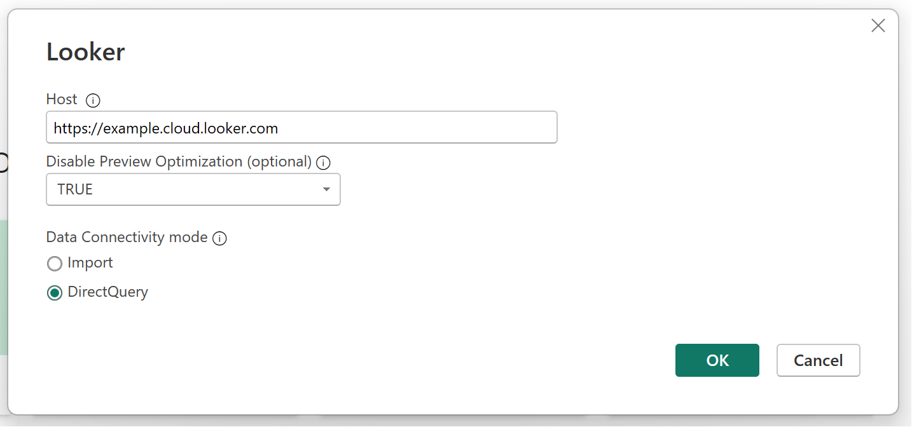

# Looker

## Summary

| Item | Description |
| ---- | ----------- |
| Release State | General Availability |
| Products | Power BI (Datasets) Power BI (Dataflows) Fabric (Dataflow Gen2) Power Apps (Dataflows) Customer Insights (Dataflows) |
| Authentication Types Supported | Organizational account |

> [!NOTE]
> Some capabilities may be present in one product but not others due to deployment schedules and host-specific capabilities.

## Prerequisites

You'll need an account on a Looker-hosted Looker instance in order to connect to Looker. See more [here](https://cloud.google.com/looker/docs/powerbi-connector#requirements).

You'll also need to confirm that a Looker admin has enabled the Power BI connector on this Looker instance. See details [here](https://cloud.google.com/looker/docs/powerbi-connector#enable_connector).

## Capabilities supported

* DirectQuery

## Connect to Looker data from Power Query Desktop

To connect to Looker from Power Query Desktop, take the following steps:

1. In the Get Data experience, search for and select **Looker**.

2. In **Host** enter your Looker instance URL, e.g. https://example.cloud.looker.com

3. The default value of **Disable Preview Optimization** if left blank is True. This is the recommended setting. Setting the value to False will result in a potentially expensive preview query being sent to Looker. Read more [here](https://cloud.google.com/looker/docs/powerbi-connector#preview_optimization).

4. Select **Direct Query**. Selecting Import may also result in a potentially expensive query that includes all fields from all the views that are referenced in the Looker Explore. In addition, with Import, you lose the ability to have Looker correctly evaluate the measures in the Explore.
 
5. Select **OK** to continue.

    

6. The Looker connector supports connecting using an Organizational account. You will use your existing Looker credentials. Select **Sign In** to continue.

7. The traditional Looker login screen appears. Sign in the same way you would normally log in to Looker.

8. Once signed in, select **Connect** to continue.

9. Once you successfully connect, a **Navigator** window appears and displays the data available in your Looker instance. First select and a Looker model. Within each model, you will see the available Explores. Select the Explore you would like to connect to and click **Load**.

## Limitations and considerations

Please see [here](https://cloud.google.com/looker/docs/powerbi-connector#things_to_consider) for additional limitations and considerations of the Looker connector.
