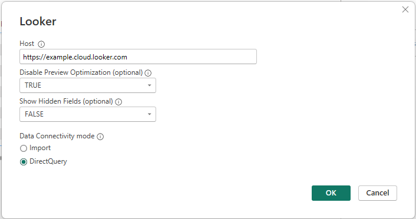

# Looker

## Summary

| Item | Description |
| ---- | ----------- |
| Release State | General Availability |
| Products | Power BI (Semantic models) |
| Authentication Types Supported | Organizational account |

> [!NOTE]
> The following connector article is provided by Google, the owner of this connector and a member of the Microsoft Power Query Connector Certification Program. If you have questions regarding the content of this article or have changes you would like to see made to this article, visit the [Google website](https://cloud.google.com/looker/docs/best-practices/looker-support-details) and use the support channels there.

> [!NOTE]
> Some capabilities may be present in one product but not others due to deployment schedules and host-specific capabilities.

## Prerequisites

To connect to Looker, you'll need an account on a Looker-hosted Looker instance. See details in the [Looker documentation](https://cloud.google.com/looker/docs/powerbi-connector#requirements).

You'll also need to confirm that a Looker admin has enabled the Power BI connector on this Looker instance. See details in the [Looker documentation](https://cloud.google.com/looker/docs/powerbi-connector#enable_connector).

## Supported capabilities

* DirectQuery

## Connect to Looker data from Power Query Desktop

To connect to Looker from Power Query Desktop, follow these steps:

1. In the **Get Data** experience, search for and select **Looker**.

2. In **Host**, enter your Looker instance URL, for example, https://example.cloud.looker.com.

3. The default value of **Disable Preview Optimization** if left blank is True. This is the recommended setting. Setting the value to False will result in a potentially expensive preview query being sent to Looker. Read more in the [Looker documentation](https://cloud.google.com/looker/docs/powerbi-connector#preview_optimization).

4. The default value of **Show Hidden Fields** (if left blank) is False. This will mimic the default visual behavior on Looker where fields with the hidden tag will not be shown. If this parameter is set to True, all fields will be visible in the Power BI report, including those with hidden tags.

5. Select **Direct Query**. Selecting Import may also result in a potentially expensive query that includes all fields from all the views that are referenced in the Looker Explore. In addition, with Import, you lose the ability to have Looker correctly evaluate the measures in the Explore.

6. Select **OK** to continue.

    

7. The Looker connector supports connecting using an Organizational account. You will use your existing Looker credentials. Select **Sign In** to continue.

8. The traditional Looker login screen appears. Sign in the same way you would normally log in to Looker.

9. Once you're signed in, select **Connect** to continue.

10. Once you successfully connect, a **Navigator** window appears and displays the data available in your Looker instance. First, select a Looker model. Within each model, you will see the available Explores. Select the Explore that you would like to connect to, and click **Load**.

## Limitations and considerations

Please see the [Looker documentation](https://cloud.google.com/looker/docs/powerbi-connector#things_to_consider) for additional limitations and considerations of the Looker connector.
