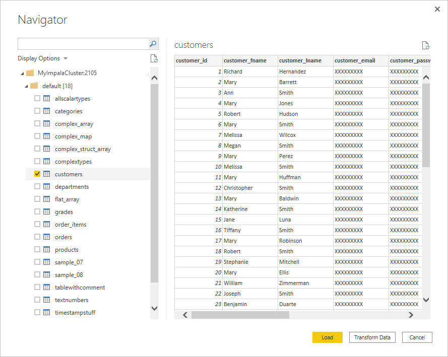

# Impala database

## Summary

| Item | Description |
| ---- | ----------- |
| Release State | General Availability |
| Products | Power BI (Semantic models)<br/>Power BI (Dataflows)<br/>Fabric (Dataflow Gen2)<br/>Power Apps (Dataflows)<br/>Dynamics 365 Customer Insights |
| Authentication Types Supported | Anonymous<br/>Database<br/>Windows |
| Function Reference Documentation | &mdash; |

> [!NOTE]
> Some capabilities might be present in one product but not others due to deployment schedules and host-specific capabilities.

> [!NOTE]
> The Impala connector implementation 2.0 has been in preview since July 2025.  

## Capabilities Supported

* Import
* DirectQuery (Power BI semantic models)
* Advanced options
  * Connection timeout duration
  * Command timeout duration

## Connect to an Impala database from Power Query Desktop

To connect to an **Impala** database, take the following steps:

1. Select **Get Data** from the **Home** ribbon in Power BI Desktop.

2. Select **Database** from the categories on the left, select **Impala** on the right, and then select **Connect**.

    :::image type="content" source="media/impala-database/get-data.png" alt-text="Image of the Get Data dialog with the Database category and Impala connector selected.":::

3. In the **Impala** window that appears, type or paste the name of your Impala server into the box. You can **Import** data directly into Power BI or you can use **DirectQuery**. Learn more about [using DirectQuery](/power-bi/connect-data/desktop-use-directquery). Then select **OK**.

    :::image type="content" source="media/impala-database/server-selection.png" alt-text="Image of the Impala dialog with a Server name entered and the Import data connectivity mode selected.":::

4. When prompted, enter your credentials or connect anonymously. The Impala connector supports Anonymous, Database (user name and password), and Windows authentication.

    

   For more information about authentication methods, go to [Authentication with a data source](../connectorauthentication.md).

   > [!NOTE]
   >  If the connection isn't encrypted, you'll be prompted with the following message. Select **OK** if you want to use an unencrypted connection.

   

5. After you connect, a **Navigator** window appears and displays the data that's available on the server. Either select **Load** to load the data or **Transform Data** to continue transforming the data in the Power Query editor.

    [](media/impala-database/navigator.png#lightbox)

## Connect to an Impala database from Power Query Online

To connect to an **Impala** database, take the following steps:

1. Select the **Impala** option in the connector selection.

2. In **Connect to data source**, provide the name of the server and a port number if required.

   :::image type="content" source="./media/impala-database/service-signin.png" alt-text="Enter the impala database online connection.":::

3. If required, select the name of your on-premises data gateway.

4. If this is the first time you're connecting to this Impala database, select the type of credentials for the connection in **Authentication kind**.

5. Enter your credentials.

6. Select **Use Encrypted Connection** if you want to use an encrypted connection, or clear the option if you want to use an unencrypted connection.

7. Select **Next** to continue.

8. In **Navigator**, select the data you require, then select **Transform data** to transform the data in the Power Query editor.

## Connect using advanced options

Power Query provides a set of advanced options that you can add to your query if needed. The following table lists all of the advanced options you can set in Power Query.

| Advanced option | Description |
| --------------- | ----------- |
| Connection timeout duration | Specifies the maximum time Power Query will wait for a connection to complete. You can enter another value to keep the connection open longer.|
| Command timeout duration | Specifies the maximum time a command is allowed to run before Power Query abandons the call. |

## Impala connector implementation 2.0

In August 2025, we introduced a new implementation for the Impala connector to enhance the integration with Impala. We recommend that you upgrade your Power BI Desktop and the on-premises data gateway to the latest version to benefit from the most current capabilities. 

Provide us [feedback](https://aka.ms/ImpalaConnectorFeedback) to help us continue improving the connector. 

The Impala connector implementation 2.0 is built using the open-source Arrow Database Connectivity (ADBC) driver. ADBC provides a set of standard interfaces for interacting with Arrow data, which is especially efficient at fetching large datasets with minimal overhead and no serialization or copying. The ADBC driver also incorporates security enhancements such as memory safety and garbage collection.

Additionally, collaboration with the open-source community enables more rapid updates, utilizing modern tools and secure development lifecycle (SDL) processes. To enable you to take advantage of these performance and security enhancements, all newly created connections automatically use the 2.0 implementation starting August 2025. During the transition period, you can test the 2.0 implementation by updating your existing queries and adding the `Implementation="2.0"` flag in **Impala.Database** as follows. After the transition, connections that don't specify  an implementation will be automatically updated to the 2.0 implementation.

Source = Impala.Database("impalavm.centralus.cloudapp.azure.com", [Implementation="2.0"

To aid with diagnosing any potential issue, you can find the `Implementation` and `DriverType` details in your Mashup logs like the following example. If you encounter any issue during the transition, contact support.


```json { "Start": "2024-11-02T00:14:02.7968686Z", "Action": "Engine/Module/Impala/IO/Impala/Implementation", "ResourceKind": "Impala", "ResourcePath": "impalavm.centralus.cloudapp.azure.com", "HostProcessId": "29200", "Implementation": "2.0", "DriverType": "ADBC", "ProductVersion": "2.139.0.0 (Main)+eda56ecd858054173a4d11db9c63a6da5cf92a99", "ActivityId": "106f16b6-cfbb-4853-9f20-ed45486486d2", "Process": "Microsoft.Mashup.Container.NetFX45", "Pid": 38560, "Tid": 1, "Duration": "00:00:00.0000291" }
```
To remain on the previous connector implementation temporarily (while troubleshooting), specify `Implementation="1.0"` in your queries.

## Considerations and limitations

Here are a few considerations and limitations to keep in mind with the **Impala** connector:

* The Impala connector is supported on the on-premises data gateway, using any of the three supported authentication mechanisms.
* The Impala connector uses the Impala driver, which limits the size of string types to 32K by default.
* The Impala connector doesn't support overridding the **Realm** option for Kerberos authentication.


+TEST
