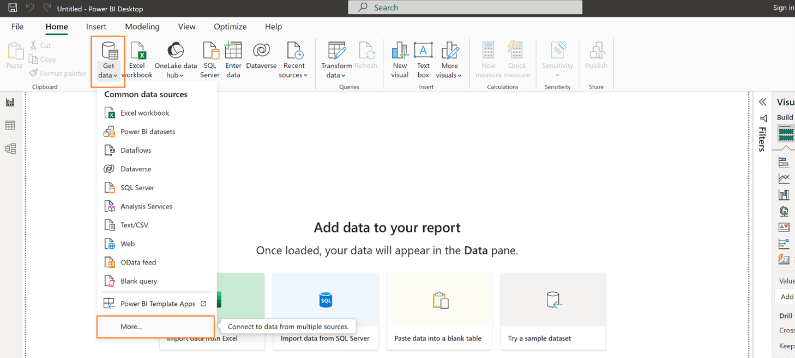
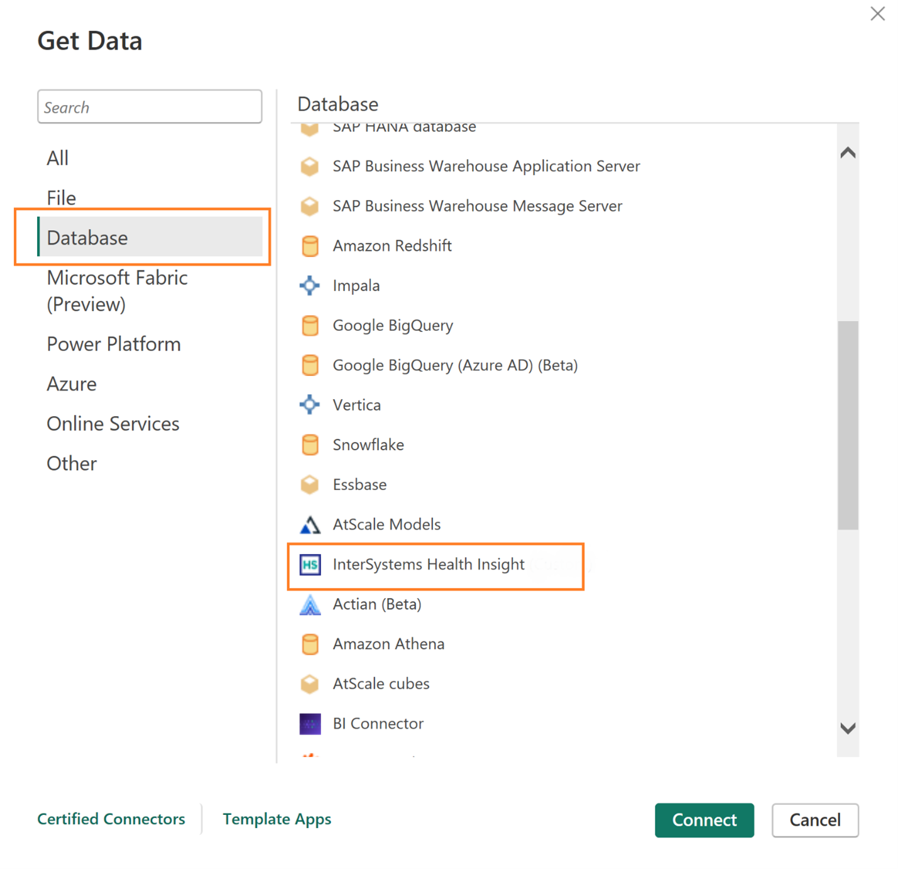
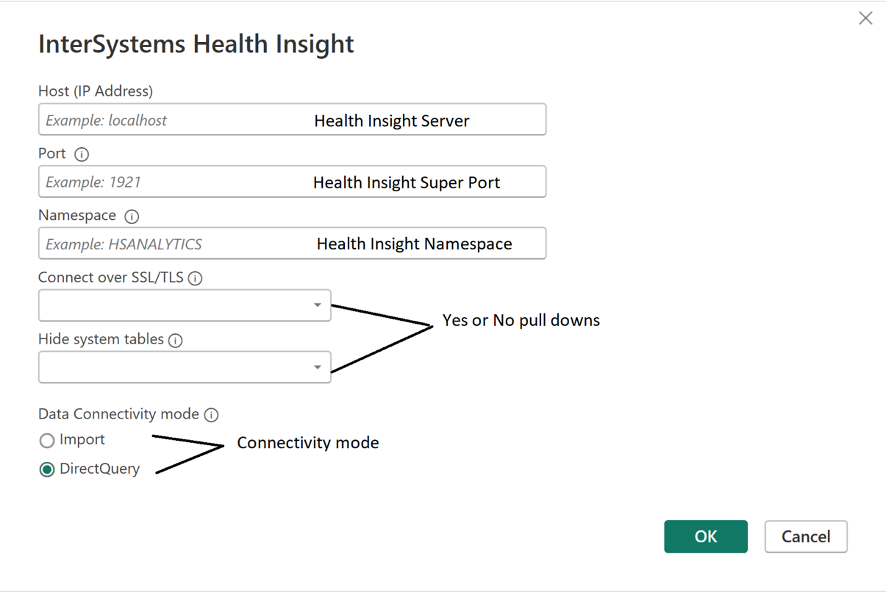
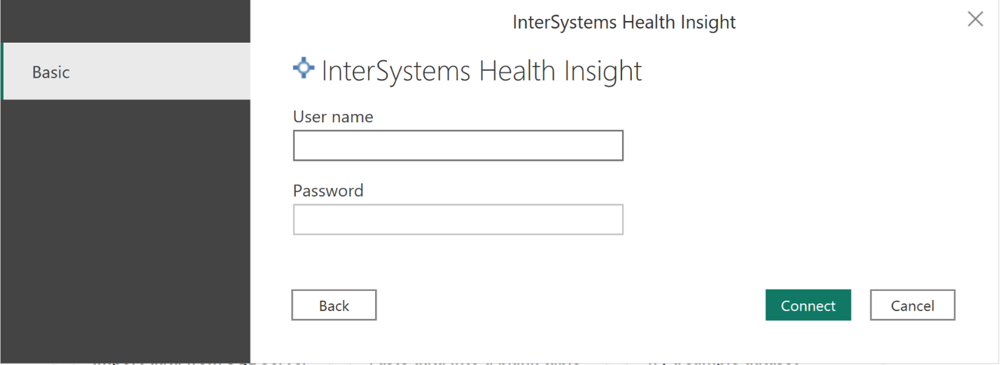

# Intersystems Health Insight

## Summary

|**Item**                              |**Description**                                        |
|:-------------------------------------|:------------------------------------------------------|
| Release State                        | General Availability                                  |
| Products Supported                   | Power BI (Semantic models)                            |
|                                      | Power BI (Dataflows)                                  |
|                                      | Fabric (Dataflow Gen2)                                |
| Authentication types supported       | Health Insight IRIS account                           |

## Prerequisites

To use the Intersystems Health Insight connector, you must have an IRIS account (user/password) and your user must have privileges to access the SQL tables, views and cubes. You must also have the IRIS ODBC driver installed. 
The IRIS ODBC driver can be downloaded (from the [WRC distributions page](https://wrc.intersystems.com/wrc/coDistGen.csp)) and installed separately. 

## Capabilities supported

- Import
- DirectQuery (Power BI semantic models)

## Connect to a Intersystems Health Insight database in Power BI Desktop

1.	Identify the Health Insight server connection details – Server, Super server port and Namespace.

2.	Open Power BI Desktop, click on Get Data and More.
    

4.  The Get Data screen opens, select Database and then search the listing to find Intersystems Health Insight. Then click the  Connect button.
      

5.  The connection screen will open. Here, Host (IP Address) is the IP address of the host for your InterSystems Health Insight instance, Port is the instance’s superserver port, and Namespace is the namespace where your Health Insight data is located. Answer Yes or No to the questions related to connecting via SSL and hiding system tables. Then select the desired connectivity 
     

6.	Upon your first connection to the Health Insight instance, an authentication dialog will appear. Choose Basic and enter your InterSystems Health Insight credentials.
     

7.	The navigation window opens, and presents a Table folder (this is where the HSAA tables will reside) and a Cube folder (this is where you will find the cubes).

Please visit the [documentation](https://docs.intersystems.com/hslatest/csp/docbook/DocBook.UI.Page.cls?KEY=HSAA_powerbi) for connection, usage, and troubleshooting instructions.

## Considerations and limitations

### Booleans Cause Errors in DirectQuery Mode 

When using Power BI in Direct Query mode, attempting to create filters, slicers, or visuals with Health Insight Booleans will result in errors. This is because the InterSystems Health Insight Connector exposes Booleans as the BIT datatype. Power BI cannot handle BIT data in Direct Query mode and will return a folding error if you attempt to create filters, slicers, or visuals. 

You can correct this issue by exposing the Boolean in a view via a CAST statement like the following: 

 
CAST((CASE WHEN *fieldname*=1 then 1 ELSE 0 END) as INTEGER) as *fieldname* 
 

...where *fieldname* is the Boolean in question. 

This CAST statement exposes the Boolean as an Integer, which Power BI can handle without error. Any NULLs are defaulted to 0. 

You can either create your own views or use the CreateViewEntry utility to create a view for any Health Insight table with this issue. 

### Long Strings Cause Errors in DirectQuery Mode 

When using Power BI in Direct Query mode, attempting to create filters, slicers, or visuals with long Health Insight strings will result in errors. When data is brought into a report in Direct Query mode, the Power BI engine tries to limit the number of queries sent to the source environment and will attempt to use data that it has cached in memory. When the engine uses cached memory data, it is unable to handle larger strings and returns a folding error. 

For example, Gender_Code in HSAA.Patient has a maximum length of 32,000 and will cause errors in Direct Query mode. You can correct this issue by exposing the property in a view via a CAST statement like the following: 

 
CAST(*fieldname* AS VARCHAR(4000)) as <fieldname> 
 

...where *fieldname* is the long string in question. 

This CAST statement limits the schema maximum length that is sent to Power BI. Ensure that you do not eliminate important data via this CAST statement. As an example, you might confirm that your Gender_Code data never exceeds 4000 characters in length, meaning that you can shorten the maximum length that is sent to Power BI without consequence. 

You can either create your own views or use the CreateViewEntry utility to create a view for any Health Insight table with this issue. 

## Further assistance

For further assistance please contact InterSystems' [Worldwide Response Center](https://wrc.intersystems.com).
